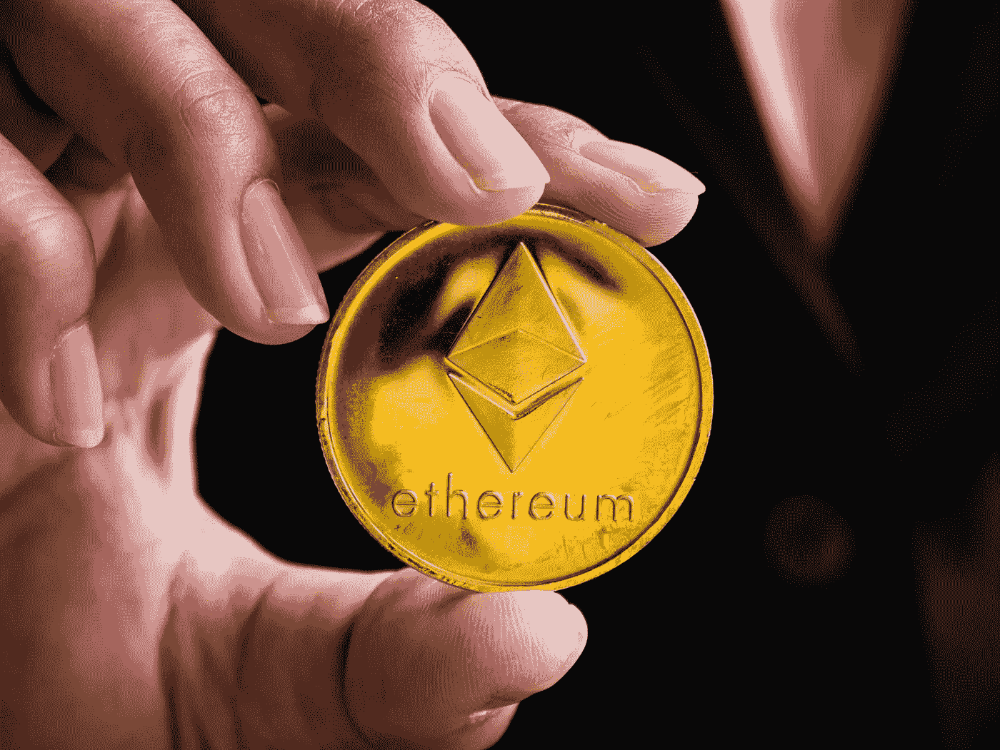

# 我花 10 美元买了以太坊，然后卖掉，损失了 25000 美元。以下是我学到的 5 个教训。

> 原文：<https://medium.com/geekculture/i-bought-ethereum-for-10-then-i-sold-it-and-lost-25-000-here-are-5-lessons-i-learned-ec8c2d8c9255?source=collection_archive---------16----------------------->

## 我失去了 25，000 美元潜在利润的故事，因为我对 crypto 没有信心。

Licensed via Freepik

最近那里火了！它上了新闻，上了头条，当然也在许多人的秘密投资账户里。加密货币有…