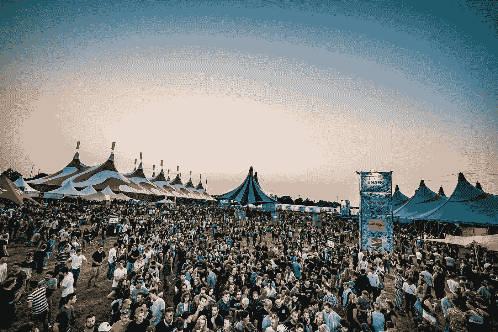
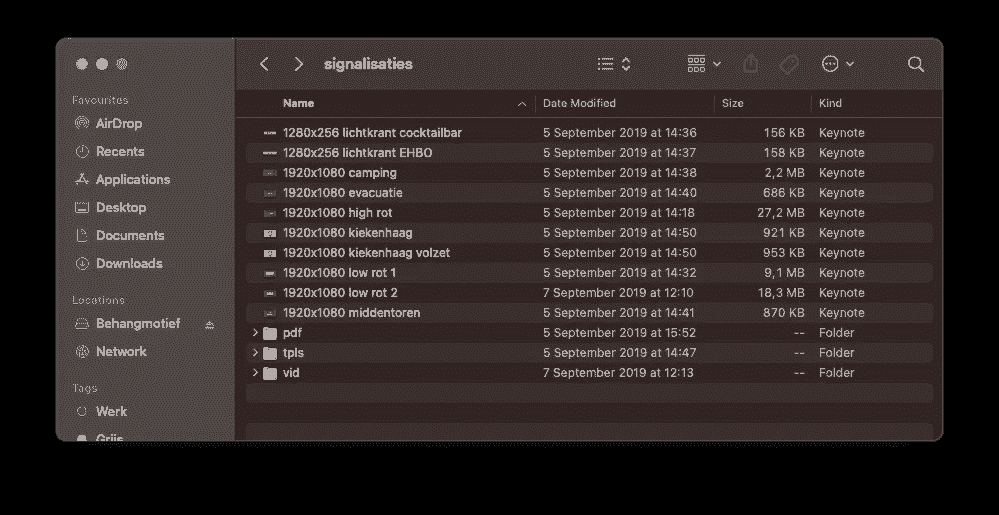
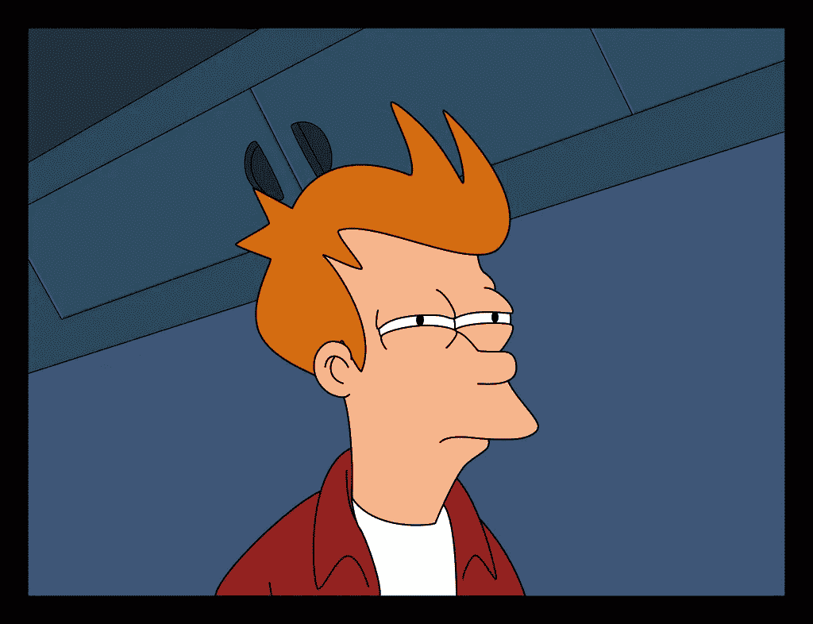
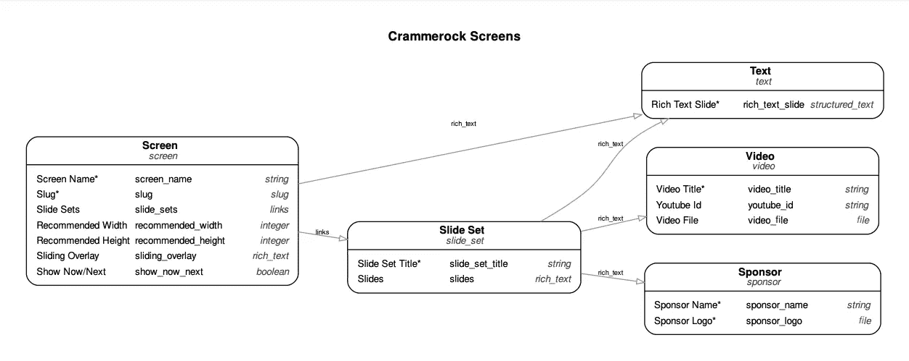
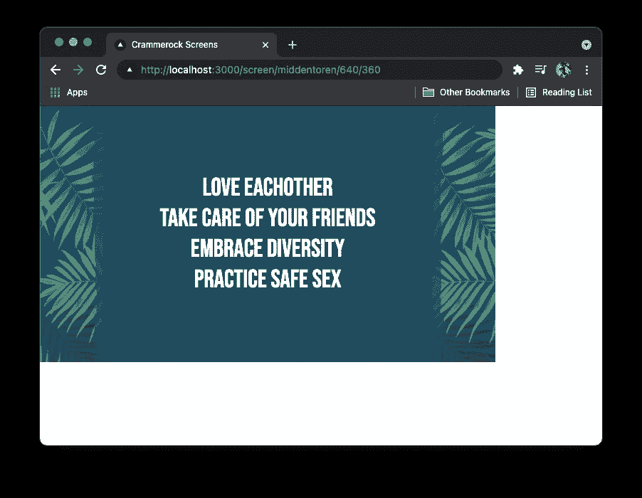

# 我使用 Next.js 和 Dato CMS 为一个音乐节构建了一个数字标牌管理器。

> 原文：<https://medium.com/geekculture/i-built-a-digital-signage-manager-for-a-music-festival-using-next-js-and-dato-cms-575c27b92342?source=collection_archive---------26----------------------->

近十年来，我一直是斯特肯市克拉姆洛克节的志愿者。媒体沟通团队使用的大多数在线工具都是我开发和管理的。多年来，我已经建立和重建了 4 次电影节网站，我创建了仪表板来监控社交媒体，脸书机器人来增加内容参与度，并提供工具来让我们的预订者了解我们的游客希望在电影节上看到哪些艺术家。

Crammerock Festival 2021, a two-day festival in Belgium with 17000 visitors.

# 这一点都不好玩

每年的星期四，也就是电影节开始的前一天，我还会为电影节网站上所有的 LED 屏幕制作标牌。在今年的版本之前，这是一个完全手动的过程，包括以下步骤:

*   列出所有付费在屏幕上出现他们商标的赞助商。
*   收集所有赞助商标志。
*   获取一个列表，其中包含要在网站不同位置显示的所有消息。
*   在每个屏幕上制作 keynote 演示文稿，并确保分辨率匹配。
*   将所有主题演讲导出为视频。
*   使用正确的编解码器和容器转换视频，以匹配独立的屏幕(古代规格)。
*   将它们全部保存在 USB 驱动器上，并交付给不同地点的 2 家不同供应商。

这一过程通常会持续到凌晨 3 点——确保所有赞助商、标识和信息都经过所有利益相关方的验证。

但是问题来了。每年，在星期五，或者在节日期间，有人会注意到一个错别字( *bomvoucher* 而不是*bon voucher*——基本上是说“炸弹券”💣而不是机票代金券。这是一个相当令人痛苦的错别字，因为这是布鲁塞尔机场爆炸的一年。)或者赞助商会抱怨我们用错了他们的 logo 版本。

对屏幕进行调整意味着我必须重复上面提到的最后 4 个步骤。每一个。单身。时间。

I would have all these keynotes. PDF exports for validation and converted videos for distribution.

# Covid 版本需要自动化

今年，我们不得不考虑很多 covid 措施来组织这个节日。所有这些措施都需要在游客一进入电影节时就进行沟通。这意味着额外的屏幕。节日周围街道上的额外屏幕和我们考试中心附近的额外屏幕。

由于这些屏幕上的通信也可能在周末多次改变，我决定考虑一些数字标牌解决方案，以便从一个位置轻松管理所有屏幕。

Me looking at existing digital signage solutions.

我很快决定自己造点东西。

# DatoCMS + NextJS =💛

为了管理所有的屏幕、幻灯片和赞助商，我选择了 **DatoCMS** ，一个无头的内容管理系统。经过 10 分钟的设置，我有:

*   屏幕模型:定义节日场地上/周围的物理屏幕。
*   幻灯片集模型:定义可以分配给一个或多个屏幕的幻灯片集(文本、视频或赞助商/图像)。

Here’s a schematic representation of the CMS. Easy, right?

在前端，我选择了静态生成的 Next.js 设置。代码方面没有什么特别之处，但针对多种屏幕尺寸的特定用例进行了一些优化，这些屏幕尺寸具有怪异的纵横比、分辨率和有限的移动数据可用性(周末为 500 MB/屏幕)。

功能概述:

*   我为“屏幕人”制作了动态 URL 参数，以便手动插入正确的屏幕分辨率。根据这些宽度和高度参数，我调整了通过 DatoCMS GraphQL API 查询的资产(图像和视频)的大小。大幅减少加载时间和数据卡使用的数据。
*   对于视频，我决定不使用 Dato HLS 流媒体，因为我们会很快用完我们的免费流媒体分钟。视频根据屏幕大小调整大小(见上文),并在屏幕设置时预加载一次。
*   为了确保“屏幕家伙”不必在每次 CMS 发布时都进行硬刷新，我可以使用 Dato 实时 API(它使用[服务器发送的事件](https://developer.mozilla.org/en-US/docs/Web/API/EventSource))。我只需要添加一些简单的故障保险，如果屏幕在幻灯片 x 上，你会删除幻灯片 x，它会重新开始循环等。

A simple overview of all the screens in the system with the slide sets that are assigned to them.

用法:

*   最后，我有了一个概览屏幕，可以看到所有活动的屏幕以及分配给它们的幻灯片集。这个页面基本上是我自己参考用的。
*   每个屏幕都有一个网址。那个网址是屏幕上的家伙在周四晚上设置的。而在周末，当有什么需要改变的时候，我只需要在我的 iPhone 上登录 Dato，直接在选择的屏幕上发布改变。

Example of a screen URL.

# 学习编码，真的

最后，我成功地把一个非常非常烦人、令人烦恼、令人沮丧的任务变得非常简单。它只花了我 4 个小时的编码和成本我们€0，使用现代网络工具和框架。

最棒的是，我明年还可以用它！

During testing. 🙃