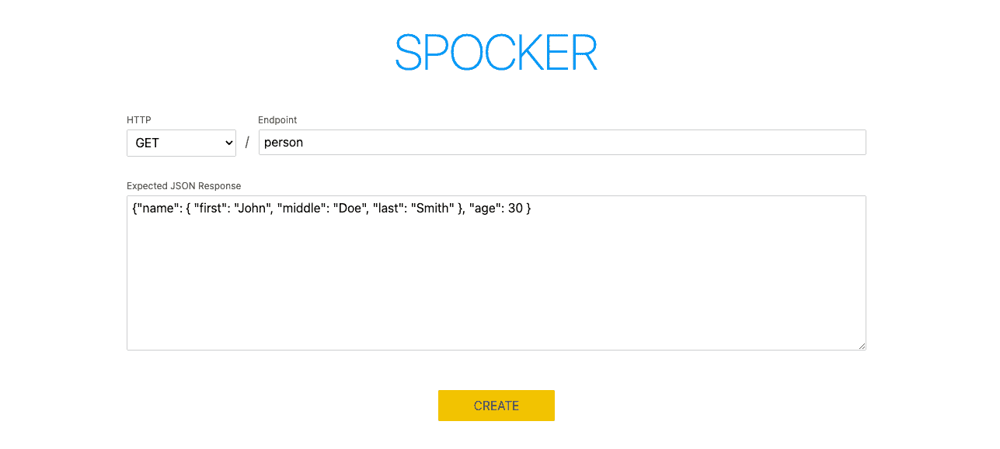
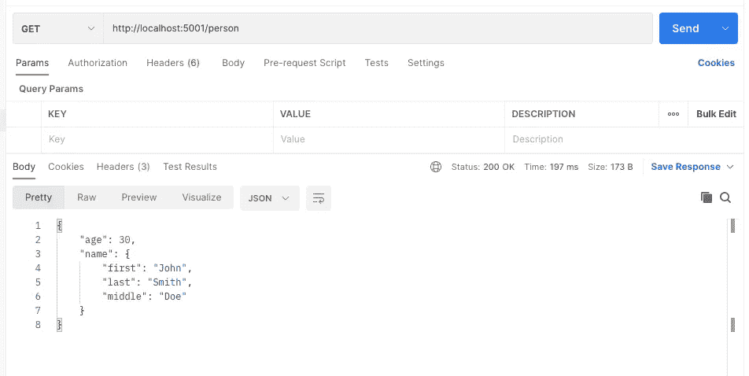
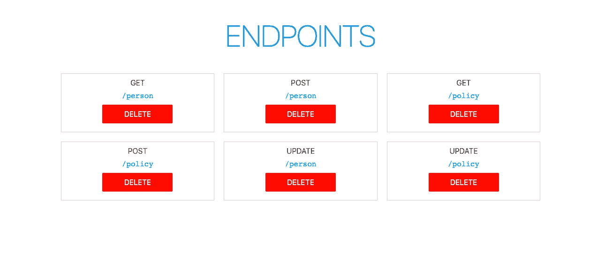

# 我构建了一个免费工具来加速前端开发

> 原文：<https://medium.com/geekculture/i-built-a-free-tool-to-speed-up-frontend-development-732117da9add?source=collection_archive---------22----------------------->

Photo by [Mailchimp](https://unsplash.com/@mailchimp?utm_source=medium&utm_medium=referral) on [Unsplash](https://unsplash.com?utm_source=medium&utm_medium=referral)

# 问题是

如果你做了很多前端开发，你可能已经建立了一个网站或者一个与 API 交互的应用。

与 API 交互是前端开发的一大部分。您可能正在从 API 中检索信息，并将其显示在网页上。您也可以收集信息并将其发送给 API。

在本地测试您的更改时，您可能会:

*   用硬编码的测试数据填充响应对象(模拟)
*   在本地运行 API 及其资源(数据库、附加 API)
*   触及 API 的开发或测试环境
*   其他的(让我在评论中知道)

这些解决方案没有提供我所追求的速度和灵活性。

# 解决方案

我构建了一个名为 [Spocker](https://github.com/michaeldfaber/spocker) 的免费工具来动态创建模拟端点。创建模拟端点就像填写表单一样简单。

假设我的前端应用程序调用了一个带有 GET /person 端点的 API，它返回了一个带有一些信息的对象。有了 [Spocker](https://github.com/michaeldfaber/spocker) ，端点在几秒钟内就准备好了。

Spocker uses port 5001 by default. This can be configured.

在您的机器上启动 Spocker 就像拉下 repo 并运行一个命令一样简单。这是用 Docker Compose 完成的。如果你不想使用 Docker，也有手工运行 Spocker 的说明。

如果您使用完一个端点，请使用控制面板来管理它们:

# 未来

Spocker 是开源的，并将永远是。这里的储存库是。

您可以在自述文件底部的 backlog 部分阅读我计划的特性和改进。

我坚信协作和社区使开源软件变得既美丽又强大。我乐于接受任何建议、反馈和批评。

感谢阅读！如果你觉得有趣，请给斯波克一颗星！