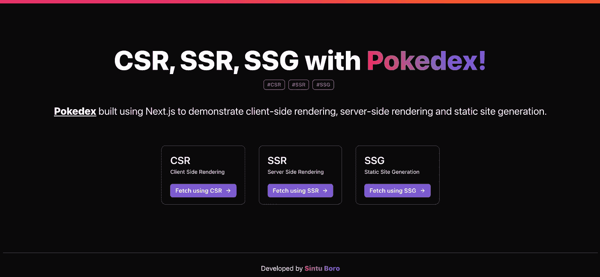
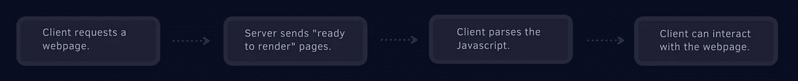

# 我构建了一个 Pokedex 来演示 Next.js 的数据获取技术。

> 原文：<https://medium.com/geekculture/i-built-a-pokedex-to-demonstrate-next-js-data-fetching-techniques-c77a94df8239?source=collection_archive---------18----------------------->

CSR, SSR, SSG w/ Next.js

# 概观

Next.js 吸引人的原因之一是能够在客户端(浏览器中)和服务器端呈现应用程序，以及能够在构建时静态生成页面。让我们仔细看看这些术语的含义:

**1。客户端渲染:**在客户端渲染的应用中，服务器本质上是向客户端发送一个空白的 HTML 页面(加载状态)，没有任何动态内容。你不会真的看到任何有意义的瞬间。在呈现加载状态的同时，客户端(浏览器)向所需的服务器发送多个 API 请求，以获取动态内容，并在稍后使用动态数据对应用程序进行再水合。

**2。服务器端呈现:**在服务器端呈现的应用程序中，服务器预先呈现带有动态数据的页面，最终，一旦在服务器端完成了水化，它就将带有动态数据的完全填充的 HTML 页面交付给客户机。服务器端呈现实质上是在服务器上为页面生成整个 HTML。

**3。静态站点生成:**静态站点生成在构建期间生成页面。基本上，一个静态生成的站点会在任何用户请求之前提前生成 HTML 页面。而且，通过 Next.js 的增量静态再生(ISR ),我们可以在每页的基础上静态生成，而不需要重建整个网站，这意味着您可以随着新数据的到来而增量更新静态页面。

# CSR 是如何运作的？

Client-side rendering

*   当客户端向服务器发送网页请求时，服务器会向客户端发送一个空白的 HTML 页面(没有任何动态数据)。
*   客户端立即为空白的 HTML 页面提供加载状态。(大多数时候我们会注意到加载动画)。这是客户端发出 API 请求来获取动态数据的时候。
*   一旦动态数据可用，客户端/浏览器就用动态/新数据重新组合应用程序。

# SSR 是如何工作的？

Server-side rendering

*   当客户端向服务器发送网页请求时，服务器实际上预先呈现并准备了包含所有动态数据的 HTML 页面。
*   这就是为什么服务器端渲染往往具有较慢的首字节时间(TTFB)的原因，因为它们在服务器上工作。
*   一旦服务器将预先呈现的页面发送给客户机，客户机就显示 HTML 页面。这也有助于避免多次从客户端请求数据。

# SSG 是如何运作的？

Static-site generation

*   基本的静态站点生成包括在构建期间甚至在任何用户请求之前预生成或生成页面(有/没有动态数据)。
*   客户端立即显示静态生成的页面。但是这种方法有一定的局限性。如果我们有大量的页面需要预先生成，这可能会大大增加应用程序的构建时间。
*   还有另一种非常有趣的方法涉及静态站点生成，称为增量静态再生(ISR)。ISR 允许在每页的基础上静态生成，而不需要重建整个网站。
*   这意味着应用程序将根据请求提供所有预先构建的页面，但是如果用户请求不是预先生成的页面，它将提供一个后备版本(或加载状态)，同时 Next.js 将发出 API 请求，在服务器上生成所请求的页面。
*   并且在对同一页面的后续请求中，Next.js 将服务于已经生成的页面，而不会重新生成它。

# CSR、SSR 和 SSG 的使用案例

## 客户端渲染

*   认证页面或付费墙/私人仪表板页面。
*   数据更新频繁的页面。例如，具有实时数据更新的页面。
*   按需请求数据的银行网站。
*   不需要 SEO 优化的页面。

## 服务器端渲染

*   可用于需要大量工作负载的页面。
*   需要链接预览的网站。
*   有很多页面的网站(仅根据请求呈现)。
*   需要 SEO 优化的页面。

## 静态站点生成

*   数据不经常更新的文档页面。
*   博客网站。
*   非常适合同构应用程序/网站。
*   需要 SEO 优化的页面。

# 演示

我已经使用 Next.js 构建了一个演示客户端呈现、服务器端呈现和静态站点生成的基本应用程序。构建该应用程序是为了实现并帮助解释 Next.js 的数据获取技术。Next.js 通过允许开发人员选择他们希望如何在每页的基础上呈现应用程序，提供了一个非常棒的开发人员体验。

# 参考

*   Next.js '取数据[技巧](https://nextjs.org/docs/basic-features/data-fetching)。
*   演示应用[回购](https://github.com/Boro23-wq/Pokedex-w-Next)。
*   [总比分](https://www.toptal.com/front-end/client-side-vs-server-side-pre-rendering) —中国南车 vs SSR vs SSG