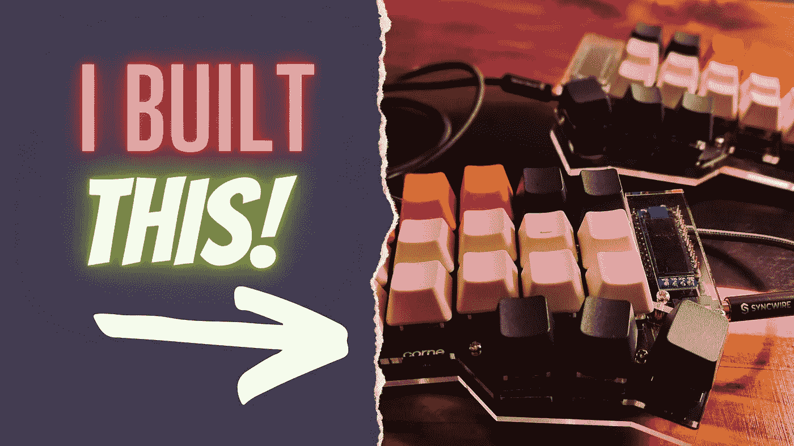

# 我给自己做了一个键盘，并用它来写这篇文章

> 原文：<https://medium.com/geekculture/i-built-myself-a-keyboard-and-i-used-it-to-write-this-article-9673898ca821?source=collection_archive---------8----------------------->

## 每个人都应该建立自己的键盘

Photo and edits by Author

没错，你可以自己制作键盘，你不知道吗？还好，我也是几个月前才知道的。

事实证明，我一直对分离键盘很着迷，但从来没有真正研究过它们和它们的价格。但是一旦…