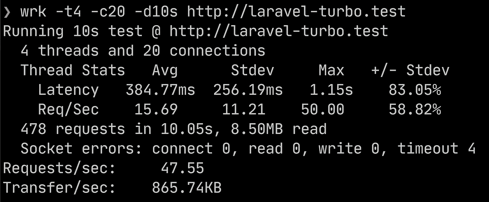
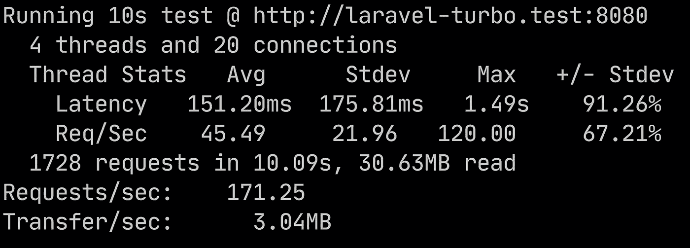

# 我等不及了

> 原文：<https://medium.com/geekculture/i-cant-wait-for-laravel-octane-6697d1d355c1?source=collection_archive---------5----------------------->


等不及 Laravel Octane 了，就开始玩 Laravel 和 Roadrunner。

> 2021 年 4 月 6 日，Laravel Octane Beta 发布，因此本文已过时。我的建议是使用 Laravel 辛烷与 Roadrunner。为此，你可以关注这个帖子:[https://Roberto dev . medium . com/laravel-octane-is-here-9ce 026 f 6180 e](https://robertodev.medium.com/laravel-octane-is-here-9ce026f6180e)

在拉拉康 2021 期间🎉🎉🎉，在 Taylor 的精彩的“Laravel Octane”演讲之后，我对使用一个有多个工作人员的应用服务器来服务 Laravel 应用程序感到非常兴奋。

在引擎盖下，Laravel Octane 可以与 Roadrunner 一起使用，所以我决定直接用 Roadrunner 玩一会儿。

什么是 Roadrunner: Roadrunner 是一个用 Go 编写的应用服务器，为 PHP 应用服务。

# 安装

我们要做的是:

*   从头安装一个新的 Laravel 应用程序
*   安装 HTTP 基准测试工具
*   安装 Roadrunner
*   安装 Laravel“桥”,以便与 Laravel 框架一起使用 Roadrunner
*   配置 Roadrunner
*   启动应用服务器
*   使用 Nginx 和 Roadrunner 执行比较基准测试
*   请考虑一下，因为使用应用服务器与使用 Web 服务器是不同的。

# 从头开始安装新的 Laravel 应用程序

我将从头开始创建一个新的 Laravel 应用程序。

所以首先，我需要安装或更新“laravel”工具。这对于创建新的 Laravel 应用程序非常有用:

```
composer global require laravel/installer
```

然后我可以创建新的 Laravel 应用程序:

```
laravel new laravel-turbo
cd laravel-turbo
```

我建议在代客服务的目录中创建这个应用程序。所以你可以通过 Nginx 在你的浏览器中找到这个:[http://laravel-turbo . test](http://laravel-turbo.test)

# 安装 HTTP 基准测试工具

为了检索一些关于性能的见解，并在您的 Laravel 应用程序上模拟大量并发流量，我将使用“*Wrk*”[https://github.com/wg/wrk](https://github.com/wg/wrk)。

如果你有一台 macOS 并且你使用的是 Homebrew，你可以安装“ *Wrk* ”:

```
brew install wrk
```

使用 *Wrk* 您可以在一段定义的时间内生成许多并发请求。稍后我将使用它来运行一些基准测试。在此之前，让我为 Laravel 安装应用服务器及其桥。

# 安装 Roadrunner

现在我将安装应用服务器，稍后我将安装 Laravel 桥。

应用服务器的 GitHub 库是:[https://github.com/spiral/roadrunner-binary](https://github.com/spiral/roadrunner-binary)

要安装 Roadrunner，您需要:

*   安装应用服务器的 PHP 包；
*   获取应用服务器的二进制文件(可执行文件)；
*   确保 *rr* 二进制可执行(可执行权限)；
*   通过 *.rr.yaml* 文件配置应用服务器。

```
composer require spiral/roadrunner:v2.0 nyholm/psr7
./vendor/bin/rr  get-binary
chmod u+x rr
```

# 安装 Roadrunner Laravel 桥

为了让 Laravel 与应用服务器一起正常工作，您需要安装 Roadrunner Laravel Bridge，然后发布 Laravel Bridge 的配置文件:

```
composer require spiral/roadrunner-laravel "^4.0"
php artisan vendor:publish --provider='Spiral\RoadRunnerLaravel\ServiceProvider' --tag=config
```

# 配置 Roardrunner

应用服务器的配置在文件 *.rr.yaml* 中。

我们示例的基本配置可能是这样的:

```
server:
  # If you want to use Unix socket for internal communication:
  #command: "php ./vendor/bin/rr-worker start --relay-dsn unix://rr-laravel-rpc.sock"
  #relay: "unix://rr-laravel-rpc.sock"
  # If you want to use TCP socket for internal communication:
  command: "php ./vendor/bin/rr-worker start --relay-dsn tcp://127.0.0.1:7001"
  relay: "tcp://127.0.0.1:7001"
​
http:
  # The Web application is served via 8080 port
  address: 0.0.0.0:8080
  middleware: ["headers", "static", "gzip"]
  pool:
    num_workers: 4
    max_jobs: 64
    supervisor:
      exec_ttl: 60s
  headers:
    response:
      X-Powered-By: "RoadRunner"
  static:
    dir: "public"
    forbid: [".php"]
​
```

# 启动应用服务器

用刚刚下载的新的“ *rr* ”可执行文件启动应用服务器:

```
./rr serve -c ./.rr.yaml
```

一旦应用服务器启动，根据配置( *num_workers* ) 4 个工作器被启动，准备好服务 Laravel 应用程序。

根据配置文件中的“*地址*”参数，Laravel 应用暴露在 8080 端口上。

# 执行测试比较，Nginx 与 Roadrunner

为了执行测试，我将使用“ *wrk* ”来生成流量和 2 个不同的 URL，每个 URL 引用两个不同的服务:

*   [http://laravel-turbo.test/](http://laravel-turbo.test/):用本地地址 127.0.0.1 解析，并将回复 Nginx Web 服务器；
*   [http://laravel-turbo.test:8080/](http://laravel-turbo.test:8080/):用本地地址解析，端口 8080 被 Roadrunner 应用服务器绑定。

我将使用一些特定的选项:

*   要使用的 4 个线程；
*   20 个连接保持开放；
*   测试持续时间为 10 秒。

因此，为了测试 Nginx:

```
wrk -t4 -c20 -d10s [http://laravel-turbo.test](http://laravel-turbo.test)
```

对于测试 Roadrunner:

```
wrk -t4 -c20 -d10s [http://laravel-turbo.test:8080](http://laravel-turbo.test:8080)
```

结果是不同。

对于 Nginx，我在 10 秒钟内收到了 478 个请求:



4 threads, 20 connections keep open, to Nginx

对于 Roardrunner，我在 10 秒钟内收到了 1728 个请求



差别令人印象深刻。Roadrunner 比 Nginx 快多了。

# 一些考虑

使用 Roadrunner 而不是传统的 Web 服务器为 Laravel 应用程序提供服务的主要区别在于:

*   应用程序被引导一次，多个请求将共享相同的资源。
*   控制器的构造被调用一次(当工人被实例化时)
*   想想“静态”类属性会发生什么

我来解释一个例子。

在 routes/web.php 中创建 2 条路由:

```
use App\Http\Controllers\MainController;Route::get('/', [MainController::class, 'index']);Route::get('/show', [MainController::class, 'show']);
```

在 app/Http/Controllers 目录中创建 MainController.php，您可以:

*   定义一个静态属性(数组)$ list
*   定义 index 方法，将一个随机整数追加到 self::$list 数组中；
*   定义 show 方法，在其中使用并显示 self::$list 数组

```
<?phpnamespace App\Http\Controllers;use Illuminate\Http\Request;class MainController extends Controller{ public static $list = []; public function index() { self::$list[]= \random_int(1,6); return view('welcome'); } public function show() { return view('show', ["list" => self::$list]); }}
```

如果您调用多次 http://laravel-turbo.test:8080/，它将被称为索引方法，所以一些整数将被添加到您的列表中。静态列表在同一个 worker 上的请求之间共享。因此，如果你试图调用[http://laravel-turbo.test:8080/show](http://laravel-turbo.test:8080/show)，它将被调用显示方法，其中将使用列表属性。

所以我认为，对于 PHP 开发人员来说，在应用服务器环境中工作是一个巨大的变化，特别是考虑到请求的生命周期。PHP 开发人员通常习惯于在每个请求中引用所有的框架。

可能 Laravel Octane 将负责为每个请求向 Laravel 公开一个干净的状态，使 PHP 开发人员的生活更加轻松。

你同意这些考虑吗？

请随意发表一些评论和/或反馈。