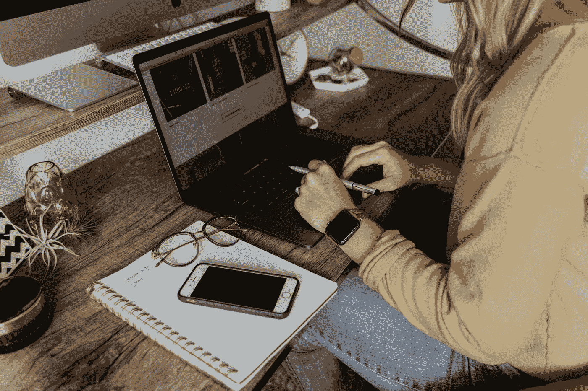

# 一年后，我在工作之余做了一个 Python 项目&下面是进展情况…

> 原文：<https://medium.com/geekculture/i-did-a-python-project-outside-work-after-a-year-heres-how-it-went-7cd33033b23a?source=collection_archive---------2----------------------->

## 来自数据分析师的诚实坦白和用于简化工作的最佳实践

Photo by [Corinne Kutz](https://unsplash.com/@corinnekutz?utm_source=unsplash&utm_medium=referral&utm_content=creditCopyText) on [Unsplash](https://unsplash.com/s/photos/list?utm_source=unsplash&utm_medium=referral&utm_content=creditCopyText)

作为职场中的专业人士，我们的日常工作消耗了我们太多的时间，以至于我们失去了在工作之外做项目的动力——我们远离了重塑自我和追赶……