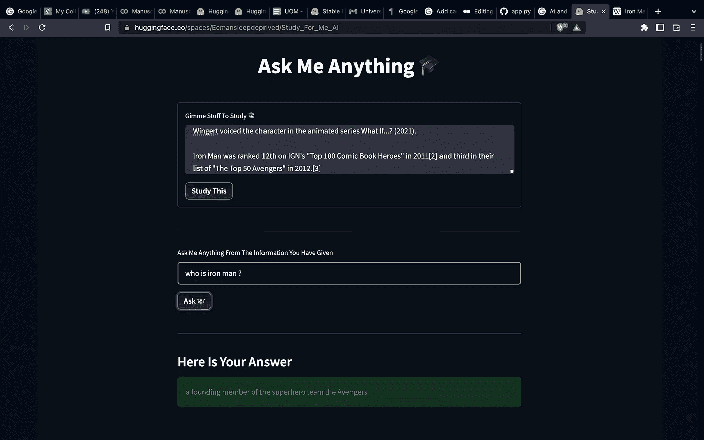
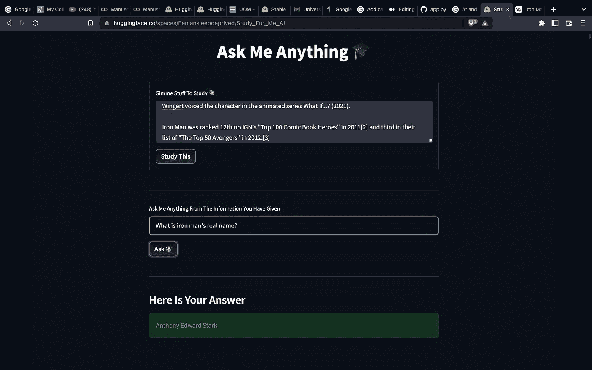

# 我做了一个可以替我学习的 AI。

> 原文：<https://medium.com/geekculture/i-made-an-ai-that-can-study-for-me-7c9329c54dae?source=collection_archive---------0----------------------->

所以，有很多时候，我有大量的文本，我现在有我需要的数据，但懒得通读它来找到我需要的东西。所以，有一天我想，如果我制造一个人工智能，它可以为我学习内容，并回答我直接问它的问题，那会怎么样呢？现在我们在这里。

因此，经过一番研究后，我决定使用罗伯塔模型来完成这项工作。这是一个预先训练好的模型，使用 MLM(屏蔽语言建模)对英语进行建模。这基本上意味着它和人工智能可以在大量文本中找到关键词，然后根据给出的问题识别它。

让我们从代码开始。

首先让我们创建一个 requirements.txt 文件:

现在为 colab 笔记本下载 PyTorch:

现在安装变压器:

现在开始通过导入 roberta 模型依赖项来加载模型:

制作问答管道:

制作上下文文本语料库数据:

制作一个问题集:

现在运行人工智能上的问题集:

打印答案:

这样代码就完成了。

所以，我把它做成一个应用程序，这样你们就可以使用它了。这是它的代码。

这是应用程序:

 [## 为我研究 AI——一个拥抱的面部空间](https://huggingface.co/spaces/Eemansleepdeprived/Study_For_Me_AI) 

一定要试试。

让我们看看一些输出:

Dyam I didn't know that

如你所见，结果非常准确。你自己去试试！！

如果你喜欢这篇文章，继续关注 medium 对我帮助很大。

有关代码，请点击此处:

 [## GitHub-eeman 1113/Study _ For _ Me _ AI](https://github.com/Eeman1113/Study_For_Me_AI) 

请在 twitter 上关注我的每日 AIML 更新:

感谢阅读😁，下周见👋🏼。