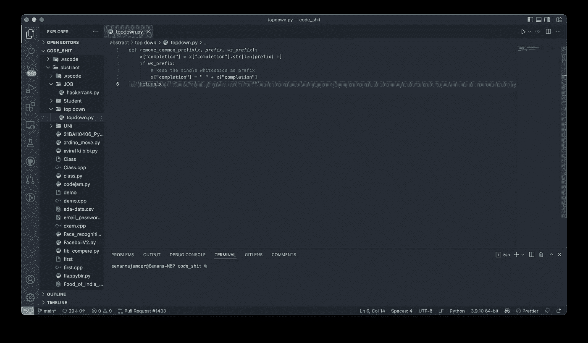
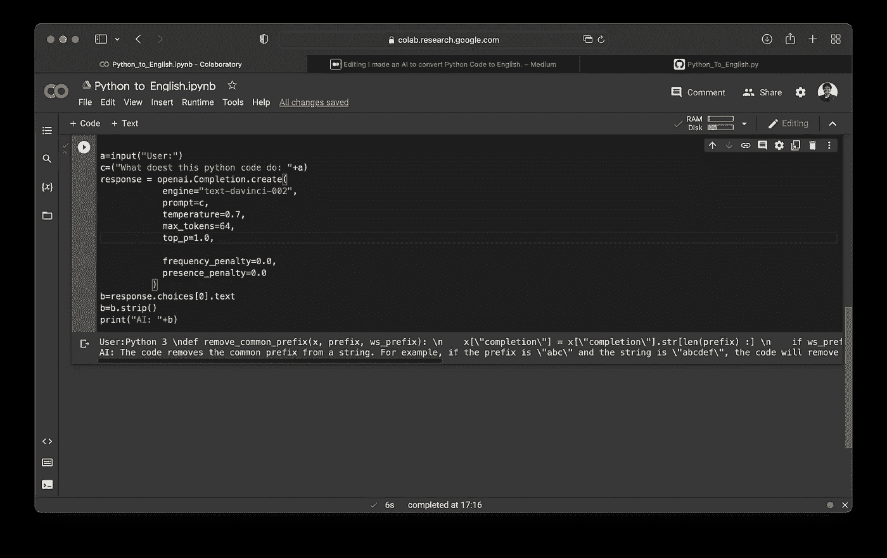

# 我做了一个 AI，把复杂的 Python 代码转换成简单的英语。

> 原文：<https://medium.com/geekculture/i-made-an-ai-to-convert-python-code-to-english-c0e709db0149?source=collection_archive---------6----------------------->

所以，我是一个程序员，我可以保证每个程序员在生活中一定会有这样的时刻，当他们被另一方询问屏幕上的代码是什么意思时，即使在解释之后，他们也不知道发生了什么。所以，为了解决这个问题，我为它做了一个人工智能。

我将使用 [GPT-3](https://openai.com/blog/gpt-3-apps/) 为它，因为它是最好的语言处理。

如果你想知道更多关于 GPT-3 阅读我的文章，我有详细的解释:

 [## 人工智能使用 GPT-3 向二年级学生解释复杂的事情。

### 所以，我经常在面试中遇到这样的情况:面试官要求以一种孩子能理解的方式解释一些困难的话题…

medium.com](/@eeman.majumder/ai-to-explain-complex-things-to-a-second-grader-using-gpt-3-ab28872bdce9) 

让我们从代码开始。

首先安装:

现在让我们导入所需的库:

现在让我们使用 GPT-3 输入并生成转换后的文本:

就这样，这就是如何用 10 行代码制作一个 Python 到英语的转换器。

让我们看看一些输出:

This is the code we will be explaining using the AI

added it in prompt and lets see what the AI says about this

艾的解释是:

> AI:这段代码删除了字符串中的公共前缀。例如，如果前缀是\"abc\ "，字符串是\"abcdef\ "，代码将从字符串中删除\"abc\ "，保留\"def\ "。如果前缀是“abc”，字符串是“abcd”，代码将被删除

这就是了。清晰的解释。呵呵，它的成功让我们 gooooo。

[**如果你们喜欢这篇文章，就关注我吧。**](/@eeman.majumder)

关于 Colab 笔记本，请点击此处:

 [## Python _ to _ 英语

### Eeman_Majumder

colab.research.google.com](https://colab.research.google.com/drive/1N5Ax-IzgcnoTH11JS84xiJzuQeKqyBJc?usp=sharing) 

更多内容请查看我的 Github:

 [## Eeman_Majumder

github.com](https://github.com/Eeman1113) 

请在 twitter 上关注我的每日 AIML 更新:

感谢阅读😁，下周见👋🏼