# 我们制造了一个人工智能来管理流浪狗

> 原文：<https://medium.com/geekculture/i-made-an-ai-to-manage-street-dogs-4be366219b35?source=collection_archive---------11----------------------->

[https://cdn.mos.cms.futurecdn.net/7ZhzoqeJ28tvfnYETqwfu8-1200-80.jpg](https://cdn.mos.cms.futurecdn.net/7ZhzoqeJ28tvfnYETqwfu8-1200-80.jpg)

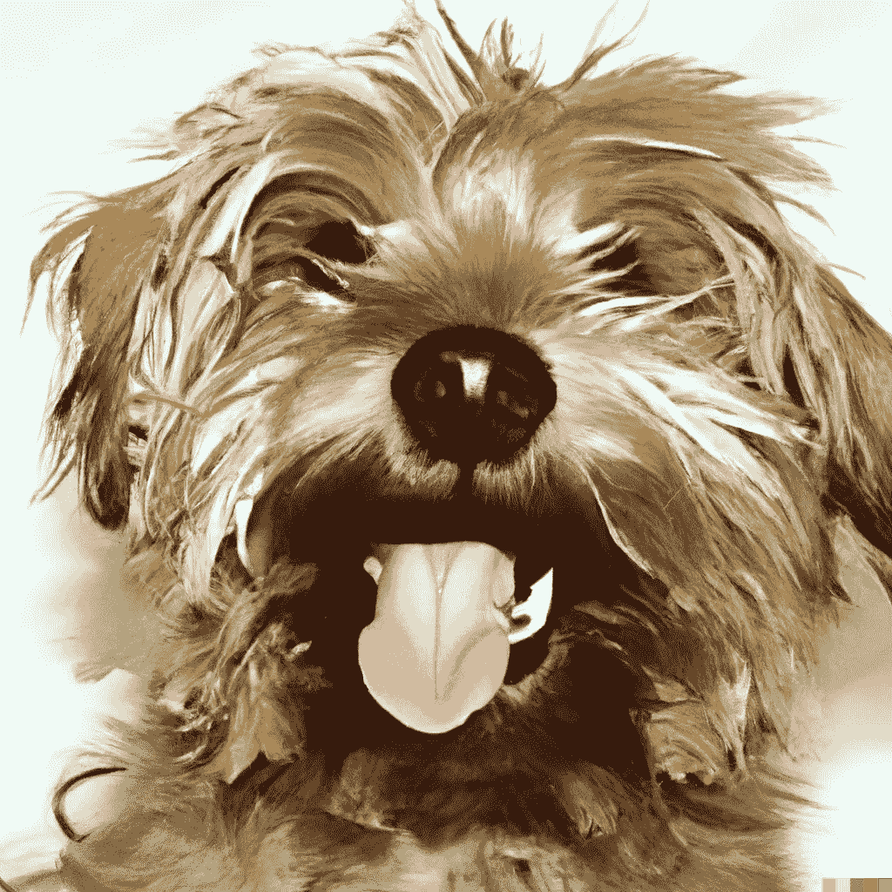 [## dawg-Eemansleepdeprived 的拥抱脸空间

### 发现由社区制作的令人惊叹的 ML 应用程序

huggingface.co](https://huggingface.co/spaces/Eemansleepdeprived/Dawg) 

所以，我的大学有一个项目展览。这基本上是一个主题，迫使你做一个好的项目来炫耀，而你的位置。

我们一行 5 人([https://twitter.com/actual_aviral](https://twitter.com/actual_aviral)、、[、](https://twitter.com/SannidhyaSriva2)、[https://twitter.com/Suraj_p__10](https://twitter.com/Suraj_p__10))，我们都来自印度。印度的街头流浪狗问题日益严重。就像每隔几天，一些地区的街头流浪狗就会引起大的骚动，所以我们想做一个项目来在一定程度上解决这个问题。

**那么我们该怎么办呢？**

我们希望让报道狗更容易接近，我们提出了一个网络/应用程序概念，允许您在您的区域单击狗的图像，在您单击图像后，我们定制训练的 yolov7 模型将识别图像中狗的数量，并保留该数量的数据库。网页/应用程序还会将您的 ip 位置作为狗被报告的位置。如果我们发现来自某个区域的报告数量非常多(<50) then we will automatically report the dogs to be collected to the nearest municipal co operation available there.

**时间线是什么？**

所以基本上我们学校给了我们 3 个月的时间来完成这个项目，包括文学和技术。

我们在提交前的最后 3 天做的🙂。只是三天没睡觉。啊疼。

你可以理解我们没有时间表。我们所做的只是加速跑。

但是没错，我们心中有一个时间表，就是这样:

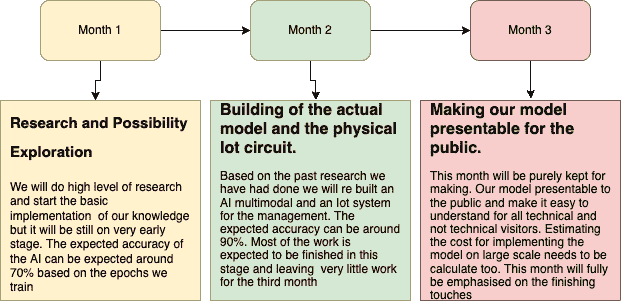

**UI/UX？**

好了，我那位了不起的朋友([https://twitter.com/ParthKalia_](https://twitter.com/ParthKalia_))告诉了我关于 streamlit 的事情，就像我知道它，但不知道你可以只用几行代码就做出这么好的用户界面。

我跳进了细流:

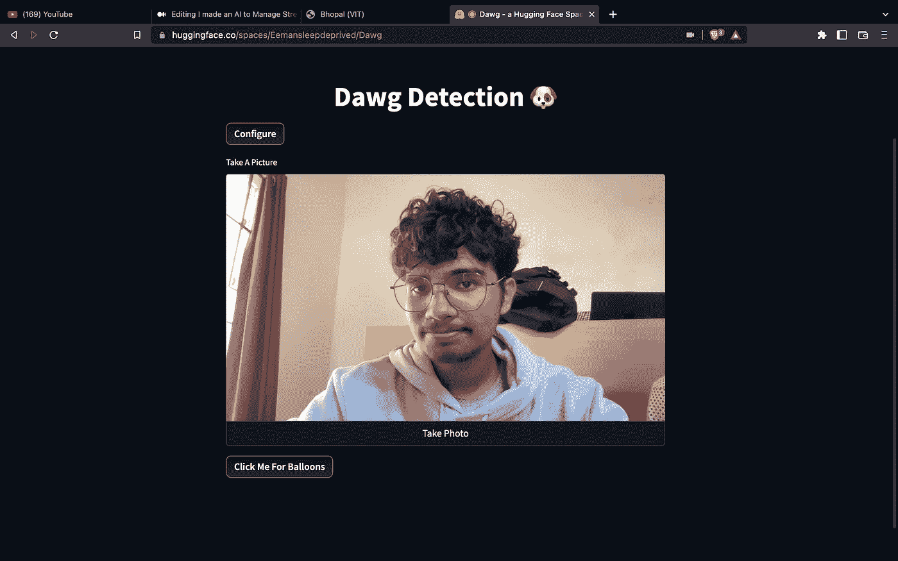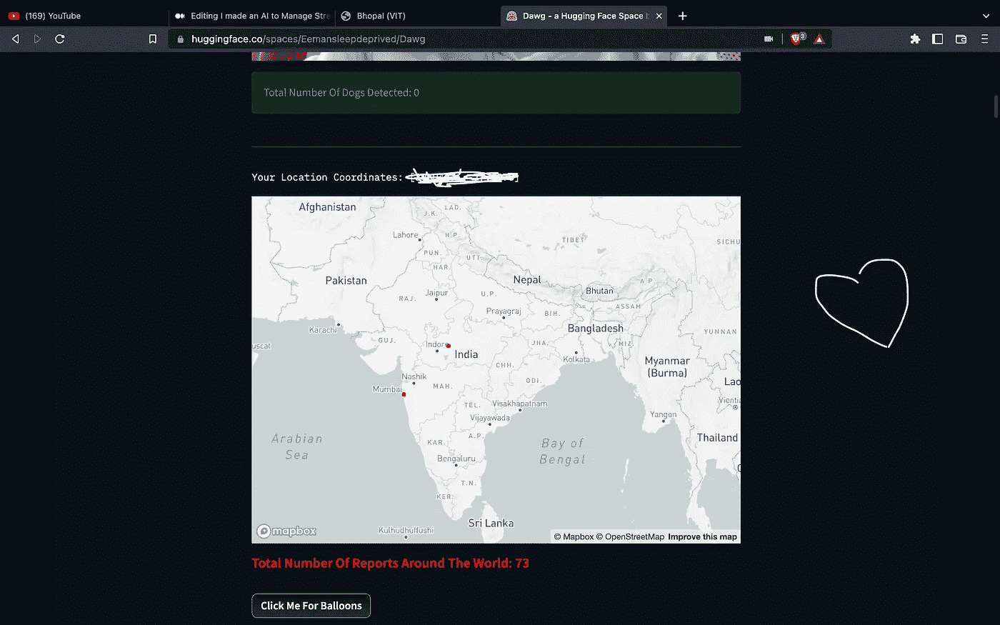

然后我们有了用户界面。

就像字面意思一样，这不到 20 行代码。

**它是如何工作的？**

看，我不能给你看这个项目的代码，因为这可以成为一个产品，但你仍然可以在我们的拥抱脸空间看到一部分代码。

但是让我们来看看这个应用程序的工作原理

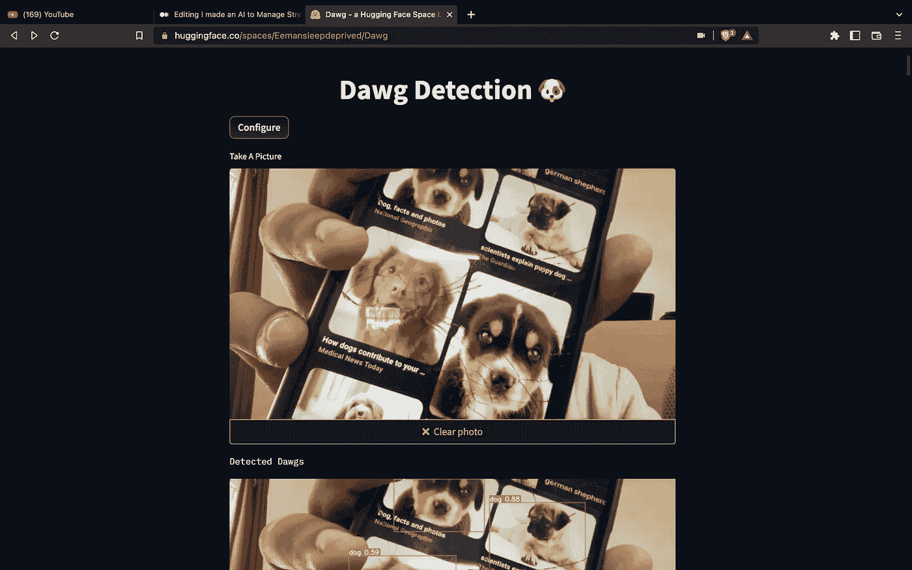

Click the photo

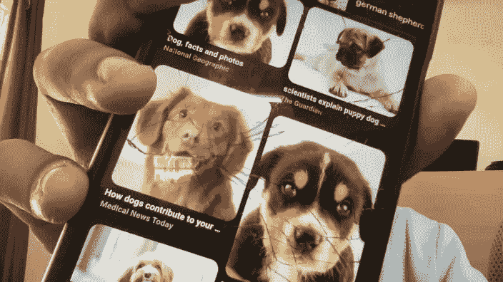

The photo will be then taken and yolo will be runned on it

然后 CNN 基本会把整个图像分割成方块，尝试找到狗的推断。如果它发现匹配狗的模式，它将在图像的这一部分制作计数器，并检测狗。

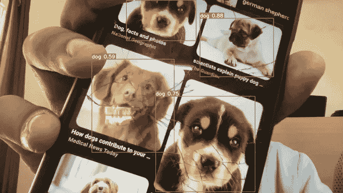

那么，现在我们要数狗了，我们应该怎么做呢？Yolo 基本上有一个功能，就是把所有检测到的东西，以精度保存在一个文本文件里。

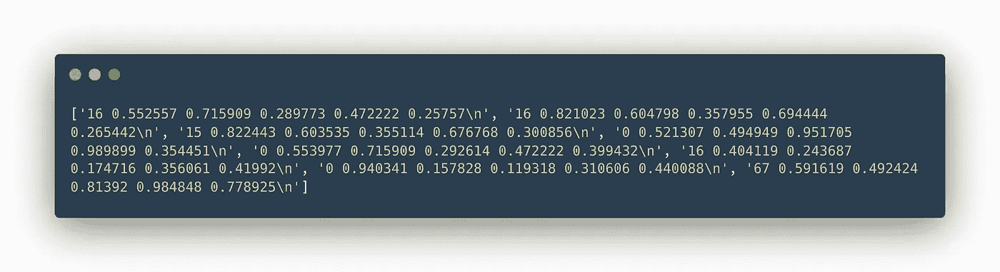

这是以列表格式生成的文本文件。在 yolo 中 16 代表狗。所以 16 开头的元素都是狗。

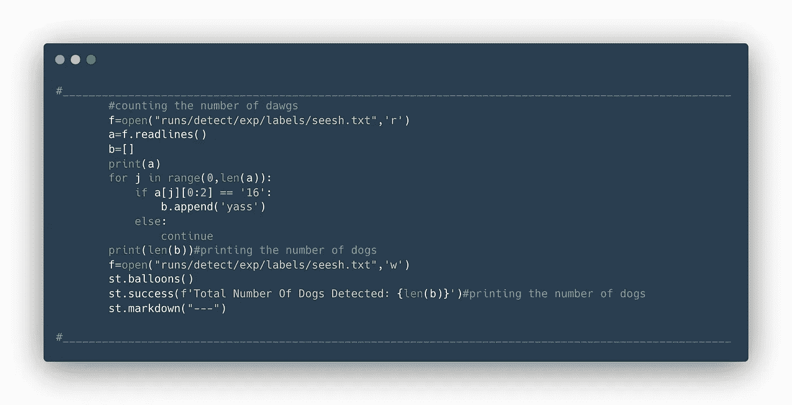

在那之后，我只计算前两个字母为 16 的元素，并计算它们。

并向用户显示狗的数量:

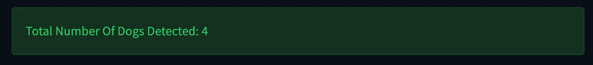

之后，我们得到用户使用 IP 地址的位置，并在地图上标出

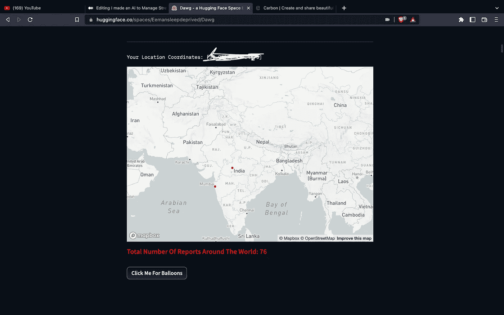

之后，我检查有多少报告，我从一个地区。如果报告的数量超过 50 条，我们将报告当局来收集这些狗。

这只是一个原型，随着时间的推移，功能将会增加。

如果你想试试自己，这里有个网页:

 [## dawg-Eemansleepdeprived 的拥抱脸空间

### 发现由社区制作的令人惊叹的 ML 应用程序

huggingface.co](https://huggingface.co/spaces/Eemansleepdeprived/Dawg) 

我的 Github 在这里:

 [## GitHub - Eeman1113/Neyus

github.com](https://github.com/Eeman1113/Neyus) 

关于我的每日 AIML 更新，请关注我的 twitter:

感谢阅读😁，下周见👋🏼