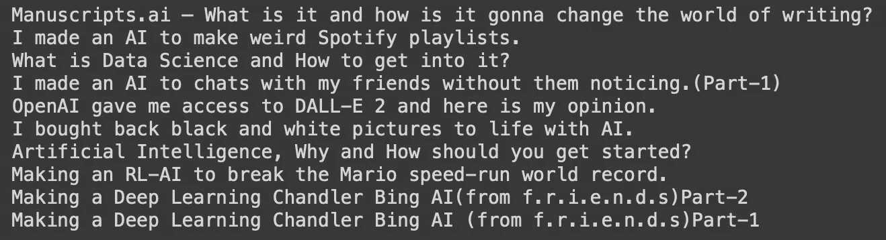
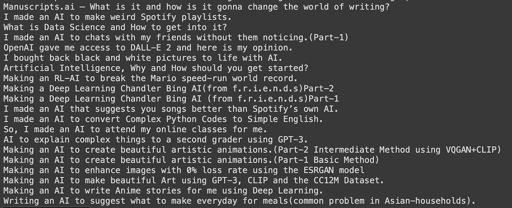
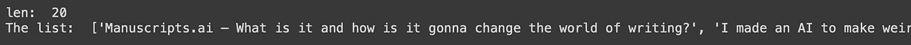
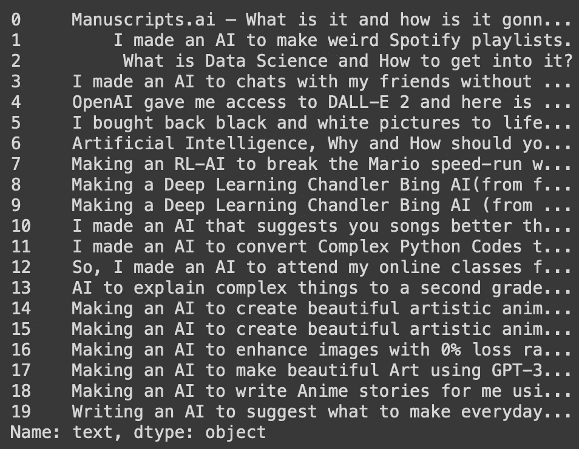

# 我做了一个人工智能来评价我的人工智能项目。

> 原文：<https://medium.com/geekculture/i-made-an-ai-to-rate-my-ai-projects-5e146d255d5c?source=collection_archive---------16----------------------->

DALL-E 2

所以，前几天我和我的朋友( [Parth](https://twitter.com/ParthKalia_) )聊天。我们正在头脑风暴，突然他有了一个想法，“你应该制作一个人工智能来排列你的人工智能项目”，于是我们就在这里了。

所以，基本上我不会给我的人工智能排名，而是给我的中等文章排名。因为排名代码很容易，当它只是为一些特定的问题，但当问题不是常数的可能性是无限的(字面上)，所以它将需要极大的计算能力和时间。

让我们开始吧:

所以，我决定使用网络抓取来获取我文章中的所有数据。让我们先做那件事。

让我们从进口开始:

让我们得到我们想要抓取的链接:

安装 chromium 及其驱动程序和 selenium:

让我们将选项设置为无头:

转到网站并获取结果:

设置驱动程序:

抓取一个类并取出它的文本:

The output

我的文章标题都刮成功了。

现在让我们获得标题的 herf 链接，以便我们的 AI 可以访问它:

现在让我们制造一个可以给文章打分的人工智能。

让我们首先将数据转换成数据帧:

打印数据:

现在让我们安装 textblob:

让我们在文章上运行人工智能，并对它们进行评级:

完成了！！！

让我们看看结果。啊，我兴奋极了:

基本上我的人工智能不喜欢我的文章。在一些 cases🥲🥲🥲🥲🥲🥲🥲.，它只给了我 0.0%

[**如果你喜欢这篇文章，请在 medium 上关注我。**](/@eeman.majumder)

代码如下:

 [## GitHub-eeman 1113/AI-对我的 AI-项目进行评级-](https://github.com/Eeman1113/AI-to-rate-my-AI-projects-) 

在 twitter 上关注我的每日 AIML 更新:

感谢阅读😁，下周见👋🏼