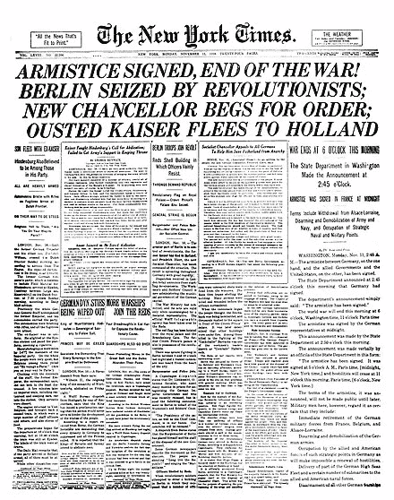
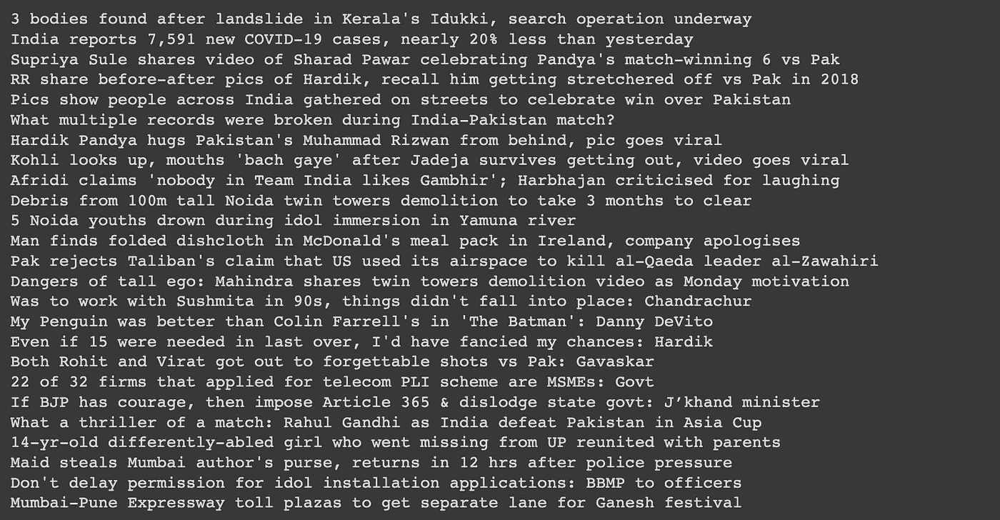
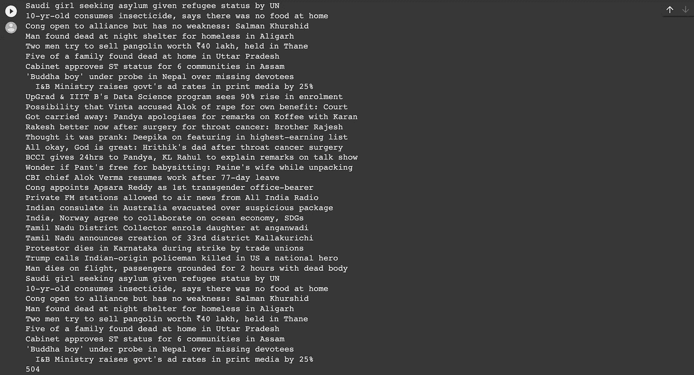
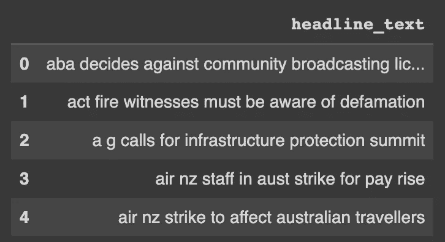
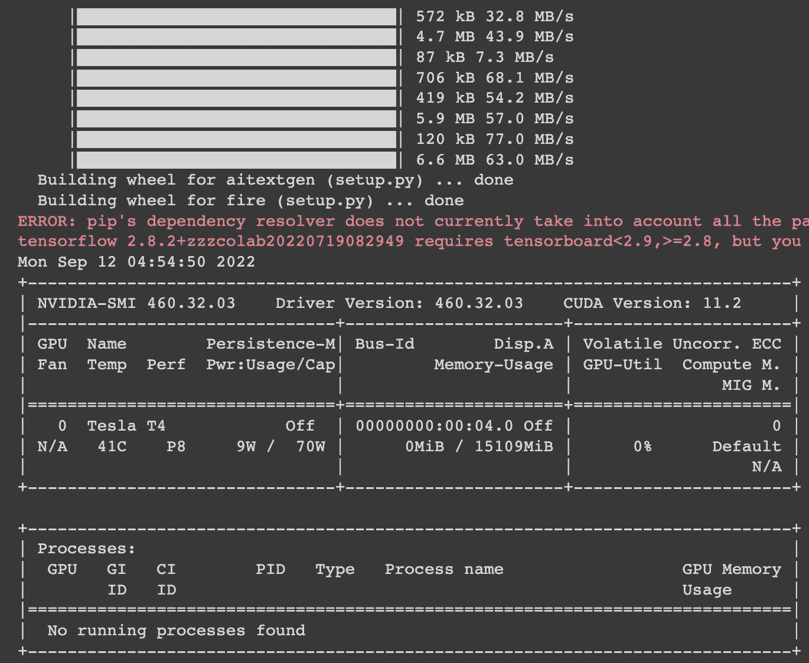
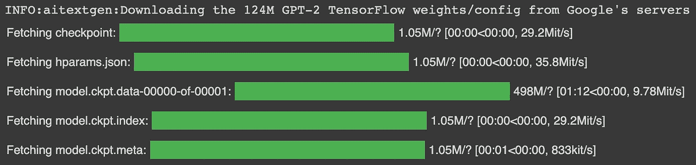
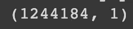
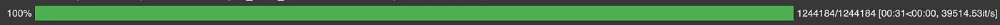

# 我创造了一个人工智能，从一个随机虚构的世界给你送报纸。(1/4)

> 原文：<https://medium.com/geekculture/i-made-an-ai-to-send-you-newspapers-from-a-randomly-made-up-world-1-4-71881711b28b?source=collection_archive---------2----------------------->

DALL-E 2

所以，很久以来我一直有这样的想法，“如果我做一份报纸，提供一些其他世界的新闻，会怎么样”。这就是我们今天在这里的原因。

首先让我们看看报纸到底需要什么？

[https://en.wikipedia.org/wiki/Newspaper](https://en.wikipedia.org/wiki/Newspaper)

## 它需要一个:

*   有力的标题
*   许多小文章
*   一个好名字
*   超棒的字体风格

在这一部分，我们来研究一下我称之为“标题生成器”的东西。这很简单，我想我将使用一个带有标题的数据集，并定制一个 GPT-2 模型。

## 让我们开始吧:

## 让我们制造一个人工智能来生成标题。

首先是进口:

让我们获取我用于数据集的新闻 url:

让我们制作一个打印标题功能:

让我们看看当前的世界头条:

因此，它获得了头条新闻，但不是所有的头条新闻，因为网站不会一次加载全部。要一次加载全部内容，让我们添加一个强制加载功能:

504 news headlines

让我们把编译好的。我的 gdrive 中的 csv 文件:

让我们读取 csv 文件并删除不需要的列:

## **现在让我们开始定制训练 GPT-2 模型:**

让我们获取 aitextgen 库:

建立张量流 GPT-2 1.24 亿参数模型；

添加数据集并使其适合训练:

准备数据集:

Size of the dataset is 1244184

保存清除的文本。csv:

安装我的 gdrive:

训练 GPT-2 模型；

It took about 31 minutes

将训练好的模型保存在我的驱动器中:

现在让我们使用模型并生成标题:

> **头条:**
> 
> 工党呼吁调查拙劣的抢劫
> 
> 工党称 abc 堪培拉医院是工党阻止伊拉克新总理的承诺
> 
> 工党将在新南威尔士州举行关键投票
> 
> ==========
> 
> **头条:**
> 
> 克莱夫·帕尔默参观乡村时光
> 
> 克莱夫·帕尔默将访问该国
> 
> clive palmer 参观 riverina cooper cronk councils，考虑纽卡斯尔 cbd =========
> 
> **头条:**
> 
> 警察逮捕袭击妇女的男子
> 
> 警方逮捕涉嫌不正当性行为的男子
> 
> 警察停止搜寻失踪少年警察请求帮助寻找失踪的警察寻求帮助寻找失踪的人警察寻求帮助
> 
> ==========
> 
> **头条:**
> 
> 采访大卫·兰恩
> 
> 采访乔纳森·瑟斯顿采访迈克尔·克林格
> 
> 采访迈克尔·克拉克
> 
> 采访特伦特·罗宾逊
> 
> 采访特伦特·罗宾逊
> 
> ==========
> 
> **头条:**美国宇航局启动火星任务
> 
> 美国宇航局飞往火星火星火星火星
> 
> 美国宇航局火星火星月球纽卡斯尔议员支持新台币政府削减资金纽卡斯尔警察部长纽曼说西北连接计划

这是一些轰动的头条新闻😁。让我们在下一部分制作一个文章生成器。

我休息了两周。谢谢你的等待。

有关代码，请点击此处:

 [## 人工智能从一个随机虚构的世界里给你送报纸。/Newspaper _ Headline _ generator . ipynb at main…

### 投稿至 eeman 1113/AI-to-send-you-news-from-a-random-made-up-world。通过在…上创建帐户进行开发

github.com](https://github.com/Eeman1113/AI-to-send-you-newspapers-from-a-randomly-made-up-world./blob/main/Newspaper_Headline_Generator.ipynb) 

请在 twitter 上关注我的每日 AIML 更新:

感谢阅读😁，下周见👋🏼