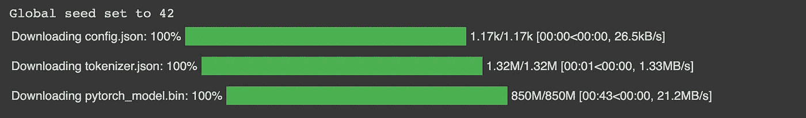
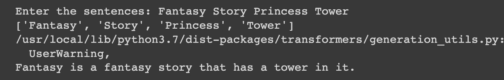
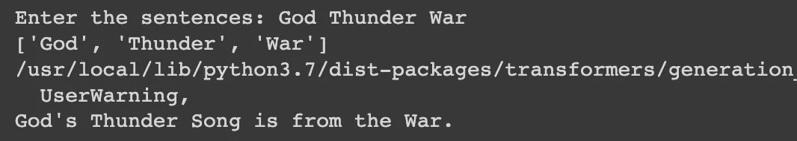
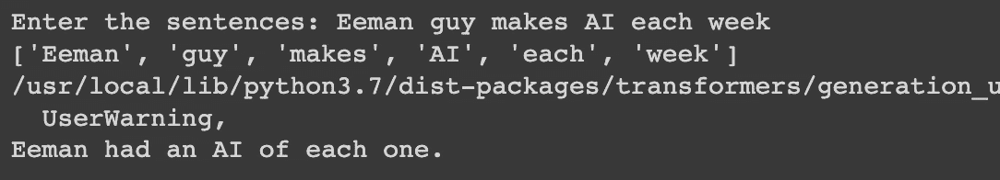

# 我做了一个深度学习的 AI，可以从单词生成句子。

> 原文：<https://medium.com/geekculture/i-made-an-deep-learning-ai-that-can-generate-sentences-from-words-aa656d2a8c7a?source=collection_archive---------9----------------------->

DALL-E 2

前几天我在看一本小说。我意识到每个句子中都有一个重要的关键词，于是我有了一个想法，看看我们是否可以只通过使用关键词来生成文本。

让我们开始安装:

让我们加载名为 k2t-base 的相关模型:

现在让我们微调模型并运行人工智能:

代码完成了。是的完成了。只有 8 行。

现在让我们看看一些输出:

输出很酷。

如果你喜欢这篇文章，请在 medium 上关注我。这对我帮助很大。

有关代码，请点击此处:

 [## AI _ to _ generate _ sentences _ from _ words/Keywords _ to _ text . ipynb at main…

### 为 eeman 1113/AI _ to _ generate _ sentences _ from _ words 开发做贡献

github.com](https://github.com/Eeman1113/AI_to_generate_sentences_from_words/blob/main/Keywords_to_text.ipynb) 

关于我的日常 AIML 学习，请在 twitter 上关注我:

感谢阅读😁，下周见👋🏼