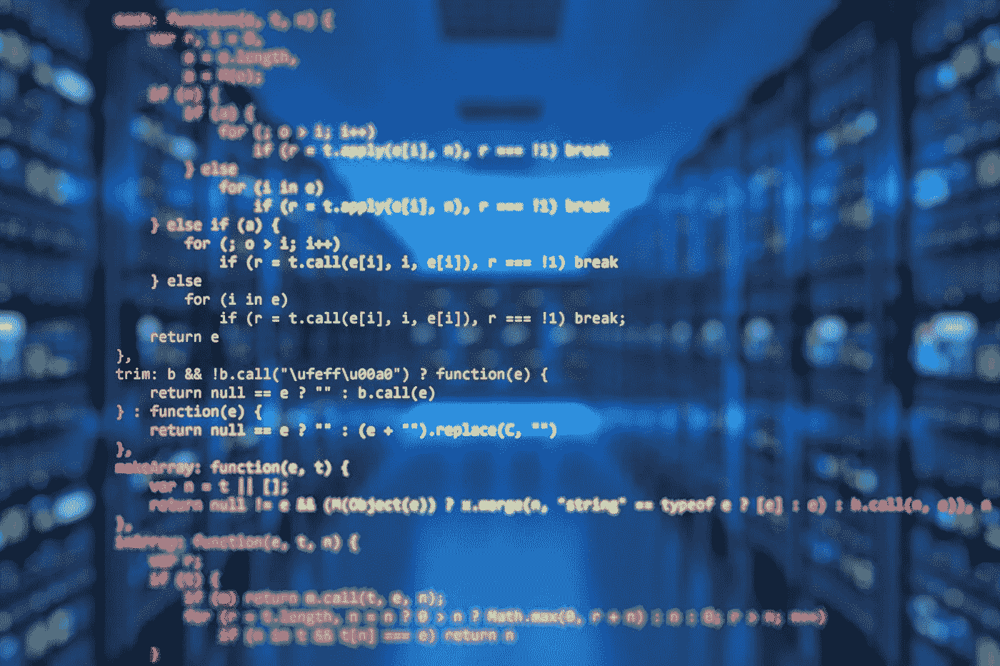

# 我用 Docker CMD 指令替换了 Supervisor

> 原文：<https://medium.com/geekculture/i-replaced-supervisor-with-the-docker-cmd-instruction-18b1d3b5ebd1?source=collection_archive---------6----------------------->

## 在 Docker 容器启动后自动启动 PHP chess 服务器

嘿，棋友们，这是关于构建 startupish 产品的新一集，这次重点放在 DevOps 方面。

你可能知道，到目前为止， [PHP 象棋服务器](https://github.com/chesslablab/chess-server)一直运行在自己的沙箱上…