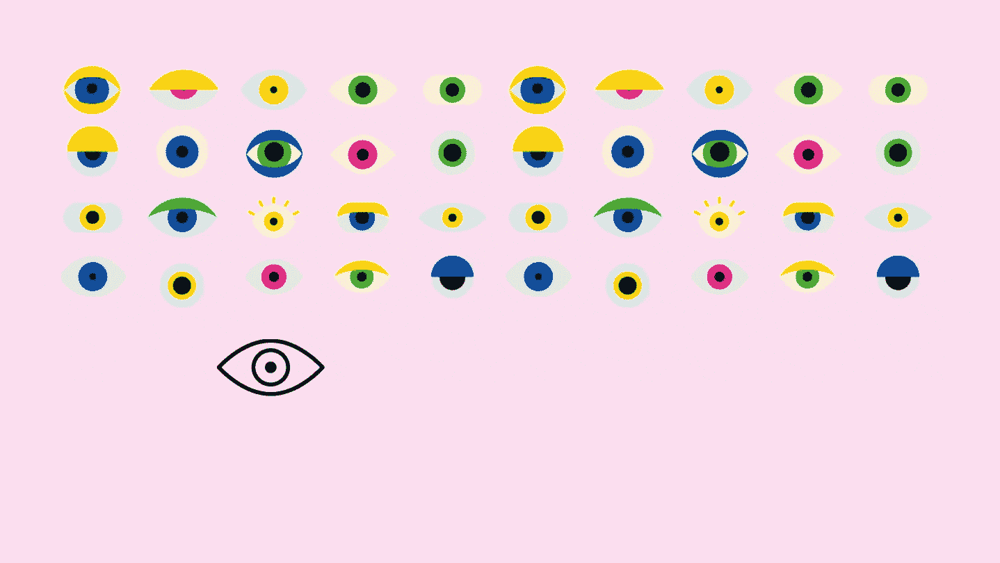

# 我说吧:盲人的眼睛和声音

> 原文：<https://medium.com/geekculture/i-say-ight-an-eye-voice-for-the-blind-5f696e274f9d?source=collection_archive---------16----------------------->

# 这是什么想法？

令人惊讶的是，世界上估计有超过 2 . 85 亿视力障碍者，大约相当于 T2 总人口的 20%。他们经常遭受并不断面临许多挑战，尤其是在独自航行时。他们主要依赖他人来满足基本的日常需求。因此，这是一项艰巨的任务，为他们提供技术解决方案是必要和迫切的。

考虑到上述问题，我们试图提出一个我们这边的解决方案，这是一个**集成机器学习系统。**它允许有视觉障碍的人**识别**并基于**实时**对常见的日常物体进行分类，此外，它还生成**语音引导反馈**并估计**距离，**给出人是否离物体太近或太远的警告。可以使用相同的思想来实现对象检测机制。

# 这个名字是怎么回事？

我知道这个名字**I-say-right**一开始可能会显得不可思议，但是让我来为你解释一下。我们将这个项目命名为 **i-say-ight** ，读作*视力(ai site)* 。在这个**“我”**字母表示*眼睛*，也就是说它给盲人带来视觉，单词**“说”**暗示着项目中使用的*语音*助手。这个项目基本上是为视障人士服务的。基本上就是*物体检测和自然语言处理的结合。*

# 后端会发生什么？

想知道这东西是怎么工作的吗？快，订阅我们，等下一个帖子。

