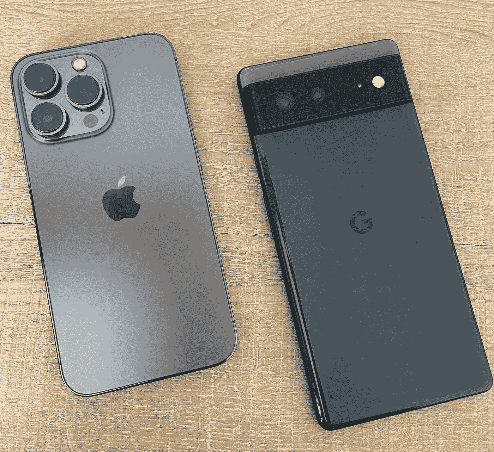
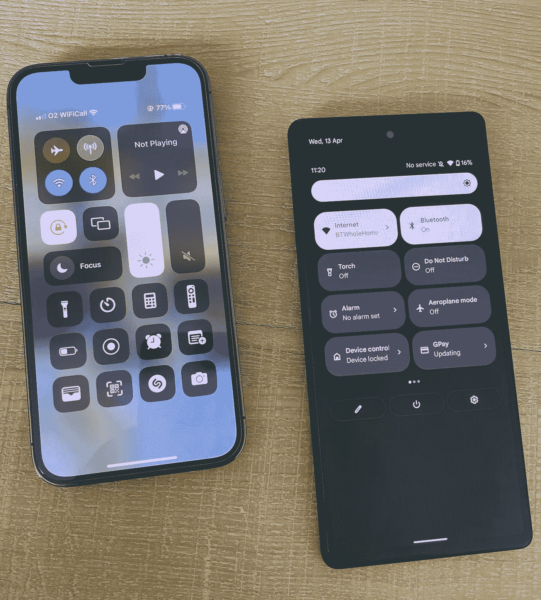
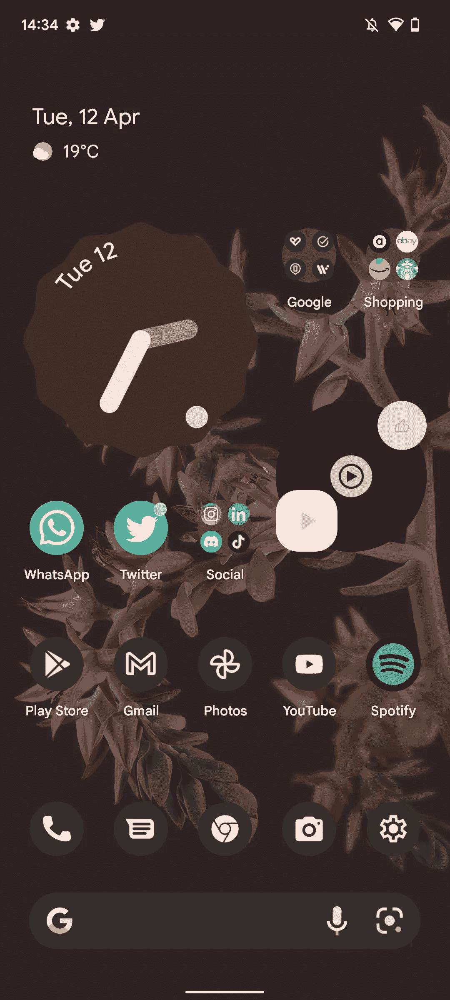
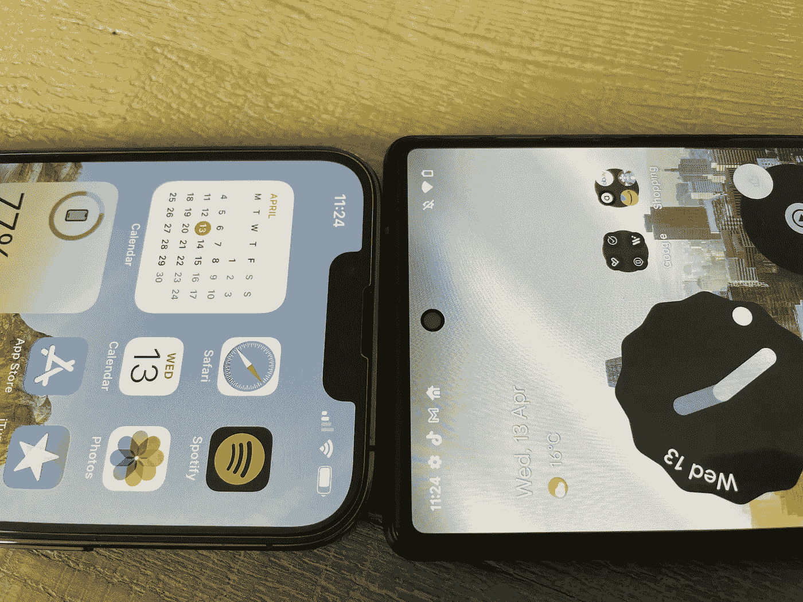
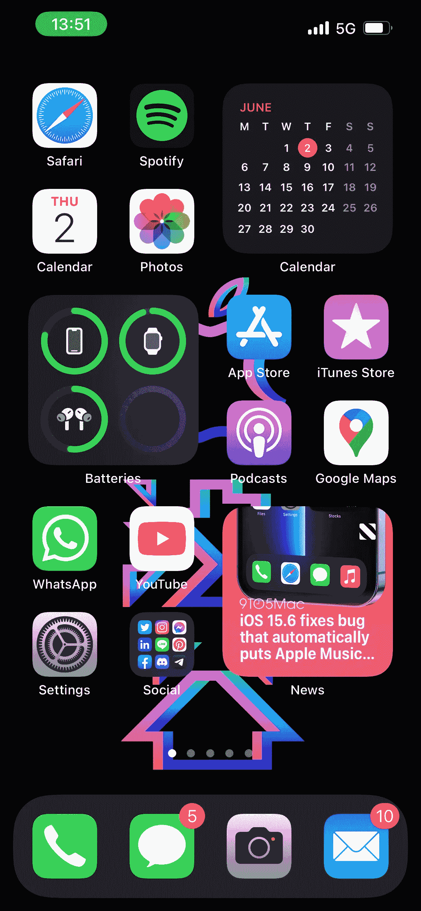
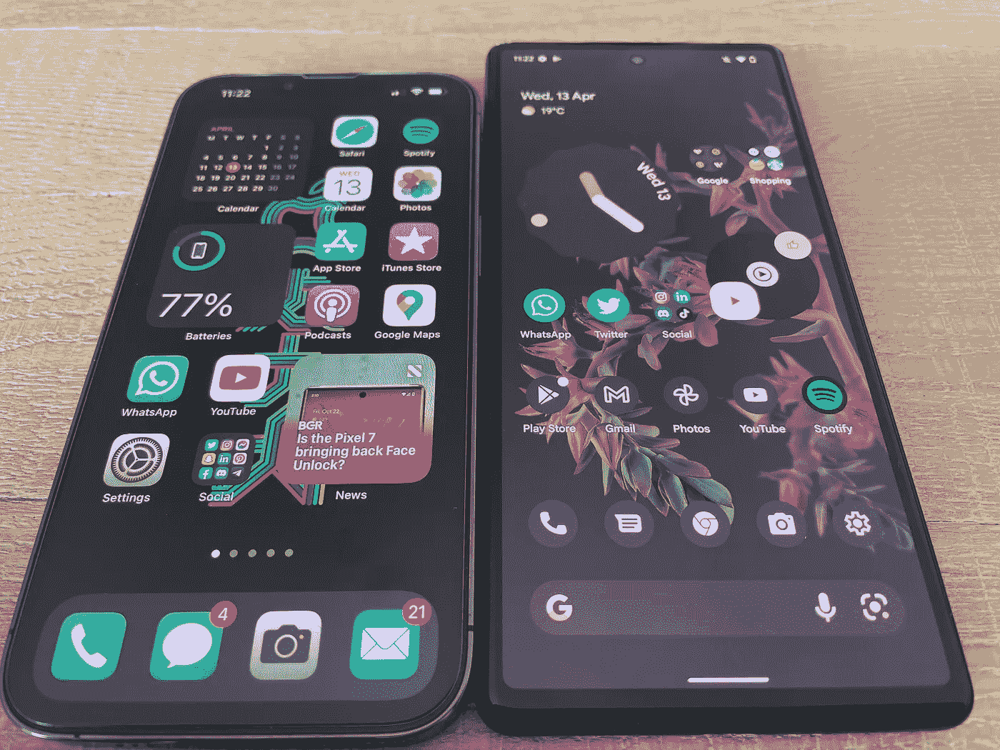
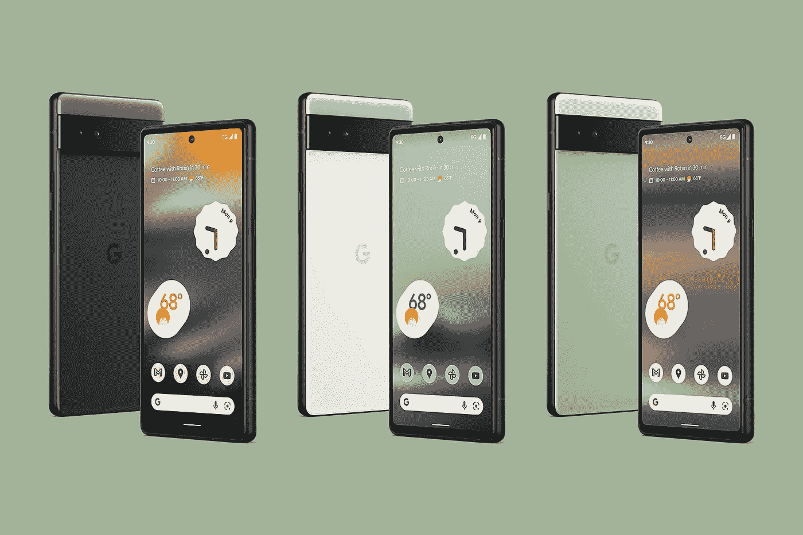
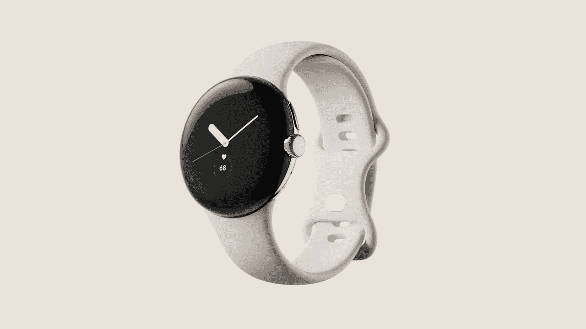

# 换了一个星期的 Pixel 6。

> 原文：<https://medium.com/geekculture/i-switched-to-a-pixel-6-for-a-week-17f234ae913a?source=collection_archive---------2----------------------->

来自一个 iPhone 13 Pro！

我最近想尝试最新的 Pixel 设备，因为我喜欢关注谷歌和苹果的最新和最棒的产品，这次我发现这种体验非常令人满意。

在我们开始之前，我必须澄清一点，我将 iOS 作为我的日常设备，但我曾使用过自最初的谷歌 Pixel 和 Nexus 设备以来的每一款设备，每次都是用于开发、测试或短期评估。因此，做出这一改变并不令人震惊，而 iPhone 13 Pro 的价格几乎是 Pixel 6 的两倍，所以这不是一个直接的比较，而是更多地从 iPhone Pro 用户的角度看另一面。

这也是一个我能不能把它作为我的日常设备使用，它能不能处理我现实生活中的日常使用的问题，但我希望这可能有助于你考虑改变，不管你的日常设备是什么。

在过去，我喜欢 Android 的某些领域，但对我来说，有些东西总是感觉有点粗糙，我指的是股票 Android 或 Pixel 体验。我也用过三星的一个用户界面，我真的不喜欢这种万能的设计和功能，但是我知道为什么很多人喜欢它。

由于对整个套餐不完全满意，我倾向于在晚些时候出售这些设备，但这次感觉谷歌实际上全力以赴进行了第六次尝试。张量芯片和独特的优质设计真的吸引了我，所以我终于有机会以 599 英镑的价格买到了风暴黑的 Pixel 6。

**Android 12 Home Screen UI**

所以我们现在都知道规格，所以我不会深入研究这些，但从一开始就很清楚，显示器不如 iPhone 13 Pro 的显示器明亮或清晰，它的刷新率为 90 赫兹，分辨率为 1080，而 iPhone 13 Pro 的刷新率为 120 赫兹，分辨率为 2532，然而，刷新率的差异对我来说不是很明显，但有超人视力的人可能不会同意。

我要说的是，与 iPhone 上的 6.1 英寸显示屏相比，我喜欢 Pixel 6 上更大的 6.4 英寸显示屏，这感觉像是最佳点，没有缺口，你真的会感觉更沉浸在内容中，与 Pixel 6 Pro 或 iPhone 13 Pro Max 相比，这感觉不像是一块砖头，两者都配备了更大的 6.7 英寸显示屏。

**Notch** vs **Hole**

它可能不适合每个人，但它是真正让我惊讶的主要东西，它的弯曲边缘也更舒适，我在日常使用中没有电池寿命问题。

最新每月更新的 Android 12 看起来和使用起来都非常可爱，感觉非常新鲜和独特，没有滞后，我喜欢整洁的小动画，独特的小工具设计和取决于你的壁纸的主题变化。然而，在 iPhone 上，自 2013 年发布 iOS 7 以来，iOS 并没有真正改变其设计，它开始让人感觉陈旧过时。

**iOS 15 Home Screen UI**

主摄像头和广角镜头都可以拍出很棒的照片，但我仍然更喜欢 iPhones 的照片，但我认为这真的取决于个人偏好，我不是专业摄影师，我只是一个傻瓜用户，不会乱动设置。

其他积极因素包括一个 USB-C 端口，反向无线充电和无缺口，所有好的功能和相当有用。谷歌张量芯片处理我扔给它的一切都没有滞后或口吃，包括显示指纹扫描仪从未让我失望，它感觉真的很好，与 Android 12 和令人印象深刻的第一部手机芯片。

Magic eraser 是照片应用程序中的一个功能，可以擦除破坏照片的东西，它实际上比我想象的要好得多，是 Pixel 6 上一个非常方便的功能。

现在是**底片**，前置摄像头不是很好，没有从 Pixel 5 升级，扬声器一般，不是我前面提到的非常亮的显示器，摄像头凸起对于两个镜头来说有点大，暴风雨般的黑色更像是深灰色的指纹磁铁。

但不管怎样，到周末，我发现自己惊喜地发现，尽管有负面影响，我还是非常喜欢这个像素和用户界面。这是一个令人耳目一新的变化，突出了 iOS 缺乏的一些主要领域，但也突出了我在 iOS 中错过的一些功能，如堆叠小部件和拖放。

总的来说，两个操作系统之间的差距很小，这真的只是什么更适合你的口味。

所以我会永久更换吗，可能不是现在，但那是因为我仍然更喜欢 iPhone 13 Pro 显示屏的质量，这对我来说是最大的决定因素，我也非常喜欢苹果生态系统，AirPods，Apple watch 等。然而，我不使用 iMessage，所以这不是一个问题，但一旦 Pixel Buds Pro 和 Pixel Watch 问世，Android 替代品将更难忽视。

不过对于大多数用户来说，我不认为缺少手表或 buds 是一个主要的决定因素，如果你来自 iPhone 12 或更老的型号，你会很高兴使用 Pixel 6。

Pixel 6 真的是一款神奇的设备，是对以前像素的巨大飞跃。

现在，对于那些预算较少的人来说，[谷歌最近在谷歌 IO](/geekculture/new-hardware-at-google-i-o-2022-8888f6e537b8) 上发布了 Pixel 6a 和 Pixel Watch，对于那些想在 7 月份发布 Pixel/Android waters 时测试它的人来说，Pixel 6a 可能是一个很好的切入点。它仍然使用 Tensor 芯片和 Pixel 6 上的相同设计，但使用了旧相机和 60hz 高清显示屏。

**Google** **Pixel** **6a**

虽然 Pixel 手表最终将为谷歌 Pixel 用户提供完整的生态系统体验，但我**对 Fitbit 如何集成到手表中以及今年秋天与 Pixel 7 系列一起发布时它将配备什么传感器非常感兴趣。**

**Google** **Pixel** **Watch**

我希望这对那些犹豫是否要换成 Pixel 的人有所帮助，我还建议看看 youtube 上的一些视频，亲自体验一下，因为这至少值得一看。