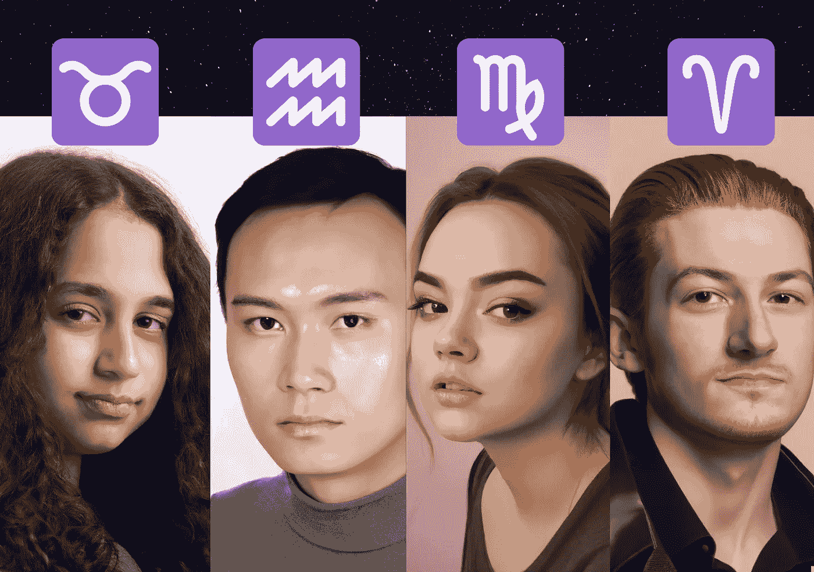

# 人工智能将十二生肖变成真人

> 原文：<https://medium.com/geekculture/i-used-ai-to-transform-zodiac-signs-into-real-people-7844a250cbf4?source=collection_archive---------3----------------------->

Image by [Jim Clyde Monge](https://medium.com/u/819323b399ac?source=post_page-----7844a250cbf4--------------------------------)

最近几个月，人工智能图像生成器是一个热门的新趋势，在互联网上掀起了风暴。这些生成器使用复杂的机器学习算法来创建逼真的人物肖像，使用起来非常有趣。

今天，我将使用 OpenAI 的一个名为 Dall-E2 的工具，根据人们的生肖特征来生成他们的肖像。