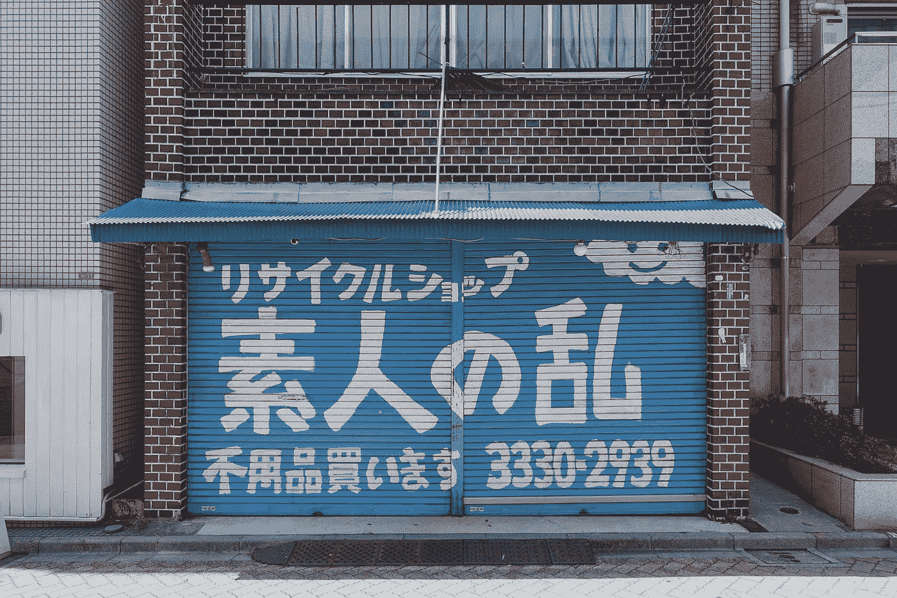

# 我从事本地化工作。公司没有正确翻译。

> 原文：<https://medium.com/geekculture/i-work-in-localization-companies-arent-translating-correctly-68b8100f7f3b?source=collection_archive---------10----------------------->

## 机器翻译被高估了

Photo by [YUXUAN WANG](https://unsplash.com/@wangyuxuan?utm_source=unsplash&utm_medium=referral&utm_content=creditCopyText) on [Unsplash](https://unsplash.com/?utm_source=unsplash&utm_medium=referral&utm_content=creditCopyText)

谷歌翻译已经变得越来越好，但认为一些公司将创造完美的机器翻译充其量是田园诗般的。最坏的情况也很荒谬。

我在一家本地化公司工作了三年，现在一直在帮助一个老客户做自由职业项目…