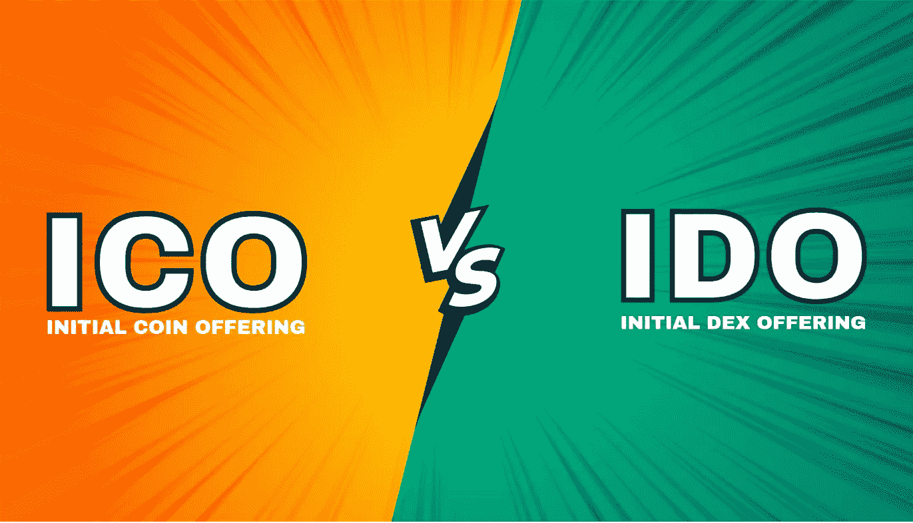

# ICO 开发和 IDO 开发|哪个好？

> 原文：<https://medium.com/geekculture/ico-development-or-ido-development-which-is-better-5d42adddcf0?source=collection_archive---------12----------------------->

在区块链和加密货币领域，数字爱好者总是对寻找全新的方法感兴趣，在这些方法中，他们可以从数字领域获得帮助，以获得为他们的企业筹集资金和升级他们的数字项目的新来源。这些加密项目所有者正在寻找最佳方式来帮助他们的业务，并根据财务解决方案和模型来解决挑战。要想得到 crypto space 的全力支持来筹款，就要知道选择哪种筹款模式；[**ICO**T3](https://www.blockchainappfactory.com/ico-development?utm_source=21%2F3%2F22+-+Nerd+for+tech&utm_medium=Medium&utm_campaign=senpagapandian)[或 **IDO**](https://www.blockchainappfactory.com/initial-dex-offering-service?utm_source=21%2F3%2F22+-+Nerd+for+tech&utm_medium=Medium&utm_campaign=senpagapandian) 。

这些帮助数字业务的新方法在分散金融领域达到了新的高度。这是因为这一领域在短时间内有了惊人的增长。这一领域的非凡提升与有效的成本效率和消除该领域的第三方密切相关。

**IDO 开发**

IDO 或 Initial Dex Offering 是一个象征性的众筹平台，发生在分散的交易所平台，而不是其他集中的筹款领域。过去，IDO 的开发是建立在以太坊区块链上的，现在它足够灵活，可以在广泛的区块链技术上进行开发。借助[**I do development**](https://www.blockchainappfactory.com/initial-dex-offering-service?utm_source=21%2F3%2F22+-+Nerd+for+tech&utm_medium=Medium&utm_campaign=senpagapandian)，任何商业项目都可以在分散交易所推出其代币，感兴趣的投资者访问该平台，帮助项目筹集资金。

过去，分散式交易所产品已经迈出了新的一步。然而，目前，基于加密货币的产品的当前版本与过去不同。现在，它与过去完全不同，每一个功劳都归于 IDO 开发，因为它接管了 IEO 平台，并为商业实体创造了一些特殊的东西。因此，对于商业平台来说，在短时间内适应并提升其收入到一个很高的水平已经成为一个非常有趣的模式。

IDO development 为 crypto 项目提供即时流动性、快速交易、公开公平的筹资机会。有了以前的筹资机制，投资者对此并不十分满意。这样做的主要原因是，某些代币在平台上出现时就会被出售，普通投资者没有机会投资该业务并获得代币奖励。大多数情况下，内部人员和机器人会拾取它们，而可用的令牌数量不足。因此，为了消除这些限制并向投资者提供最佳体验，引入了 IDO 开发。

**ICO 开发**

初始硬币发行是在 DeFi 系统的初始时期引入数字空间的第一个筹资模式。这种筹资模式包括在他们自己的网站或各种上市网站上为投资者推出代币。业务模型会将一些本地令牌作为 ico 发布到平台。这些 ico 是以不受监管的方式提供给投资者的。通过获得 ico，投资者可以在未来交易它们，或者在加密交易中持有它们以获得更高的利润率。因此， [**ICO 开发**](https://www.blockchainappfactory.com/ico-development?utm_source=21%2F3%2F22+-+Nerd+for+tech&utm_medium=Medium&utm_campaign=senpagapandian) 过去主要由业务平台使用。目前，它已被各种各样的筹资模式所取代。

**ICO Vs IDO，哪个对商家更好？**

ICO 和 IDO 的概念几乎彼此相似，有相当多的相似之处需要指出。最重要的因素是向数字社区提供有关产品的可靠知识。通过这种方式，社区将了解有关产品的详细信息，并能够进入平台开始投资代币。

这些产品具有广泛的有利因素，如为项目提供营销能力，而不必面对任何复杂情况，并且平台的稳定性非常好，最吸引人的因素是令牌在市场销售后立即在分散平台上列出。

IDO 开发和 ICO 开发现在是业务平台基于需求使用的趋势产品。但是，IDO 是一个更好的提供想法，因为 IDO 开发因平台的真实性和成本效益而广为人知，因为他们不收取上市费。因为它们是在分散的流动性交易所推出的。因此非常适合投资者，因为它能够提供即时的流动性，而不考虑市场价值。

**筹款营销**

数字空间中有各种各样的筹款模式。最首选 IDO 和 ICO。商业模式可能使用数字空间中最好和最合适的筹资模式，但如果没有适当的营销战略，很难吸引投资者。因此，传播发行代币的消息与筹集资金的过程同样重要。为了在这个领域出类拔萃，聘请一家加密营销公司来做这项工作是非常有效的。一个营销公司将拥有广泛的营销能力，他们可以在瞬间提供最好的服务。此外，结果也会在很短的时间内显示出来。

**最后的想法，**

从各方面考虑，IDO 开发非常适合投资者和企业所有者。但是，决定权完全掌握在企业主手中。企业必须决定他们想要遵循什么类型的筹资机制。尽管企业主在推出他们的产品时采取了各种预防措施，但 IDO 开发是一种更有效的方法，它被认为能为双方带来广泛的利益和回报。