# 理想谐振器与实际谐振器

> 原文：<https://medium.com/geekculture/ideal-vs-practical-resonators-ee819419114f?source=collection_archive---------26----------------------->

谐振电路是一种既包含电感又包含电容的电路，因此同时包含感性电抗和容性电抗。其目的是产生一个反射零点，以确保特定频率下信号的最大传输。在此频率下，谐振电路的阻抗最低，信号吞吐量更高。谐振电路一般如下图所示:

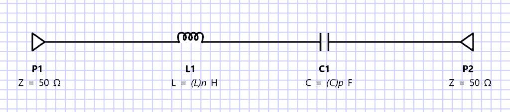

对于任何此类电路，都有一个特定的频率，在该频率下电感和电容电抗相同，即

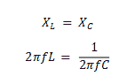

其中，f =频率，单位为赫兹(Hz)，L =电感，单位为亨利(H)，C =电容，单位为法拉(F)，π = 3.1416。

如果我们要求解 f，只取正根，我们可以从公式中找到电感和电容任意组合的谐振频率

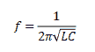

对于兆赫( *MHz* 或千兆赫( *GHz* )范围内的大多数高频无线电或微波，电感(L)和电容的单位分别为微亨利或纳亨利( *μH 或 nH* )和皮法(pF)。

假设我们想要创建一个 50 MHz 的**谐振电路，如果电感为 1 *μ* H，那么我们可以使用以下公式计算 pF 中的电容**

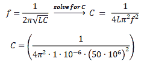

因此，

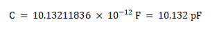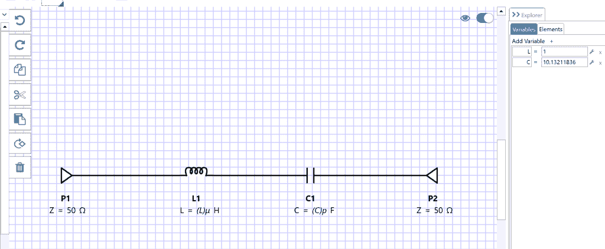

使用这些值将产生如下所示的结果。请注意，50MHz 处的反射零点几乎没有回波损耗。

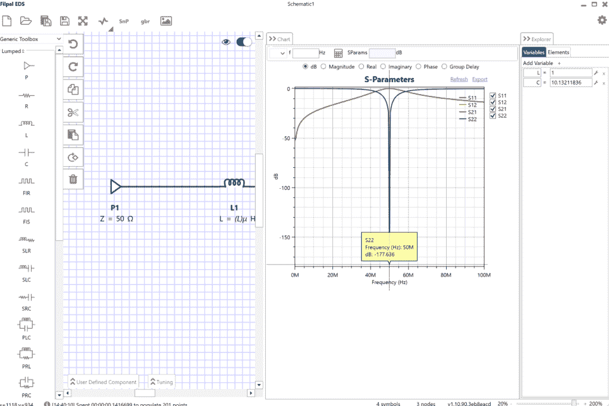

根据公式，增加电容值或电感值会使谐振频率降低。我们通过使 C = 20 pF 来实现这一点。

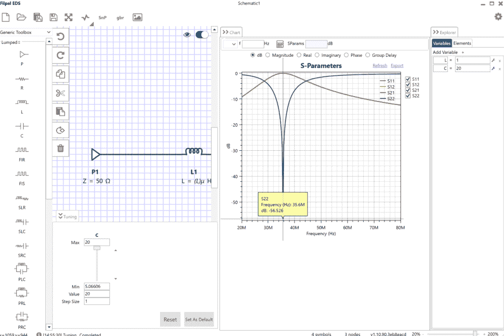

在文章的开头，记得我们提到过，在谐振频率下，电路的阻抗最低。通过增加一个串联电阻，请注意它是如何导致反射零点处的性能最差的，因为增加了损耗，这在所有实际情况下通常都是如此。

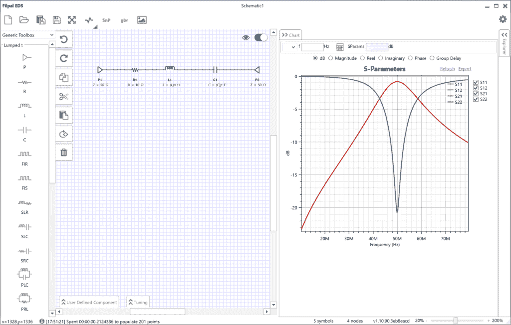

现在让我们转到 Z 参数图。在这个图中，我们将通过端接另一个端口使它成为一个单端口网络，因为我们只对输入阻抗感兴趣。

转到 Z 坐标图。50 MHz 时，输入阻抗的虚部为零(谐振)，低于谐振时为正，即电感，高于谐振时为负，即电容。50 MHz 的谐振频率是感抗和容抗相等并相互抵消的频率。

这种情况发生在电感中，它是一个并联谐振电路，导致非常高的实际阻抗，如下所示。这不应与双端口原理图的阻抗相混淆。谐振频率下，原理图的阻抗最低，吞吐量最大，Z 参数响应表示电感的反射阻抗。由于 Z11 处的阻抗较高，这就转化为“高阻塞”,防止信号反射回信号源，从而确保信号得以传输。

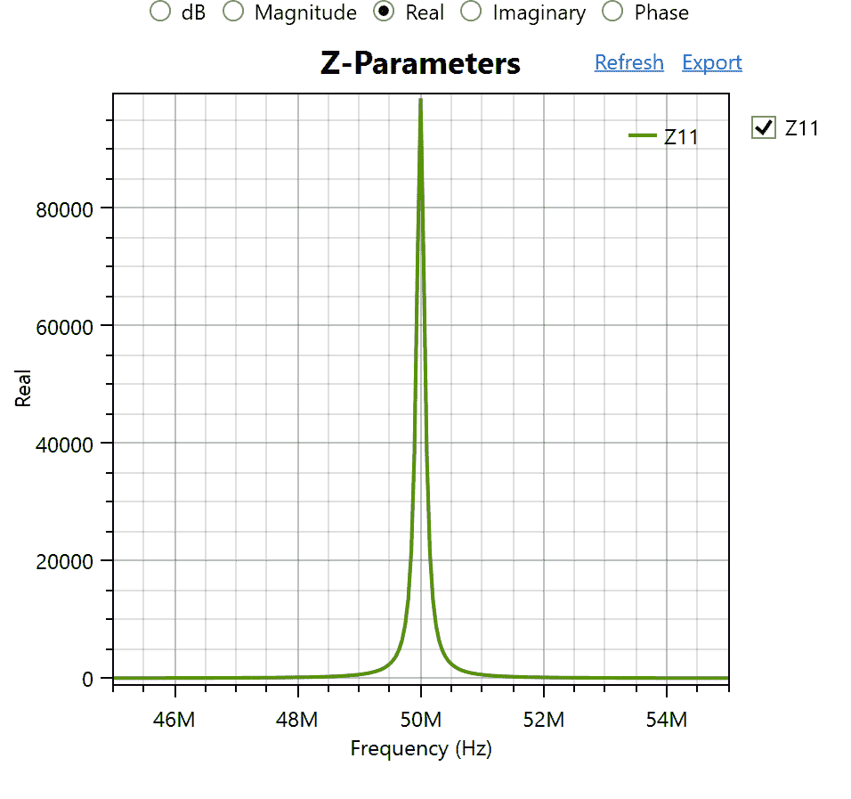

那么，我们如何在电阻、电感和电容等电子元件中利用这一谐振概念呢？
让我们来看看电感器

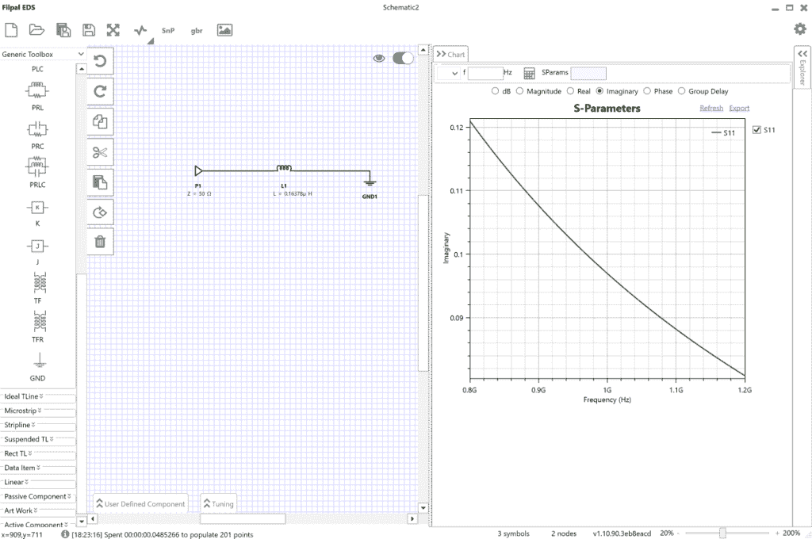

该图显示虚部为正，因为电感为

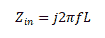

因此

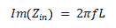

在所有频率上。让我们尝试扩展范围，您可以看到，对于理想电感，虚部始终为正。

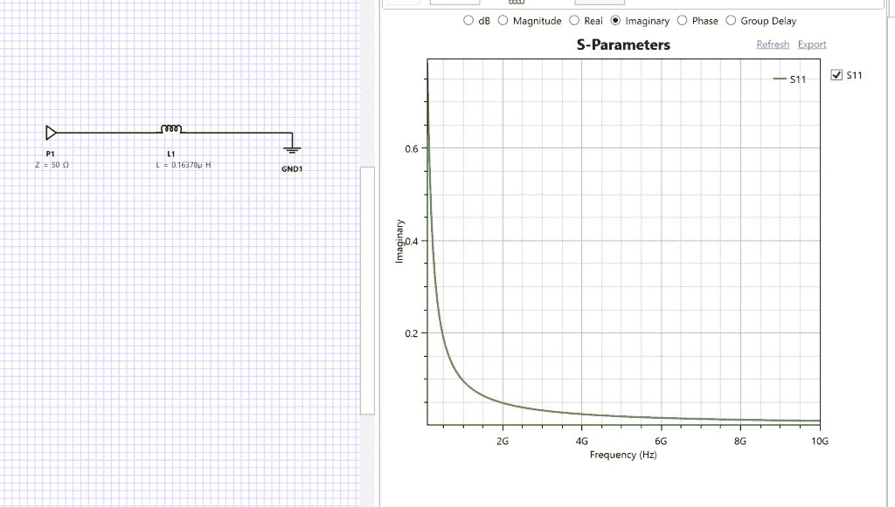

值得注意的是，真正的电感，你从市场上买的，不是一个理想的组件或纯电感。这是一个包含寄生电容和电阻的网络，可能来自制造商的封装方式或我们在电路中的焊接方式。简单的 RLC 网络可以代表如下所示的电感:

电阻代表电感的阻抗(现实世界中的每个元件都有一个很小的电阻值)。并联电容代表电感元件的寄生电容。应该注意的是，根据 Z 参数图，可以看到真实电感的谐振频率称为“自谐振频率”或“SRF ”,高于该频率时，它变为负值，这是一个电容。当电感和电容阻抗相互抵消时，谐振频率或 SRF 保持为纯实数，从 Z 参数图可以看出，虚数变为零。我们还可以使用 EDS 软件观察相位图，该图显示正相位低于 SRF，负相位高于 SRF，零相位为 SRF。

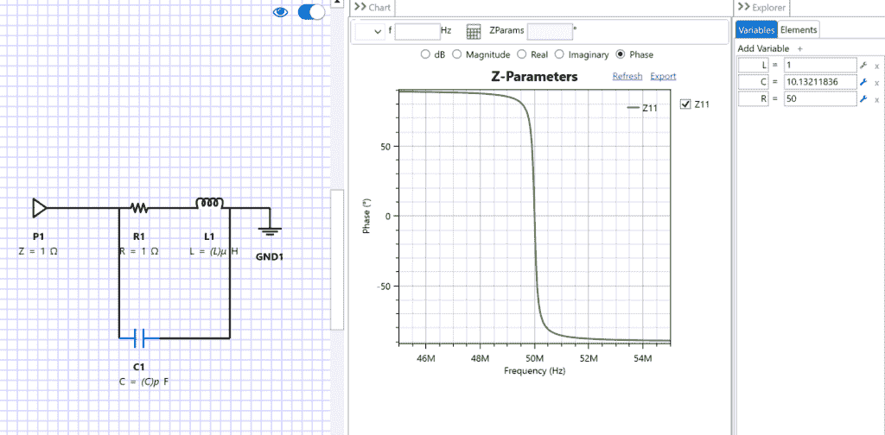

S 参数图可以非常清楚地显示 SRF 处于 50 MHz，此时传输系数为零(S12 或 S21，单位 dB 为无穷大)，这与具有非常高阻抗 Z11 的 Z 参数图相符。根据 EDS 软件图，我们可以得出结论:电感的 SRF 是并联谐振频率；而不是串联谐振频率。

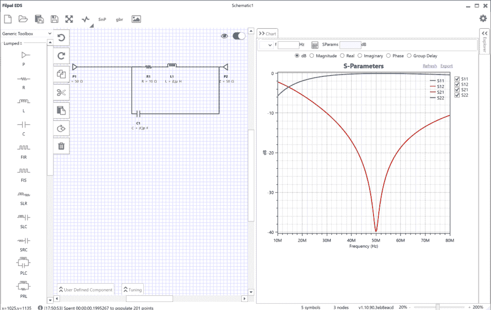

这个概念在设计滤波器或任何微波电路时非常重要，尤其是在使用集总元件来实现它们时。因为我们合成的器件及其值是理想情况，而我们可以从商店购买或用来构建器件的器件是实际元件，具有寄生效应及其干扰。因此，作为设计人员，我们需要确保如果这是我们设计的电感，它应该真正表现为电感，因为在 SRF 之后，电感实际上变成了电容，所以你最终得到的是电容而不是电感！

感谢所有制造商，他们通常会在元件本身的数据手册中指定。这就是为什么在我们开始将它作为产品或原型来构建之前，我们需要在我们的设计中包括或至少考虑所有这些，否则你会对最终得到的东西感到惊讶。在交付正确的产品规格方面，这可以节省时间、金钱和您的声誉。

*原载于 2021 年 4 月 4 日*[*【http://filpal.wordpress.com】*](https://filpal.wordpress.com/2021/04/04/ideal-vs-practical-resonators/)*。*