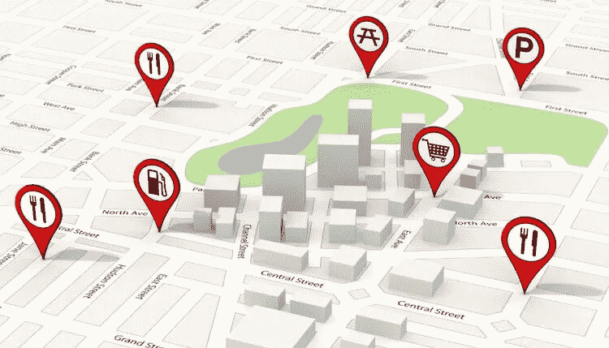
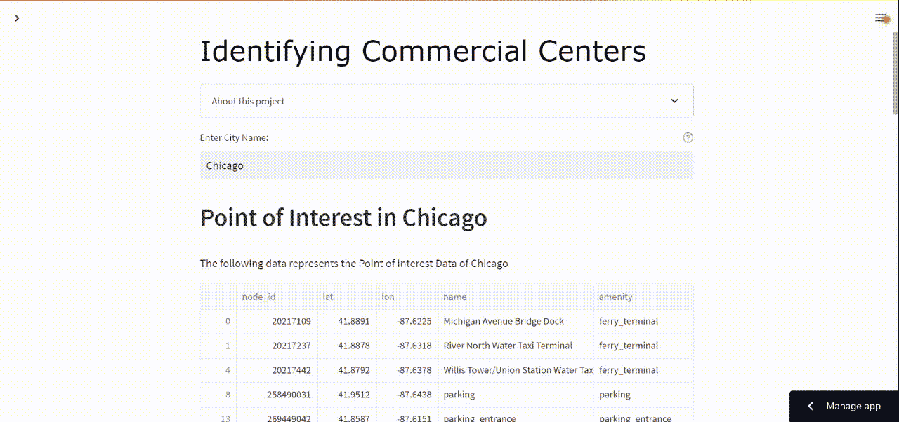
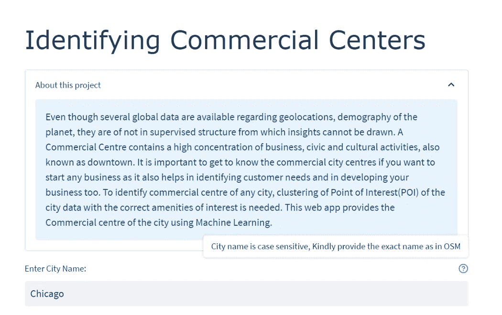
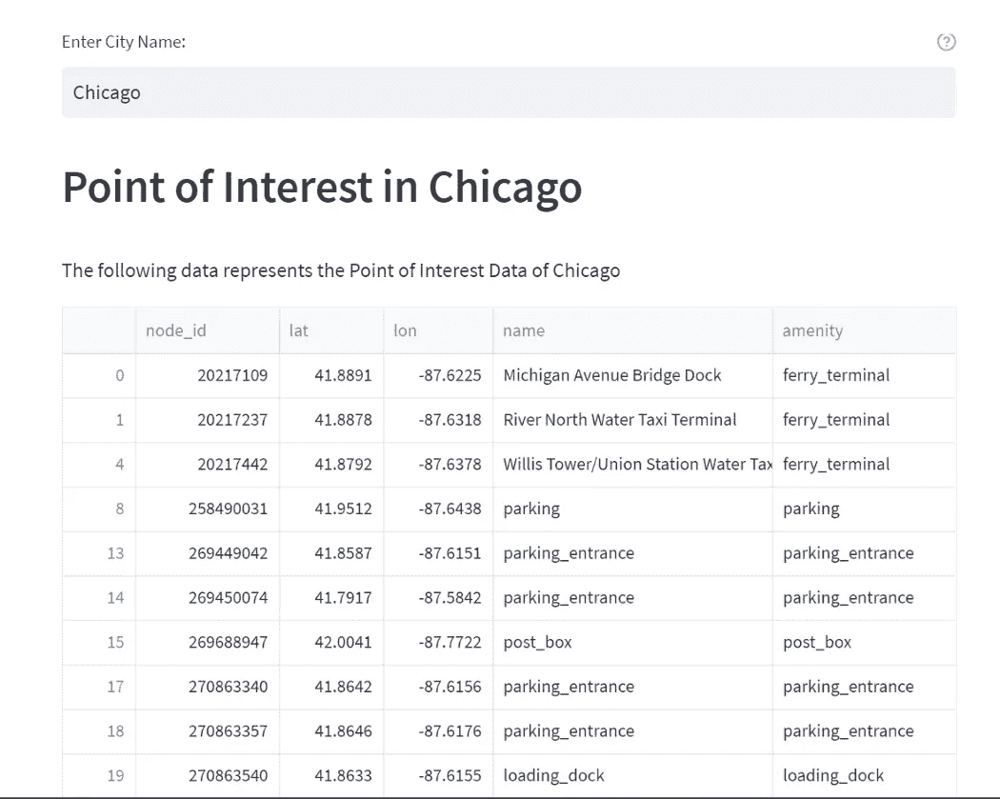

# 使用机器学习识别商业中心

> 原文：<https://medium.com/geekculture/identifying-commercial-centers-using-machine-learning-1fe0d48a1bda?source=collection_archive---------7----------------------->

## 从使用 ML 识别商业中心到将其部署为 Streamlit 应用程序的快速演练。



Point of Interest image by Alexsl [Source:[istock](https://www.istockphoto.com/photo/point-of-interest-on-map-gm180703370-24135518?irgwc=1&cid=IS&utm_medium=affiliate_SP&utm_source=FreeImages&clickid=yOLWXQ1fpxyNUc2Q6pVN32EHUkDS2VRoO3JgxM0&utm_campaign=adp_premphotos_download-button&utm_content=270501&irpid=246195)]

商业中心是商业、市政和文化活动高度集中的地方，也称为市中心。如果你想创业，了解商业城市中心是必不可少的，因为这也有助于确定客户需求和发展你的业务。要识别任何城市的商业中心，需要对城市数据的兴趣点(POI)进行聚类，并提供正确的兴趣点。兴趣点通常是一个人发现有用的任何地方，通常由纬度和经度以及一些属性来指示，例如区域的名称和它所属的类别。在本文中，利用一个城市的 POI 数据，我们将使用机器学习来识别商业中心。

机器学习(ML)也处理数据点的聚类，以找到洞察力。无监督的机器学习算法通常用于这种地理空间分析，以识别商业中心。Scikit-learn ，一个用于 ML 的 python 库包含了针对这种无监督学习问题的聚类算法。

我们将使用 python 库*over py*-查询来自 OSM 的数据，*叶子*绘制地图和集群， *Scikit-learn* 实现 ML 算法，以及其他一些基本库，如 *NumPy、*和 *Pandas* 用于我们的项目。

地理信息系统(GIS)提供任何城市的空间数据，一些流行的 [GIS 提供商](https://gisgeography.com/best-free-gis-data-sources-raster-vector/)包括开放街道地图(OSM)、自然地球数据、开放地形等。

使用 python 包 [Overpy](https://pypi.org/project/overpy/) ，可以从 OpenStreetMap(OSM)查询一个城市的空间数据。

Overpy 使用 Python 包装器访问 OpenStreetMap(OSM)的立交桥 API 来获取城市的 POI。Overpy 返回一个节点列表以及 node_id、lat、long 和 POI 的其他细节，同时还返回特定节点的 JSON 标记。

Python 提供了各种用于空间数据可视化的包，其中一个就是 folium。T2 是一个帮助绘制交互式地理空间地图的 fleet . js python 包装器。它还提供了各种基础地图，并允许人们在地图上轻松绘制多边形，这将有助于我们在地图上显示任何城市的商业中心集群。在本文中，我们将使用 [Streamlit](https://streamlit.io/) 构建一个简单的 web 应用程序，这是一个开源的 python 应用程序框架，其中从用户处获取一个城市，其数据从开放的街道地图(OSM)中获取，在预处理数据后，离群值被删除，聚类被绘制在地图上。除了确定商业中心之外，它还形成了城市中前 5 名设施的集群。

为了去除异常值，我们使用基于密度的带噪声应用空间聚类( [DBSCAN](https://scikit-learn.org/stable/modules/generated/dbscan-function.html?highlight=dbscan#sklearn.cluster.dbscan) )算法。对于聚类部分，我们在生成的数据帧上尝试了各种算法，比如 KMeans、KMeans++、K Medoids、OPTICS 和 DBSCAN，选择了最好的算法对坐标进行聚类。



GIF Source: Author

你可以在这里找到这个项目的源代码: [GitHub](https://github.com/Sowmyad15/Identifying-Commercial-Centers-Using-Machine-Learning)

以下是该项目的分步纲要:

1.  从 OSM 获取城市详细信息
2.  使用 DBSCAN 移除异常值
3.  使用 KMeans++的集群
4.  叶子图中的绘图簇
5.  对娱乐设施进行分组，并对前 5 项娱乐设施进行分组

该项目包括 5 个不同的模块:

> ***app.py*** *-由 Streamlit UI 和对 cluster_model.py 的函数调用组成，用于识别商业中心。*
> 
> ***cluster _ model . py-****具有获取城市细节、去除离群点、形成聚类和在地图中绘图的功能。它具有在地图上对各种设施、集群和地块进行分组的功能。*
> 
> ***config . py-****包含几个变量的配置*
> 
> ***convex _ hull . py-****使用 Jarvis 算法创建凸包，并定义一个函数* `*apply_convex_hull()*` *，返回凸包多边形的坐标。*
> 
> ***map _ legend . py-****它将‘图例’添加到叶子地图中。*

# 1.从 OSM 获取城市详细信息

首先，让我们安装`overpy`和`streamlit`

```
pip install streamlit 
pip install overpy
```

在 *app.py* 中，让`import streamlit`创建一个简单的 UI 来从用户那里获取城市名。

> ***app.py***



Image Source: Author

现在，在 *cluster_model.py、* `import overpy`中，定义以`city_name`为参数并使用立交桥 API 查询获取城市细节的`fetch_city_data()`。该查询返回 JSON 中的城市详细信息，并包含对城市商业中心没有贡献的不必要的节点。因此，有必要移除空白节点，并将`city`细节转换为数据帧(以便于访问)。为此，让我们定义另一个函数，比如说，`df_preprocess()`，它将 API 查询的结果作为输入。

> ***cluster _ model . py***

在`df_preprocess()`中，用`res`作为参数将 JSON 转换为 DataFrame，并让子集只包含必要的列，如- **、*、【node_id】、【lat】、【lon】、【name】、【amenity】。*** 此外，删除对商业中心没有贡献的不必要的设施，并将结果数据帧返回到`fetch_city_data()`。

> ***cluster _ model . py***

再次在 *app.py* 中，让我们让数据框对用户可见。

> 【T42*app . py*

> 在使用天桥查询从 OpenStreetMap 获取数据时，有时可能找不到城市的数据，因此最好调用`try`块下的`fetch_city_data()`。

在上面的代码片段中，如果用户提供了`city`名称，那么`fetch_city_data()`将被`cluster_model.py`调用，并最终返回一个使用`st.dataframe`显示的 dataframe。



Image Source: Author

# 2.使用 DBSCAN 移除异常值

将采用前一部分的结果数据帧`df`，并且仅子集化****【lat】和【lon】***字段。我们将应用 DBSCAN 来形成聚类，并且我们将获得聚类中 POI 的所有坐标点(lat，lon ),从而移除异常值，并且我们还将在稍后应用 KMeans++进行高效聚类时获得要形成的聚类的数量。*

> ****为什么 DBSCAN 要进行异常值的剔除？****
> 
> *[*带噪声应用的基于密度的空间聚类*](http://scikit-learn.org/stable/modules/generated/sklearn.cluster.DBSCAN.html) *又名 DBSCAN 是一种基于密度的无监督机器学习聚类算法，对异常值具有鲁棒性。DBSCAN 使用距离和每个聚类的最小点数来将点分类为异常值。在 DBSCAN 中，围绕数据点创建ε半径圆，并分类为* ***核心点、边界点*** *和* ***噪声点*** *。**
> 
> ****核心点-*** *如果该数据点在其ε中包含至少‘min points’个数的点，则该数据点称为* ***核心点*** *。**
> 
> ****边界点-*** *如果数据点在其ε中包含的点数少于‘min points’个，那么该数据点称为* ***边界点。****
> 
> ****噪点-*** *如果ε半径内的任何数据点周围都没有其他数据点，那么 dat 点就被当作* ***噪点*** *。**
> 
> **DBSCAN 需要两个重要参数:****ε****和* ***minPoints。****
> 
> ****ε****定义为要围绕数据点创建的圆的半径，以检查密度。**
> 
> ****min points****定义为将该数据点归类为* ***核心*** *点的ε内所需的最小数据点数。**

*让我们定义我们的`outlier_dbscan()`，它将一个数据帧作为一个参数，比如说，`data`和“lat”和“lon”字段的子集，将它们转换成 *NumPy* 并存储在变量`coords`中。*

*接下来，我们计算 DBSCAN。***ε***参数是被认为是聚类的点之间的最大距离(本例中为 **0.5 km** )。 ***min_samples*** 参数是最小的聚类大小(其他的都被归类为噪声)。我们将把 ***min_samples*** 设置为 **10** ，这样每个数据点要么被分配到一个聚类，要么形成它的 10 个聚类，**少于 10 个**被认为是**噪声**。我们使用[哈弗辛](https://en.wikipedia.org/wiki/Haversine_formula)度量和[球树](http://scikit-learn.org/stable/modules/neighbors.html#ball-tree)算法来计算点之间的大圆距离。哈弗森使用地球上两点的纬度和经度来计算两点之间的距离，而球树算法(一种度量树算法)用于数据点的空间划分，并将它们分配到聚类组中。*

*请注意，我们的ε和坐标被转换为弧度，因为 sci-kit-learn 的哈弗辛度量需要弧度单位:*

> ****cluster _ model . py****

*在上面的代码片段中，`outlier_dbscan()`返回一个列表，其中的数据帧仅包含簇中的坐标，并根据数据帧**‘x’**即`x[s.values]`和由 DBSCAN，`num_clusters`形成的簇的数量进行子集化。*

*如果你注意到代码，我们导入了一个叫做`config`的东西，并用它来传递**ε**和 **min_samples** 的值。*

*为了模块化，让我们将所有的配置放在一个单独的文件 config.py 中。*

> ***config . py***

# *3.使用 KMeans++的集群*

*现在，让我们使用 KMeans++对上一节得到的数据帧的坐标进行聚类，这是一种 KMeans 的质心初始化技术。这样做是因为 DBSCAN 的聚类可以是任何形状，所以我们不能在地图上绘制多边形，而 KMeans++生成的 shape convex 聚类可以在 folium 地图上绘制为多边形，因为它清楚地显示了城市的商业中心。KMeans++一般用 sci-kit-learn KMeans 算法实现，在其**初始化参数**中带有' ***k-means++*** '。*

> ****什么是 KMeans？****
> 
> *[*K-Means 聚类*](http://scikit-learn.org/stable/modules/generated/sklearn.cluster.KMeans.html) *是一种无监督学习算法，将无标签数据集分组到不同的聚类中。这种无监督算法通过选择随机的“k”个质心并将数据点分配给最近的聚类质心，将数据点划分为“k”个聚类。它重新分配质心，这样簇内的点与质心的距离最小。这里要形成的簇的数量是明确定义的。有两个初始化模式由*[*scikit-learn*](http://scikit-learn.org/stable/modules/generated/sklearn.cluster.KMeans.html)*:****【random】****和****【k-means++】，*** *其中 k-means++一般显示出比 random 更好的结果。**
> 
> ****为什么 KMeans++呢？****
> 
> *K-Means 算法的主要缺点是它依赖于质心的初始化。例如，如果质心被引入为“远”点，则它很可能结束而没有任何与之相关的数据点，同时一个以上的聚类可能结束而与单个质心连接。同样，一个以上的质心可能被引入到一个相似的组中，导致较差的聚类。为了克服这种质心初始化，我们使用 KMeans++。*
> 
> **K-Means++是一种用于 KMeans 聚类的质心初始化技术，通常初始化彼此远离的质心，并显示出比随机初始化更好的结果。这里，在对数据应用 KMeans 算法之前，对质心进行初始化。**
> 
> **此外，在测试 10 个随机城市时，使用 DBSCAN 后的数据帧结果去除异常值，并应用带有随机初始化的 KMeans、KMeans++、K- Melodiod、OPTICS 和 DBSCAN 算法。并且为了确定聚类技术的良好性，我们使用* [*轮廓系数*](http://scikit-learn.org/stable/modules/generated/sklearn.metrics.silhouette_score.html) *，其值的范围在-1 到 1 之间。以下是上述算法的轮廓系数结果:**

*Silhouette Coefficient*

> **从上表中我们可以看出，对于每个城市的数据集，than KMeans++显示出比 KMeans、OPTICS、DBSCAN 和 K-Melodid 更好的聚类结果。(* [*Python 笔记本*](https://github.com/Sowmyad15/Identifying-Commercial-Centers-Using-Machine-Learning/blob/main/Identifying_Commercial_Centers_Using_ML.ipynb) *)。**

*让我们定义`cluster_Kmeans()`，它使用 DBSCAN、`data`和要由 KMeans、`num_clusters`形成的集群的数量来获取去除离群值之后的数据帧。*

*列*‘lat’，‘lon’*从数据帧中子集化并转换为 NumPy，存储在`coords`中。*

*现在，我们计算`coords`的均值。我们使用 k-means++初始化方案，一种质心初始化技术。此外，这里，要形成的簇的数量被认为是使用 DBSCAN 形成的簇的数量，并且`random_state`是 **42** (由`config.py`设置)。*

> ****cluster _ model . py****

*`cluster_Kmeans()`返回一个列表`km`，其中包含包含 KMeans 聚类结果的`num_clusters`、`coords`、`y_kmeans`和`data`，即 dataframe。*

*在`config.py`中:*

> ***config . py***

*这里使用 KMeans 聚类的最终目的是将聚类绘制为多边形，因为 KMeans 聚类是凸形的，让我们定义`clusters_convex()`，它将聚类分成 ***最重要的聚类*** 和 ***最不重要的聚类、*** ，并且还返回它们的凸多边形坐标。*

*在`clusters_convex()`中，以一个列表`km_return`为参数，包含`num_clusters`、`coords`、`y_kmeans`和`data`(从`cluster_Kmeans()`返回)。这里，如果集群中的`coords`的长度是 **> 45** ，那么在将`apply_convex_hull()`应用到`most_significant`列表，否则应用到`least_significant`列表之后，该集群被追加。*

*现在，`most_significant`列表包含最重要聚类的凸包点，而`least_significant`列表包含最不重要聚类的凸包点。*

> ****cluster _ model . py****

*最后，`clusters_convex()`返回我们前面描述过的最重要聚类和最不重要聚类的**凸包点**。当我们查看代码时，我们从`convex_hull.py`导入了函数，并且使用了新函数`apply_convex_hull()`。*

*在`convex_hull.py`中，`apply_convex_hull()`获取聚类坐标并返回聚类的凸包点。这里，使用贾维斯的算法来计算凸包[。](https://www.geeksforgeeks.org/convex-hull-set-1-jarviss-algorithm-or-wrapping/)*

> ***convex _ hull . py***

*如果你看一下`outlier_dbscan()`、`cluster_Kmeans()`、`clusters_convex()`都是用来把数据帧转换成最重要和最不重要簇的多边形，并从另一个函数的输出中获取输入，那么让我们把它们的函数调用合并在一个函数下，比如说`cluster_models()`。*

> ****cluster _ model . py****

*`cluster_models()`在`df_preprocess()`之后获取城市数据帧，并调用`outlier_dbscan()`，其输出被传递给`cluster_Kmeans()`，然后是`cluster_convex()`，最后连同`coords`一起返回最重要聚类和最不重要聚类的**凸包点**。*

# *4.叶子图中的绘图簇*

*现在有了城市最重要和最不重要的集群的凸包的坐标，让我们在地图上用叶子画出同样的图。让我们定义一个在地图上绘制多边形的函数`mapplot()`。*

*安装软件包*

```
*!pip install folium*
```

*`mapplot()`取`cluster_models()`产生的`most_significant`、`least_significant`和`coords`。为`coords`给出的`location`创建一个叶子地图`map_osm`。使用`[CircleMarker()](/datasciencearth/map-visualization-with-folium-d1403771717)`在`map_osm`上绘制城市的坐标`coords`，这是一个在`map_osm`中绘制坐标(比如纬度和经度对)的函数。*

*多边形已经用`[Polygon()](https://nagasudhir.blogspot.com/2021/08/draw-rectangle-polyline-polygon-in.html)`标绘在`map_osm`上，folium 函数获取多边形坐标并在地图上标绘。在这里，对于**最重要的簇**，遍历`most_significant`列表，绘制带有*边界的多边形，是用 填充的 ***【黑色】******、颜色 ***【红色】*** 。同样，对于**最不重要簇**，遍历`least_significant`列表，绘制带有 ***边框*** 的多边形为****填充*** 颜色 ***黄色*** 。******

> ***cluster _ model . py***

*在[叶子插件](https://python-visualization.github.io/folium/plugins.html)和[栅格 _ 图层](https://python-visualization.github.io/folium/modules.html#module-folium.raster_layers)的帮助下，我们给`map_osm`添加了不同类型的地图布局，查看它们添加的`[LayerControl()](https://snyk.io/advisor/python/folium/functions/folium.LayerControl)`，也给地图添加了迷你地图和全屏功能。要将图例添加到`map_osm`地图，使用从`maplegend.py`调用`add_map_legend()`的宏(*检查:* [*将图例添加到叶子地图*](https://nbviewer.org/gist/talbertc-usgs/18f8901fc98f109f2b71156cf3ac81cd) )。`mapplot()`返回最终的地图。*

> ****maplegend.py****

*现在让我们扩展我们的`app.py`，显示调用返回`most_signiicant`、`least_Significant`和`coords`的`cluster_model()`，并使用`mapplot()`绘制它们。使用**flour _ static 将生成的地图`mapplot()`显示在 Streamlit 中。**为了渲染树叶地图，Streamlit 有一个特殊的组件`streamlit_folium`，它有一个函数`[folium_static()](https://github.com/randyzwitch/streamlit-folium)`，在我们的 Streamlit 应用程序中显示树叶地图。*

> ****app.py****

*现在，Streamlit web 应用结果如下所示:*

**

*GIF Source: Author*

# *5.将 5 大便利设施进行分组和归类*

*确定商业中心后，让我们通过将它们分成一些常见的类别并对城市中的 5 大便利设施进行聚类来了解城市便利设施。*

*让我们定义一个函数`amenity_df()`，它以`city_data`数据帧为参数，定义了几个通用的舒适性类别，如`food_list,bank_list,education_list,hospital_list`等。，以便将各种设施归入其中。*

*遍历数据框，`city_data`并将`city_data`的纬度和经度添加到基于`city_data`数据框中`amenity`栏的相应类别中。计算每个类别下的便利设施。因此，返回一个新的数据报`df`，包含`Amenity`-便利设施组名称，`lat_lon`-该类别所有便利设施的纬度和经度，`Count`-便利设施组的长度。*

> ****cluster _ model . py****

*在`amenity_df`中，我们定义了可以归入单一类别的设施列表，然后将`lat`和`lon`值附加到一个新的类别列表中，如果它属于设施类别。例如，`food_list`将某些娱乐设施归入其下，如果`city_data`的`amenity`类别在`food_list`下，我们将`city_data`数据帧中的`lat`和`lon`添加到`food`列表中。*

*然后对于`Count`列，我们枚举到包含所有娱乐设施组的类别`lat`和`lon`的`amenities_list`并找到它的长度，比如说`count_amenity`包含娱乐设施组的计数。*

*将`amenities_str,amenities_list,count_amenity`解析为数据帧，并按照`Count`列的升序排列。*

*为了查看城市的舒适度分布，让我们绘制一个简单的条形图，它从`amenity_df()`获取结果数据帧，并使用`[plotly.express](https://plotly.com/python/plotly-express/)`绘制一个[条形图](https://plotly.com/python/bar-charts/)，这是一个与[plottly](https://plotly.com/python/)的高级接口，python 库创建了令人惊叹的可视化图表。*

*针对`df`的`Amenity`和`Count`列绘制条形图，并返回结果图形`fig`。*

> ****cluster _ model . py****

*为了对前 5 个便利设施进行聚类，让我们定义一个函数`top5()`，该函数从基于`lat_lon`存储为`amenity_array`的`amenity_df()`对便利设施进行聚类得到的数据帧中为`amenity_name.`明确定义 KMeans 的聚类数，并在地图中绘制相同的凸包多边形。*

*这里，`amenity_array`包含特定类别的所有便利设施的纬度和经度。现在，为 KMeans 定义集群数，如果`amenity_array` **< 60** 的长度，那么集群数`n_clusters`被设置为 **5** 否则`n_clusters`被设置为 **20。***

*计算完 KMeans 后，我们声明`polygon`——应用`apply_convex_hull()`后包含集群凸包多边形坐标的列表，如博客前面所述。*

*然后定义`amenity_map_osm`，包含便利设施多边形的地图，并返回相同的内容。*

> ****cluster _ model . py****

*现在让我们把它们都放在我们的 Streamlit 应用程序中，`app.py`:*

> ***app . py***

*这里，`city_data`被传递给`amenity_df()`，返回一个数据帧，`city_amenity`包含`'Amenity','lat_lon','Count'` 列，其中`Amenity`是设施组的名称，`lat_lon`包含该组中设施的经纬度坐标列表，`Count`包含该组中设施的数量。*

*`top5name`包含前 5 名的市容组名称列表(用于命名选项卡)。*

*`barplot()`返回`city_data`的`Amenity-Count`上的条形图，返回存储在`barplt`中的数字。*

*我们使用 [Streamlit 选项卡](https://docs.streamlit.io/library/api-reference/layout/st.tabs)，分别查看条形图和前 5 名设施集群。*

*在 Streamlit 中，使用以数字`barplt`为参数的`[st.plotly_chart()](https://docs.streamlit.io/library/api-reference/charts/st.plotly_chart)`在`tab1`中显示 plotly 图表。*

*对于其他 5 个选项卡，我们使用`folium_static()`显示叶子地图，叶子地图调用`top5()`使用`city_amenity`数据帧生成便利设施的多边形聚类地图，便利设施的顺序在前 5- `ilocation`。举个例子，对于排名前 1 的宜人性，我们通过`top5(city_amenity,0)`作为 Python 中从 0 开始的索引。*

*决赛`app.py:`*

> ****app.py****

# *结论*

*总之，在这篇博客中，我们构建了一个 Streamlit 应用程序，该应用程序通过在 folium 的帮助下在地图上绘制聚类来识别任何城市的商业中心，并且还在 DBSCAN 的帮助下绘制了该城市的前 5 个便利设施以移除异常值，并在地图上将聚类绘制为凸形多边形。web 应用部署在 Streamlit 共享中，请务必查看:[https://identifying-commercial-centres-using-ml . Streamlit . app/](https://identifying-commercial-centres-using-ml.streamlit.app/)*

*如果你喜欢这篇文章或者有任何问题，请随时在 LinkedIn 上与我联系。*

*你可以在这里找到这个项目的源代码: [GitHub](https://github.com/Sowmyad15/Identifying-Commercial-Centers-Using-Machine-Learning)*

# *参考*

*[1][Aakashjhawar 利用 POI 的商业中心](https://github.com/aakashjhawar/commercial-centers-using-POI)*

*[2] [异常值的数据库扫描](/@dilip.voleti/dbscan-algorithm-for-fraud-detection-outlier-detection-in-a-data-set-60a10ad06ea8)*

*[3] [添加可拖动图例](https://nbviewer.org/gist/talbertc-usgs/18f8901fc98f109f2b71156cf3ac81cd)*

*【4】[凸包的贾维斯算法](https://www.geeksforgeeks.org/convex-hull-set-1-jarviss-algorithm-or-wrapping/):*

*[5] [转换为空间数据的弧度](https://stackoverflow.com/questions/34579213/dbscan-for-clustering-of-geographic-location-data)*

*感谢 Sean Benhur *对这个项目的有益评论和对这篇文章的评论。**