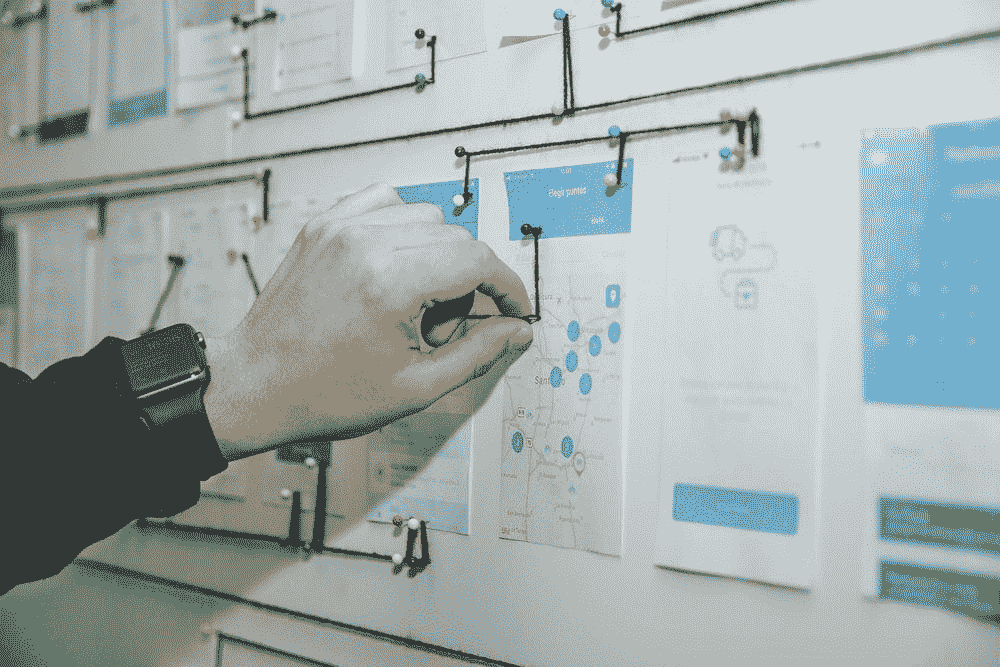
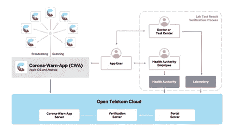
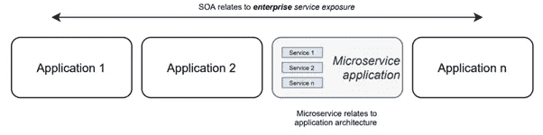
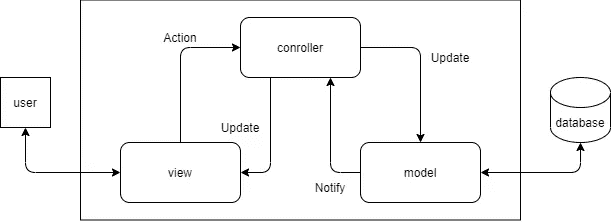

# 现代软件架构模式——以电晕警告应用程序为例

> 原文：<https://medium.com/geekculture/identifying-the-software-architecture-patterns-in-the-german-corona-warn-app-what-you-should-know-2261ed0b9d61?source=collection_archive---------43----------------------->

与[托本 _ 博施泰特](https://medium.com/u/8eb4a6c16d0e?source=post_page-----2261ed0b9d61--------------------------------)和[耶利兹·扎伊](https://medium.com/u/491c000695ee?source=post_page-----2261ed0b9d61--------------------------------)的联合工作

# 🤯建筑模式的基础

软件架构涉及到一系列的决策，这些决策基于软件开发中的许多因素。架构师在设计软件架构时面临着反复出现的问题，为了降低巨大的成本和风险，软件架构决策可以基于一组惯用的模式，通常称为架构风格或模式。[8]

在某些情况下，构建架构元素是为了解决特定的问题。随着时间的推移，这些组合物已被证明在许多不同领域中是有用的，因此已被记载和传播。这些架构元素的组合，称为架构模式，为解决系统面临的一些问题提供了集群策略。[13]架构模式决定了模式实例中使用的组件和连接器的词汇[8]。

架构模式描述了用于解决问题的元素类型及其交互形式。模式可以通过所使用的架构元素的类型来表征。

做好设计的方法很少，因此成功的架构设计是复杂且具有挑战性的。因此，模式和策略是捕捉好的设计结构的好方法，这样它们就可以被重用。策略是设计的组成部分，架构模式就是从这里产生的，所以大多数模式都由几种不同的策略组成。然而，没有一个完整的清单，因为它们是随着条件的变化而自发产生的，如果条件发生变化，新的模式就会出现。因此，根据定义，它们实际上是存在的；它们不是被发明的，而是被发现的。要对模式进行分类，必须发现它们，并描述它们的共同属性。然后，必须对特性如何导致不同的行为和对条件的反应的目录进行理解。模式实际上是设计决策的循环包，具有允许重用的已知属性，描述了一类架构。建筑设计很少从基本原则开始。有经验的架构师通常会设想一个选择、适应和组合模式的过程。软件架构师必须相应地决定如何实例化一个模式来适应问题的特定上下文和约束。[13]

目前几乎没有数据记录软件专业人员在行业中为他们的项目选择和合并架构模式时所使用的实际实践。在一项调查中，一个值得注意的发现是架构模式在软件项目中被广泛使用。尽管在整合架构模式方面存在困难，但是大多数软件专业人员表示模式对于项目的完成是最重要的。[8]

因此，这篇博客旨在指导实践敏捷项目开发和使用预构建模块的组织。

# 📱软件架构模式→ Corona Warn App (CWA)

Corona Warning App (CWA)是代表德国联邦政府开发的移动应用程序，用于跟踪感染 Sars-CoV-2 病毒的直接接触者。理想情况下，它的目的是尽可能快和容易地通知感染者的直接接触者，以便在感染链出现时就能阻断，从而有助于遏制疫情[1]。

在大约 50 天内，德国电信、SAP 和其他合作伙伴合作开发并发布了适用于 Android 和 iOS 设备的应用程序。这种快速而广泛的发展，在特殊情况下，需要一个良好的技术解决方案。由于这个应用程序是由德国联邦政府委托开发的，所以它受到了公众的特别关注，并受到了特别的关注[2]。

公众的这种特殊关注给应用程序的开发带来了一些必须满足的主要要求。

# 📑开发过程的要求

尤其是数据保护领域应该在软件开发阶段发挥重要作用，因为用户会被应用程序跟踪。其他人不应该知道这个特定的人是谁。在应用程序的开发过程中，重点放在了以下方面[3]:

*   分散跟踪
*   没有可识别性
*   禁止强制使用

# 🛡数据隐私

分散的跟踪使黑客更难攻击应用程序，因为他们不仅必须访问服务器，还必须渗透到不同的设备中以获取用户的数据。

但是，即使在这里从外部访问数据，也只能跟踪与其他用户的联系，因为用户自己不存储他自己的数据，位置也不被跟踪[4]。使用密钥和标识符可以跟踪联系人。通过蓝牙从附近的其他人接收标识符，并发送他们自己的标识符。id 仅存储在与另一个人有直接联系的相应设备上，因此最初不会被传递。如果在应用程序中输入了测试的阳性结果，用户自己的密钥将被上传到后端系统，并作为阳性密钥列表定期下载到所有用户的设备上，并与联系人进行比较。发送给每个人的 ID 每 15 分钟改变一次，这也使得跟踪个人变得困难。

# 🪟透明度

德国政府委托开发的一款应用程序，本应能够实现联系人追踪，但一开始对公民来说相当麻烦，因为它很快让人怀疑它可能被用于监控。因此，发展必须是可见的和可理解的，以便公民本身建立信任。

为了确保应用对用户完全透明，选择了开源开发。除了安装在移动设备上的应用程序的源代码之外，完整的文档也通过 GitHub 上传，作为解释，并尽可能对每个人透明。甚至在每种情况下使用的 Docker 容器都是共享的，因此也可以在家用计算机上一步一步地设置和检查整个系统。

通过这种方式，每个潜在用户都可以检查应用程序，并注意任何潜在的问题。由于源代码的完整发布，IT 和数据保护领域的各种专家检查了该应用程序，没有发现任何重大问题。

# 👩🏽‍💻开发周期短

由于 Sars-CoV-2 病毒引起的疫情情况，应用程序的开发周期必须经常和短时间完成。通过这种方式，它可以尽快部署，并且理想地警告和保护人们。SAP、德国电信(Deutsche Telekom)和其他合作伙伴仅用了 50 天时间就开发出了最小可行产品(MVP ),并将其发布在主流应用商店中，如 Google Play 和 App Store。

# 🏠CWA 的软件架构

该体系结构的特点是前面列出的数据保护和透明性。因此，分散式数据存储也主要用于体系结构的选择，并且创建了单独的服务来实现功能的隔离。

# 🤖CWA 的基本结构

CWA 基本上可以分为三个区域:

*   应用程序(前端)
*   界面实验室结果
*   后端

The architecture of the Corona Warn App (Source: [https://github.com/corona-warn-app/cwa-documentation/blob/master/solution_architecture.md](https://github.com/corona-warn-app/cwa-documentation/blob/master/solution_architecture.md))

该应用程序在结构中充当光学界面，也作为相应终端用户的警告。同样，通过智能手机使用蓝牙 LE 记录与其他人的联系，并交换各自联系人的密钥。

实验室结果的接口尤其是卫生当局、实验室或甚至医生，他们可以使用该接口将 Corona 测试的测试结果转发到后端，并且还为 Corona Warn 应用程序的用户发布密钥，以便他可以将他的测试结果存储在应用程序中，然后在测试结果为阳性的情况下发送联系密钥。

后端从测试中获得结果，并在一个人的测试结果为阳性后发送联系人。在固定的时间间隔，后端查询测试和积极的人的联系，并进一步管理。每天一次，用 Corona Warn 应用程序将积极的人的联系钥匙分发到智能手机上。

# 🤓软件架构模式

软件架构模式在工业环境中既有用又广泛使用。重要的是要认识到，在实践中不应该盲目地遵循一种模式，本文将以 CWA 为例来说明这一点。适应自己的需求对实现最大附加值很重要。[7]在下文中，一些你肯定听说过的模式将被解释并与 CWA 相关联。

# 🗂面向服务的架构模式

SOA(面向服务的架构)模式主要处理这样一个事实，即系统可以运行在不同的平台上，不受限制地分布，或者用不同的编程语言编写。这样做的好处是，预制的包可以在其他平台上使用和运行，其中的底层逻辑是隐藏的，与其他子系统无关。[12]

在 20 世纪 90 年代之前，将不是在同一基础上开发的系统部件连接起来是一个重大挑战。必须编写复杂的点对点集成来使各部分相互协调。[6]同时，组件允许通过智能接口交换信息。

塑造 SOA 模式的元素是服务提供者和服务消费者。ESB(企业服务总线)在这两个元素之间起中介作用，并转发消息。ESB 促进了互操作性、安全性和可变性。尽管如此，ESB 也可以代表 SPOF(单点故障)。[7]SOA 之后开发的软件主要通过 REST API 交换消息。[12]

# 🔀SOA 和微服务的区别

微服务主要通过 API 进行通信，以创建执行特定功能的独立应用程序。它们主要用于云架构中，封装在容器中(如 Docker、containerd 等。).这使得微服务的扩展速度更快，可移植性更强。[12]在 CWA，使用 Docker Compose 准备了用于本地开发和测试目的的完整设置，包括测试数据生成。Docker 脚本首先构建 CWA 服务，然后为运行时创建一个映像，因此不需要安装任何附加的依赖项。

SOA 和微服务的主要区别在于范围。SOA 包含多个应用，而微服务考虑单个应用。SOA 主要依赖于使组件在多个应用程序中普遍可用，以便它们可以被重用。微服务通过复制和接受重复数据来支持源代码重用。每个微服务都有本地访问数据的权限，不需要与其他微服务交换来获取信息。在 SOA 中，所有应用程序都应该能够直接从它们的主要来源同步获取和修改数据。

SOA and Microservice difference (Own presentation based on [12])

SOA 中的服务通过 ESB 进行通信，而微服务中的通信是独立的。ESB 代表着潜在的风险，因为如果服务表现出高延迟，整个系统都会受到影响。

# CWA 中 SOA 模式的🧠实现

CWA 的后端受负责处理数据的三个主要服务的影响。首先，我们有测试结果的服务器，它由“测试结果服务器”从实验室、医生或卫生部门接收。

通过 CWA 服务器，接收由用户输入的来自先前阳性测试的诊断密钥。验证服务器验证由用户和实验室/医生/卫生当局输入的数据以获得可能的阳性测试结果。

CWA 和各个用户之间的接口，以及各个服务之间的接口，都是使用带有 Java Framework Spring 的 REST 控制器来实现的。

各个服务基本上是根据 SOAP 原理构造的，因此服务非常大。因此，已经排除了将它们定义为微服务的可能性，因为它们配备了多种功能。根据 SAP 的软件架构师，定义为服务也应该谨慎。单独创建的服务器更像是服务和整体开发结构的混合体。要处理的数据也只存储在单个服务的 SQL 数据库或智能手机的 SQLite 数据库中。通过这种不同功能的划分，数据更加相互隔离，因此更难从外部访问，即使其中一台服务器存在安全漏洞。

后端的单个服务由 Telekom 托管在 Magenta 云中，并使用 Kubernetes 集群根据各自的负载和所需的流程进行扩展。

# 👩🏼‍🎨模型视图控制器

与稍后将介绍的代理模式类似，模型-视图-控制器(MVC)也是如此[5]。然而，这不是服务器和客户端之间的分离，其中代理是通信接口，而是 UI 如何与逻辑和控制器的角色分离。对以下各项进行了区分:

*   **模型**:包含纯应用数据。
*   **视图**:视图可以访问数据，但不能操作数据。这个观点主要关注用户。
*   **控制器**:和代理一样，控制器也是模型和视图之间的接口。它及时对事件做出反应，并与相应的接收器进行通信。

正如在介绍 CWA 微服务的章节中已经提到的，各个区域之间的通信是借助 Java framework Spring 实现的。这里，使用 Spring MVC REST-Controller 更准确。服务之间的查询是使用 HTTP 请求来执行的，数据是通过使用 POST、GET、PUT 和其他方法来提供的。

Model-View-Controller Pattern (Own presentation based on: [https://www.methodpark.de/blog/model-view-controller-mvc/](https://www.methodpark.de/blog/model-view-controller-mvc/))

在 Android 和 iOS 应用程序中，整个用户界面都采用了 MCV 模式。这些视图模型根据数据基础进行调整，例如针对当前的联系人跟踪状态。这个 MVC 分别有 Google (Kotlin)和 Apple (Swift)的原生编程语言版本。[6]

# 🥒分层模式

分层模式被称为最早的模块模式，它描述了复杂软件网络中各个系统之间的隔离。这个想法是为了能够开发和测试单独的服务。整个系统应该被相应地分割，子系统之间的交互最小化。软件被分成几层，其中模块的重要性以分层的形式映射。分层桥接在这里表示可以使用不相邻的较低层的信息。具体来说，这意味着理想情况下，只有相邻层(下一层)交换信息，并且这种交互是单向的。然而，如果一个层被跳过得太频繁，系统就不能实现期望的可移植性和可修改性，因为有太多的依赖性。[7]实践中的一个例子是 OSI 层模型，这是网络技术中众所周知的。每一层都有程序和协议，每一层都完成特定的任务。一个特定的服务对一个上级层是可用的。

在 CWA 也可以看到同样的做法。面向对象的编程方法允许更好地分层。可以看出，类“CWASettings”代表最高层，并编排底层的类，而各个子类又有更多的层。

分层模式的缺点是实现的复杂性和费用。由于分层模型，性能也会受到影响，因为应尽可能遵循下一个较低层的原则。

# 💂🏼‍♀️经纪人模式

在复杂开发的系统中，软件通常由几个子系统的集合组成。困难出现在短路用不同编程语言开发的单个子系统或者必须依赖它们自己的软件包。代理模式挂钩在提供者和客户机之间，保护客户机的身份。一个熟悉的例子是代理服务器。与前面的模式一样，代理模式增加了实现的复杂性。

然而，它也最终确保了客户端可以享受更流畅的用户体验。例如，如果一台服务器出现故障，代理将为客户端找到一台新的服务器，以继续向客户端提供服务。在最好的情况下，客户端不会注意到变化，但是如果实现很差，延迟将会增加。还应该注意的是，应该特别保护代理免受攻击，因为由于其中间人的地位，代理是黑客的第一接触点。

Broker pattern interaction (Own presentation based on [7])

# 👏🏽建筑模式的组合

架构模式代表了软件系统基本组织结构的测试解决方案。在这样做的时候，架构模式抽象了具体的软件架构，可以说映射了它们的一般化，从而有助于掌握软件系统的复杂性。架构模式的统一描述发生在“上下文-问题-解决方案”结构之后，并因此支持它们的应用。上下文描述了模式适用的情况。问题描述总结了使用环境中的问题情况及其解决方案。术语“力”也用于标识预期属性和模式的其他影响。力可能在相反的方向上起作用，因此必须结合使用其他更进一步的模式来平衡这些力。最终，该解决方案代表了对问题的实用且经过验证的解决方案。相应地，在具体使用中，不同建筑模式的组合也是可能的，从而可以具体地解决一个问题。[7]

如果需要的话，可以组合不同的模式，尤其是如果它们来自不同的类别。例如，在一个客户端-服务器架构中，一个服务器可以被分成几层[10]。因此，不同的架构模式可以位于分层架构的三层中。

分层架构是一种成熟的架构模式，其中一层的组件只允许访问下面层的组件，可能跨越多个层。客户机-服务器体系结构就是这样一种体系结构模式，在这种模式中，大多数客户机访问很少的服务器。例如，在 SAP R/3 系统的早期，客户机-服务器架构模式被扩展到三层。[11]

根据项目的不同，会选择和调整一个架构模板或几种模式的组合。

最近，微服务架构模式非常流行，在这种模式中，系统根据业务领域被非常精细地分割。微服务可以是小型垂直服务，也可以是分布式计算架构中的服务。区别主要在于应用程序的大小:一个微服务应该只实现一个领域中的几个特性，并被开发人员完全理解。因为一个微服务这么小，通常一个服务器上运行几个。REST 和微服务是一个很好的组合，适合构建更大的系统。例如，微服务可以负责 REST 资源。通过超媒体，这也部分解决了服务发现的问题。中介类型有助于接口版本控制和服务部署独立性。[12]

文献中已经描述过，在实践中，寻找和应用适当的架构模式在很大程度上仍然是临时的和不系统的。原因被认为是由于社区中缺乏关于架构模式的“哲学”和粒度的共识，以及缺乏一致的模式语言。[9]

关于组合架构模式的资料相对较少且陈旧，这可以归因于一个研究空白。因此，信息是从博客中收集的，并在这里进行了总结。

# ⚠️进一步强调了重要的软件架构模式

Bass 等人提出的一些更进一步的重要模式是，例如，客户机-服务器模式、对等模式、发布-订阅模式、共享数据模式、Map-Reduce 模式或多层模式，这些模式将在后面简要介绍，但对 CWA 的参考较少。

*   客户端-服务器模式:客户端与服务器交互并向服务器请求服务。客户请求服务器通过端口描述他们需要的服务。服务器向客户端提供一个或多个服务。如果几个客户端请求一个服务器，第一个挑战就出现了，因为负载没有正确分配。[7]此外，有可能服务器出现故障，因此客户端不再使用服务。因此，它适用于水平或垂直缩放，以提供故障安全性。
*   对等模式:在对等网络中，每个实体都有相同的能力和职责。类似于客户机-服务器模式，这是一种典型的请求/回复交互。从这个意义上说，每个组件都可以与另一个组件交互并交换服务。在对等网络中，一些超级节点具有索引甚至路由能力。这样做的好处是，还可以在不对系统产生负面影响的情况下移除对等体。点对点通常用于文档分发、即时消息或 VoIP(IP 语音)。
*   **发布-订阅模式**:发布-订阅模式允许应用程序向多个感兴趣的消费者异步发布事件，而无需将发送者和接收者耦合起来。在该模式中，组件通过事件进行交互。多个组件可以与一组事件相关联。需要注意的是，模式不应该集成到基于实时数据的系统中。
*   **共享数据模式**:访问设备之间的通信通过共享数据存储进行。控制可以由数据访问设备或数据存储发起。数据由数据存储保存。
*   Map-Reduce 模式:提供了一个框架，用于分析在几个处理器上并行运行的大型分布式数据集。并行化实现了低延迟和高可用性。Map 执行分析的提取和转换部分，并减少结果的加载。
*   多层模式:许多系统的执行结构被组织成一系列组件的逻辑分组。每个分组称为一层。将组件分组到层中可以基于各种标准，例如组件类型、公共执行环境或相同的运行时目的。

# 🤓摘要

总之，模式的使用可以减少规划架构的需要，因为开发人员可以更快地开始项目工作。这尤其是 CWA 的一个因素，因为他们只有 50 天的时间来开发整个应用程序及其后端。许多提到的模式，如 MCV，已经在常用的现代编程语言中实现了，并不真正需要由架构师自己实现。像 SOA 模式这样的其他模式需要手动实现。整个架构需要连接起来，这样服务才能以某种方式相互交互。总之，这些模式可以使生活变得更容易，并有助于发展进程。

# 👓观点

在这篇博客中，只描述了 CWA 的核心和个别模式。在这里，可以做一个更广泛的列表，以引起对架构中完成的可能性的更详细的概述的注意。因为也只有 CWA 建筑的核心被考虑，这里同样可以更深入的细节。诸如事件注册或在应用程序中以数字方式存储疫苗接种证书的可能性等功能被故意忽略了。更深入的分析可以在以后的博客中进行。

请随意分享博客或添加任何评论，这样我们就可以开始一个有趣的话题讨论。

# 📖参考

[1] SAP，“Corona-Warn-App Entwicklung:”经常和早期发布“，2020。【在线】。可用:[https://news . sap . com/Germany/2020/05/corona-warn-app-entwicklung-axel-Sturm/，](https://news.sap.com/germany/2020/05/corona-warn-app-entwicklung-axel-sturm/,)访问时间:17.06.2021。

[2] SAP，“Corona-Warn-App Entwicklung:“我们将在 heien 阶段找到我们”，2020 年。【在线】。可用:[https://news . sap . com/Germany/2020/06/corona-warn-app-let ZTE-tests/，](https://news.sap.com/germany/2020/06/corona-warn-app-letzte-tests/,)访问时间:2021 年 6 月 18 日

[3] hamburg.de GmbH & Co. KG，“Corona-Warn-App:Gemeinsam Corona bekpfen”，2020 年。【在线】。可用:【https://www.hamburg.de/corona-warn-app/,】T4 访问时间:2021 年 6 月 19 日。

[4] SAP，“knapp 50 Tagen programmiert:Telekom und SAP verffentlichen Corona-Warn-App”，2020 年。【在线】。可用:[https://news . sap . com/Germany/2020/06/veroeffentlichung-corona-warn-app/，](https://news.sap.com/germany/2020/06/veroeffentlichung-corona-warn-app/,)访问时间:18.06.2021。

[5] Telekom 和 SAP，“架构 Corona Warn 应用程序移动客户端— Android”，2021 年。【在线】。可用:[https://github . com/corona-warn-app/cwa-app-Android/blob/main/docs/architecture-overview . MD，](https://github.com/corona-warn-app/cwa-app-android/blob/main/docs/architecture-overview.md,)访问时间:17.06.2021。

[6] Telekom 和 SAP，“Corona-Warn-App 服务器”【在线】。可用:[https://github.com/corona-warn-app/cwa-server,](https://github.com/corona-warn-app/cwa-server,)访问时间:2021 年 6 月 20 日。

[7]巴斯、莱恩、保罗·克莱门茨和里克·卡兹曼。*实践中的软件架构*。新泽西州上萨德尔河:爱迪生-韦斯利公司，2013 年。

[8] Kassab，Mohamad 等人，“实践中的软件架构模式:一项实证研究。”*系统与软件工程的创新*14.4(2018):263–271。

[9] Avgeriou,巴黎,和乌韦 Zdun。“Architectural patterns revisited-a pattern language。”(2005)1-39。

[10] H. 蛋糕, “架构模式,” 访问:29。可用: [https://www.enzyklopaedie-der-Wirtschaftsinformatik.de/wi-enzyklopaedie/lexikon/is-management/](https://www.enzyklopaedie-der-wirtschaftsinformatik.de/wi-enzyklopaedie/lexikon/is-management/) 系统开发/软件档案馆/架构开发/架构模式

[11] G. Steinacker, “从单晶和微服务”, 2015, accessed: 29。可用: [https://www.informatik-actuell.de/development/methods/von-monolithen and-microservices.html](https://www.informatik-aktuell.de/entwicklung/methoden/von-monolithen-und-microservices.html)

[12]C。团队,“索阿 VS。微服务:有什么区别? WEB WEB WEBibm.com/cloud/blog/soa-vsmicroservices, May 2021, accessed: 28.06.2021。

[13] ITWissen.info, “架构模式”, 2018, accessed: 29.06.2021\. [在线]. Available: [https://www.itwissen.info/architectural-style.html](https://www.itwissen.info/Architekturmuster-architectural-style.html)