# 识别交易模式——交易者的行为分析

> 原文：<https://medium.com/geekculture/identifying-trading-patterns-behavioural-analysis-of-traders-5184dfa0350b?source=collection_archive---------4----------------------->

*理解交易者行为模式的程序化方法*

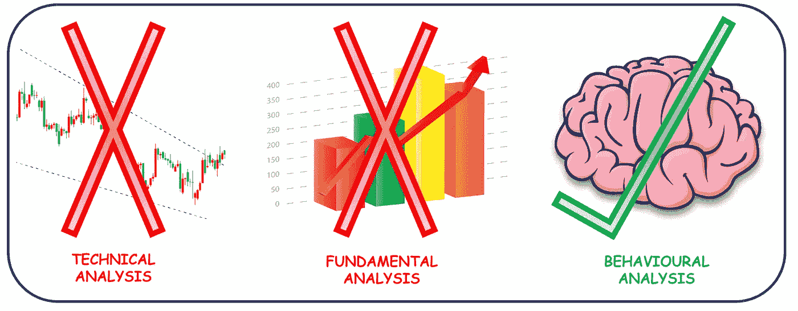

***Behavioural Analysis of Traders*** *(Image by Author)*

***情绪在交易中起作用吗？模式可以从情绪中衍生出来吗？***

我们都知道两种最常见的交易方法，技术分析和基本面分析。除了这些指标，还有另一个影响交易模式的因素，那就是情绪因素。交易是一个精神问题，而不是金钱问题，人类心理在其中起着重要作用。

在本文中，我们将考虑来自加密货币市场的比特币来分析交易模式。鉴于加密市场全天候开放，什么时候是交易的最佳时机？人们更喜欢周末交易还是工作日交易？

# 一些值得思考的问题🤔

> 上午 10 点还是下午 6 点？最大交易发生在什么时候？
> 
> 星期一，星期三还是星期五？人们什么时候交易更多？
> 
> 交易者更喜欢工作日还是周末？
> 
> 周四交易的最佳时间是什么时候，以增加未来 12 小时内获利的机会？
> 
> 哪天什么时候做多或做空？
> 
> 现在是星期六下午 4 点。未来 3 小时盈利的几率有多大？

***让我们让数据为我们解答这些问题！！***

# *入门*

*   分析基于 2021 年的比特币每小时数据
*   来自币安交易所的数据被用于分析
*   对 Q1 2022 的数据进行了回溯测试
*   本文末尾提供了数据和代码的链接
*   注:图表中的时间以 UTC ( [协调世界时](https://en.wikipedia.org/wiki/Coordinated_Universal_Time))为准

# *上午 10 点还是下午 6 点？最大交易发生在什么时候？*

密码市场 24 小时开放，全球各地的人都在上面交易。这是否意味着全天的交易量是一致的？

让我们根据每小时的 BTC 交易量，找出 2021 年比特币的交易情况。

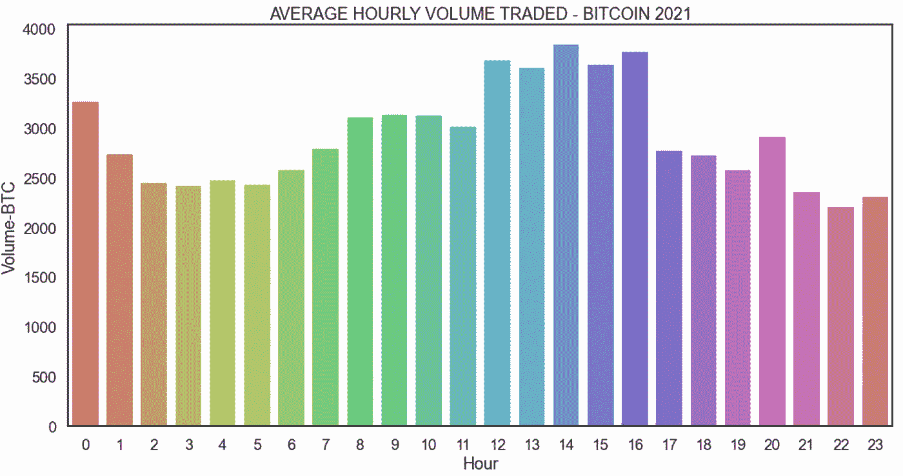

如果图表会说话…

*   最大交易量在下午 12 点到 5 点之间
*   下一个最受欢迎的交易时段是上午 8 点到 11 点
*   凌晨 2 点到 6 点的交易量有所下降
*   每天晚上 8 点交易量有一个小高峰，可能人们喜欢下班后睡觉前交易。

# 星期一、星期三还是星期五？人们什么时候交易更多？

*   大多数加密交易发生在工作日，最多的交易发生在周一。
*   与工作日相比，周末的平均交易量相对较低。

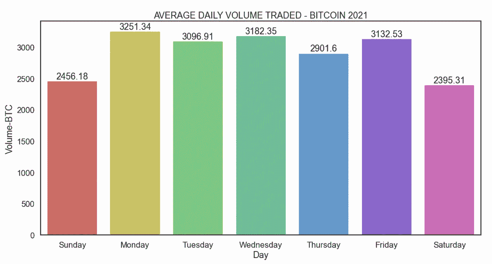

# 工作日和周末哪个更好？

工作日和周末的交易量模式有什么不同吗？

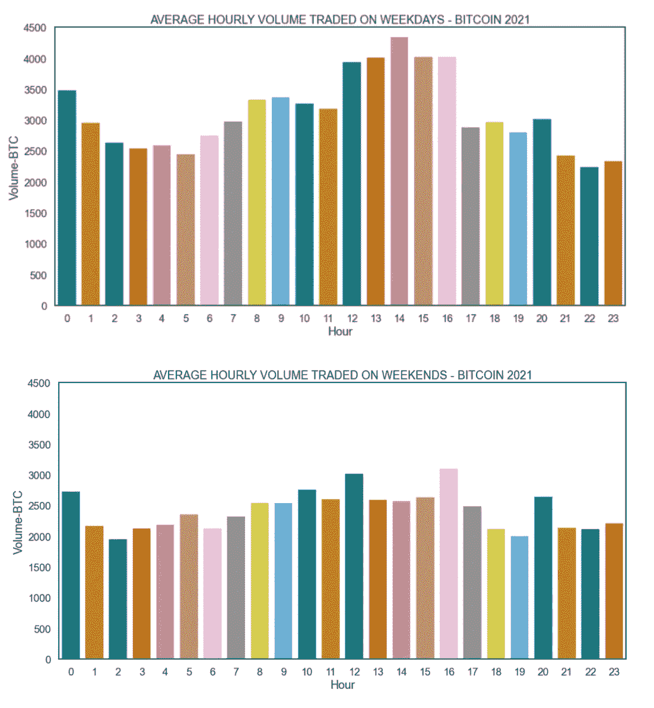

*   就交易量而言，工作日比周末高
*   大多数工作日的交易发生在中午 12 点到下午 5 点之间
*   周末没有真正的高峰交易区

# 周四的最佳交易时间是什么时候，可以最大化未来 12 小时的盈利机会？

假设你想买一些比特币，并在 12 小时后卖出，什么时候是买入的好时机？

这张图表显示了 12 小时窗口期内每天的最佳交易时间。

根据 2021 年比特币的数据，我们可以说，如果我们在周一晚上 10 点购买比特币，12 小时后它有 63%的机会上涨。

类似地，如果我们在周一下午 4 点购买，那么有 61%的可能性价格会在 12 小时后下跌。


***周四交易提示*** *如果你计划在一个有 12 小时窗口的周四交易比特币，那么在下午 6 点进行交易可能是一个好主意，这让你有 66%的机会在 12 小时后看到绿色交易。*

# 哪天什么时候做多或做空？

某一天的最佳交易时间会因窗口期的不同而不同。以下是 2 小时、4 小时、8 小时和 24 小时窗口的最佳交易时间。

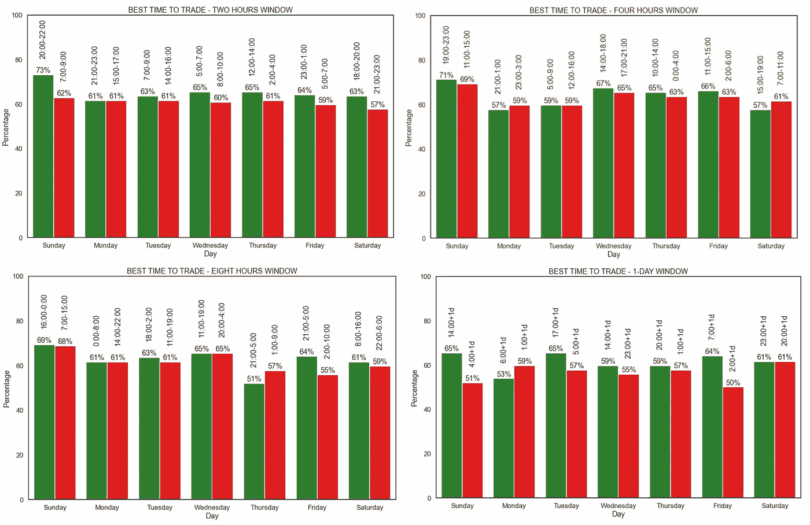

查看 git repo 中的 python 笔记本，了解其他时间段的情况。

# 现在是星期六下午 4 点。未来 3 小时盈利的几率有多大？

让我们说，在一个慵懒的星期六早上，你想做一个短期加密交易，那么你应该什么时候做这个交易？

看看下面的 3 小时窗口图表，知道什么时候是交易的最佳时间。从图表来看，如果交易在晚上 8 点完成，你有 63.5%的机会在 3 小时内看到绿色，然后在凌晨 4 点交易，有 61.5%的机会，你有最大的机会赚钱。

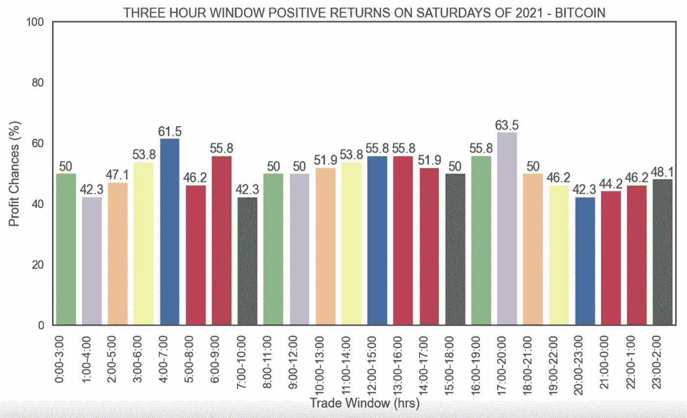

使用代码查看不同窗口期的其他日子的概况。

# *回溯测试*

现在是有趣的部分。所有的分析对我们有什么帮助？有没有可能在交易的时候以某种方式使用它？

## 这听起来现实吗？

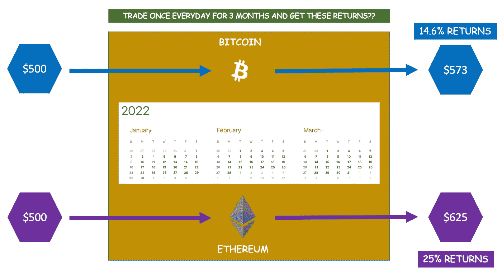

**IS THIS POSSIBLE?**

让我们看看 2022 年的数据，以便更好地理解这一点。基于对 2021 年比特币数据的分析，以下两个测试被用于回测这些发现:

**测试用例-1:对所有日期使用固定窗口周期的测试**

1.  设定一个交易窗口期(例如:每天买入后 3 小时内卖出)
2.  根据给定窗口期的 2021 年数据，确定每天的最佳交易时间
3.  应用此交易时间在 Q1 2022 买卖比特币

**测试用例-2:用每天的最佳窗口期进行测试**

1.  根据 2021 年的数据，确定每天的最佳交易窗口和时间
2.  应用此交易时间在 Q1 2022 买卖比特币

**一些快速免责声明**

*   测试结果仅供参考，以显示有多少分析实际上适用于看不见的数据
*   利润/损失仅根据加密的开盘价/收盘价计算，不考虑额外的交易成本

## **测试案例-1(比特币):固定窗口期**

现在让我们考虑一个 3 小时的窗口来执行交易。

在一周的每一天，我们想以 500 美元的价格买入比特币，并在整整 3 个小时后卖出。根据对 2021 年数据的分析，每天的买卖时间会有所不同。蓝框中给出了基于 2021 年数据的最佳交易时间和每天盈利的机会。

现在，使用这些数据，如果我们从 2022 年 1 月 1 日到 2022 年 3 月 31 日在 Q1 2022 年的所有日子里持续进行交易，那么每天的总利润/损失将显示在下面的绿框中。

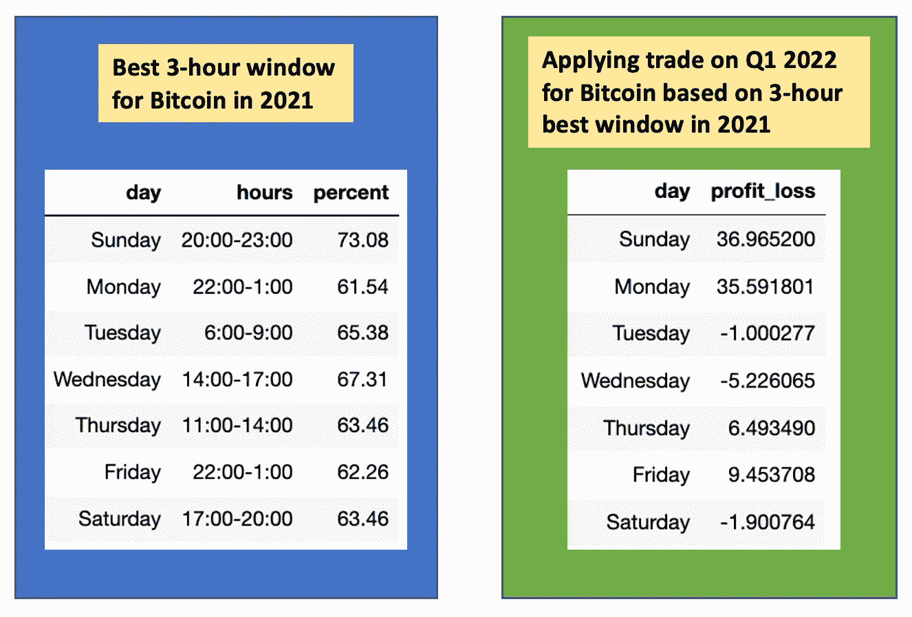

理论上，在 3 个月的时间里，500 美元的投资将会得到 80.38 美元的回报**(哇！！那就是 16%的利润！！)**

听起来很完美？让我们看看其他窗口期的结果。

## 与其他窗口期交易

与上述 3 小时窗口的计算类似，理论上交易是在最佳的 1、2、3、4、6、8、12 和 24 小时窗口期间进行的。每个窗口期的利润/损失如下图所示。

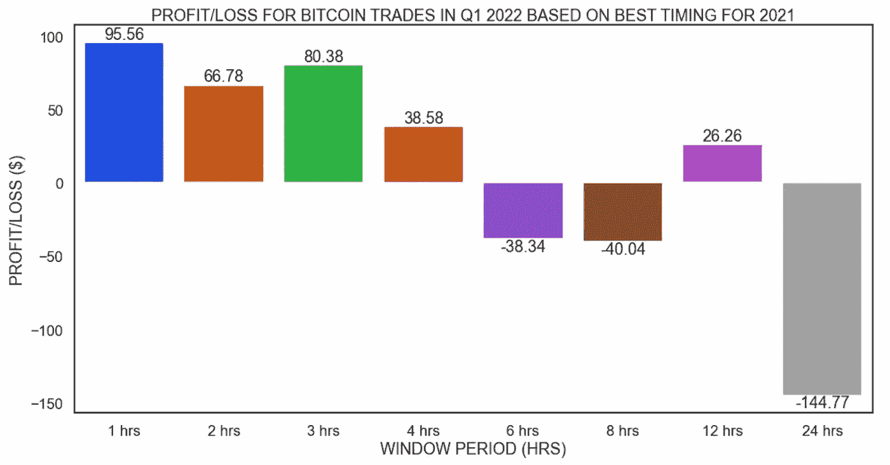

除了 6 小时、8 小时和 24 小时窗口，其他窗口时段表现良好。

## **测试案例-2(比特币):每天的最佳窗口期**

为了继续测试，让我们根据 2021 年的数据确定每天的最佳交易窗口。

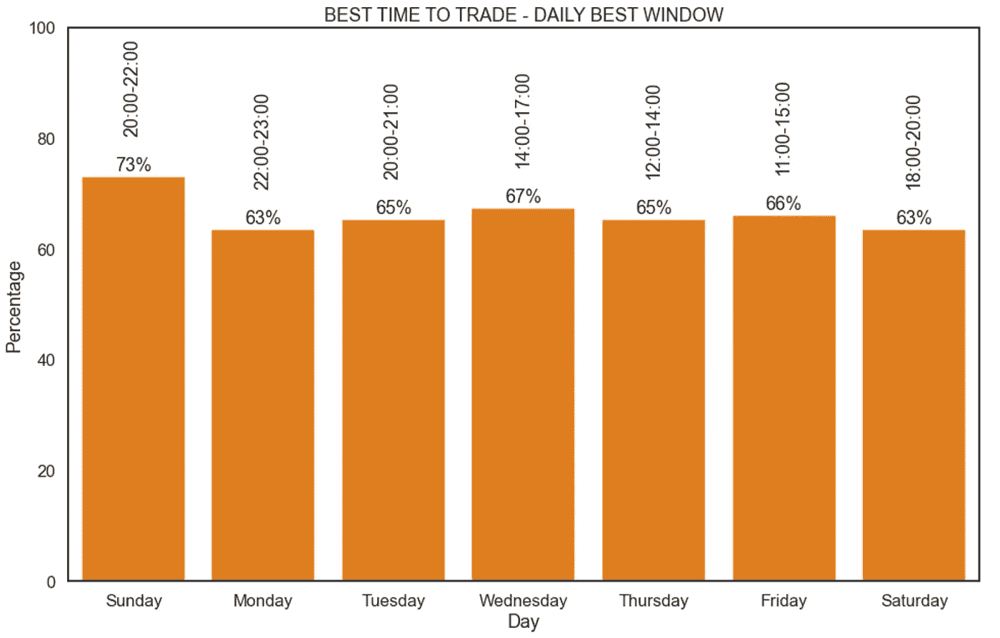

现在，让我们尝试在 2022 年 1 月 1 日至 2022 年 3 月 31 日的这些时间窗口内进行交易，即 2022 年 1 月 1 日(周六)的
，下午 6 点以 500 美元买入 BTC，晚上 8 点卖出
，下午 8 点以 500 美元买入 BTC，晚上 10 点卖出
，以此类推，直到 2022 年 3 月 31 日
3 月 31 日(周四)，以 500 美元买入 BTC

如果从 1 月 1 日到 3 月 31 日每天都进行这种买卖交易，那么结果将如下所示:

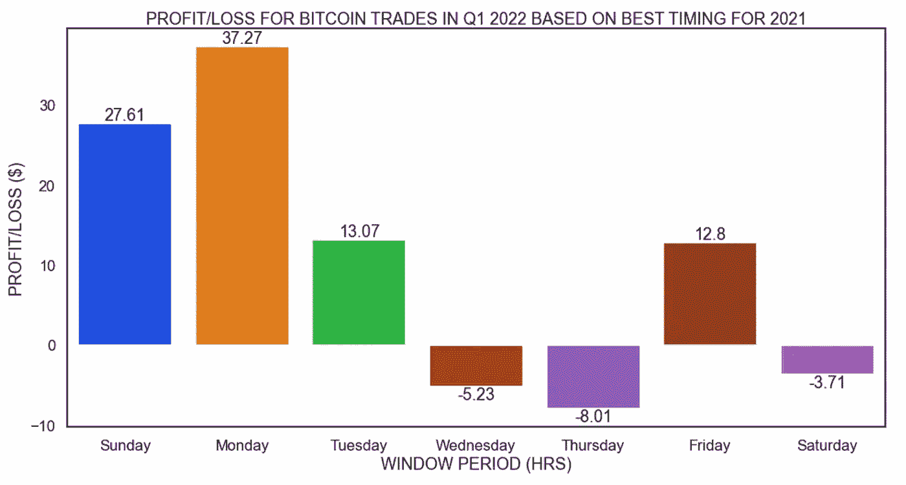

```
*INVESTMENT  : $500
DURATION    : 3 MONTHS
PROFIT/LOSS : $73.8
PROFIT %    : 14.76 %*
```

## **以太坊交易**

鉴于我们已经对比特币进行了分析，那么同样的逻辑如何在其他密码上发挥作用呢？

作为一个实验，相同的代码在以太坊数据上运行，下面是结果。

## 测试用例 1(以太坊):固定的窗口期

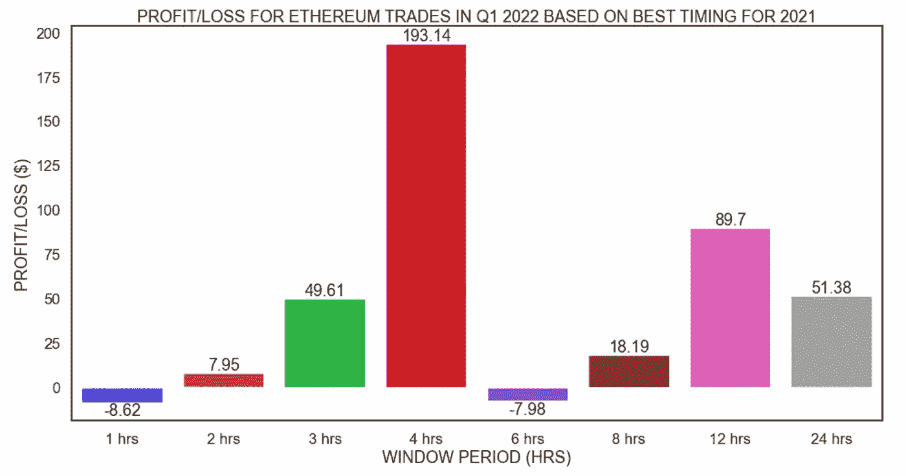

4 小时的窗口给出了最好的结果，初始投资为 500 美元，3 个月的回报率为 38%。

## 测试案例 2(以太坊):每天的最佳窗口期

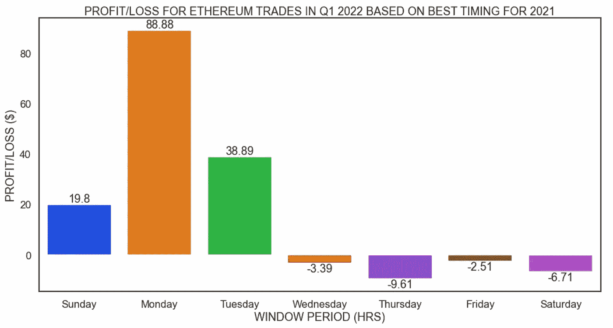

```
*INVESTMENT  : $500
DURATION    : 3 MONTHS
PROFIT/LOSS : $125.35
PROFIT %    : 25 %*
```

谁会不满足于此呢？

# 但是有一个问题…..

从 1 月 1 日到 3 月 31 日的 90 天内，进行了 180 笔交易(90 笔买入交易和 90 笔卖出交易)。如果我们把交易佣金考虑在内，那么利润数字会发生巨大变化。

这里是基于交易所每笔交易的佣金的最终利润/亏损的快照，假设它对于买入和卖出、庄家和庄家交易是相同的。


看起来，并非所有的交易所都能进行日常交易。

一个可能的选择是，在回报最好的时候，一周只交易一到两次，然后评估表现。我将把它作为一个练习留给感兴趣的人来评估这个选项，考虑交易佣金。用于此分析的数据和代码将在下一节中提供。

# 数据和代码

用于分析的每小时加密数据来自[cryptodatadownload.com](https://www.cryptodatadownload.com/data/binance/)

本文中执行分析的数据和代码可以在 git repo 中获得:[cryptotraderanalysis](https://github.com/Lakshmi-1212/CryptoTradersAnalysis)

# 还有什么？

*   该应用程序可以进一步增强，以不断地动态学习过去的数据，并根据最新数据使用一天的交易时间
*   代码可以被包装到一个交易机器人中，根据这个策略自动进行交易。如果你想学习如何建立一个交易机器人，可以参考这篇文章:[用 Python 构建一个基本的加密交易机器人](/geekculture/building-a-basic-crypto-trading-bot-in-python-4f272693c375)

# 结束语

本文的主要目的是有计划地探索除了传统的技术和基本面分析之外的其他数据分析方法。

请注意，本文中的所有分析仅用于教育目的，绝不是任何类型的交易建议。在做出任何交易决定之前，请做好尽职调查。

希望这篇文章有趣且内容丰富。如果您能在数据中找到任何其他有趣的模式，请继续探索数据并留下评论。

探索愉快！！:-)

## 如果“PYTHON+TRADING”让你着迷，那就看看这些吧…

*   [*算法交易 Python 技术分析入门*](/geekculture/beginners-guide-to-technical-analysis-in-python-for-algorithmic-trading-19164fb6149)
*   [*用 Python 构建一个基本的加密交易机器人*](/geekculture/building-a-basic-crypto-trading-bot-in-python-4f272693c375)

*   *识别交易模式—交易者行为分析【你在这里】*
*   [*股票基本面分析使用 Python*](/geekculture/fundamental-analysis-of-stocks-using-python-d5ad050e6372)