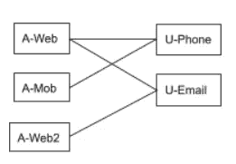
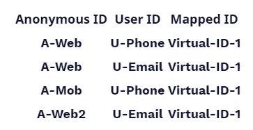
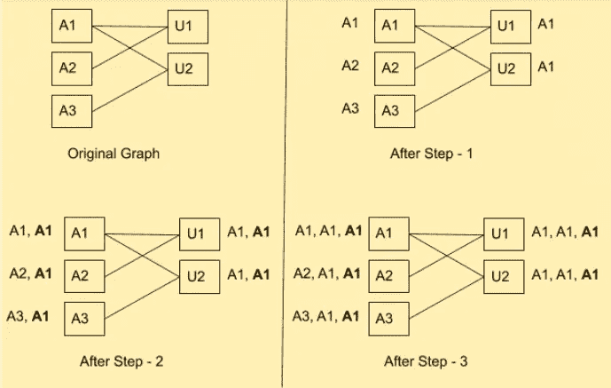
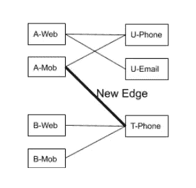

# SQL 中的身份图和身份解析

> 原文：<https://medium.com/geekculture/identity-graph-and-identity-resolution-in-sql-6bafad5cf0f0?source=collection_archive---------30----------------------->


在我们之前的博客[中，身份图和身份解析的故事](https://rudderstack.com/blog/the-tale-of-identity-graph-and-identity-resolution/)，我们描述了身份解析的问题。我们使用了一个用户从多个网站访问一个电子商务网站的具体例子。具体来说，我们展示了应用程序事件如何与多个身份相关联，以及如何使用`identify()`调用将这些身份联系在一起。我们使用以下身份图捕捉到了这种关联:



**身份图捕捉关联**

身份图存储在 SQL 数据库的`identify`表中，如下所示:



**SQL 数据库中的** `**Identify**` **表**

**匿名 ID 用户 ID 映射 ID**A-WebU-phone virtual-ID-1A-WebU-email virtual-ID-1A-MobU-phone virtual-ID-1A-web 2u-email virtual-ID-1 SQL 数据库中的`Identify`表

在这篇博客中，我们将展示如何将一个虚拟 ID 与所有这些 ID 关联起来。(匿名或用户 ID)和虚拟 ID 之间的这种关联将使我们能够将所有事件联系起来，认为它们来自一个最终用户。系统用单独的 id 标记每个事件。

# 连通分量算法

很容易看出，这个任务与在标识图中识别连接的组件是相同的。此外，该任务包括将唯一的 ID 与每个连接的组件相关联。我们通常使用深度优先搜索来实现连通分量算法。然而，这里的目标是用 SQL 实现这个算法。

David R. Maclver 的这篇文章展示了实现连通图组件算法的一种方法。其思想是保留一组连接的组件，最初将单个节点初始化为连接的组件。在此之后，如果组件之间有链接，您需要递归地合并组件。

该算法要求节点表与自身(自连接)和边表(笛卡尔积)之间的连接。不幸的是，在分布式数据仓库中实现自连接和笛卡尔积的成本非常高。例如，BigQuery 认为 self joins 是反模式的，并强烈反对它。

# 身份图和身份解析:提出的算法

为了解决这个问题，我们提出了一种算法，通过在边上传播 id 来找到连通分量。您将为每个节点分配一个 ID，这是它自己的 ID 和它的邻居的 ID 的最小值。如果你重复这个步骤足够多次，一个连接组件中的所有节点将获得一个连接组件中的最小节点 ID。您可以看到，您需要重复该步骤的次数与最大连接组件的直径一样多。

最简单的方法是为边和节点保留两个表。在每个阶段，我们可以连接这两个表并更新节点 id。然而，正如前面所解释的，这些自连接和笛卡尔积可能是非常昂贵的。

然而，在二部图的情况下，我们可以简化这一点。右侧的节点只能更新左侧的节点，反之亦然。下图显示了上述恒等图的算法的连续步骤:



**为我们的身份图实施连通分量算法的连续步骤**

# 它是如何工作的

每一步给每个节点分配一个节点，这个节点是它的 ID 和它的邻居的最小值。假设排序`A1<A2<A3<U1<U2`，在步骤 1 之后:

*   节点`A1`得到`A1`(其 ID `A1`和邻居`U1`、`U2`中的最小值)
*   节点`A2`得到`A2`(它的 ID `A2`和邻居`U1`中的最小值)
*   节点`U1`获取`A1`(ID 的 ID 和邻居`A1`、`A2`的最小值)
*   等等

在上图中的后续步骤之后，您可以看到节点 id。粗体的 ID 是与该节点关联的最新 ID。如上图所示，在步骤 2 之后的**上方，ID 已经稳定，每个节点都分配有相同的 ID `A1`。**

# SQL 中的代码实现

下面的 SQL 代码实现了这个算法。我们创建连续的图形`ID_GRAPH_0`、`ID_GRAPH_1`等等。每个表有四列:

*   `orig_anon_id`:初始图形中的匿名 ID
*   `orig_user_id`:初始图形中的用户 ID
*   `curr_anon_id`:第 n 次迭代更新时的匿名 ID
*   `curr_user_id`:第 n 次迭代更新时的用户 ID

您可以通过如下所述取最小值从`ID_GRAPH_N`创建`ID_GRAPH_N+1`:

```
CREATE TABLE ID_GRAPH_0 (
  orig_anon_id varchar(32), 
  orig_user_id varchar(32), 
  curr_anon_id varchar(32), 
  curr_user_id varchar(32),
  version_anon_id int,
  version_user_id int,
); CREATE TABLE ID_GRAPH_1 AS
(
 SELECT 
orig_anon_id, 
orig_user_id, 
   	CASE 
        WHEN curr_anon_id is NULL THEN NULL
        WHEN tmp_anon_id < curr_anon_id  THEN tmp_anon_id
        ELSE curr_anon_id
     END AS curr_anon_id, CASE 
        WHEN curr_user_id is NULL THEN NULL
        WHEN tmp_user_id < curr_user_id THEN tmp_user_id
        ELSE curr_user_id
     END as curr_user_id, CASE 
        WHEN curr_anon_id is NULL THEN version_anon_id
        WHEN tmp_anon_id < curr_anon_id THEN curr_version
        ELSE version_anon_id
     END AS version_anon_id, CASE 
        WHEN curr_user_id is NULL THEN version_usrer_id
        WHEN tmp_user_id < curr_user_id THEN curr_version
        ELSE version_user_id
     END as version_user_idFROM
 (
  SELECT 
	    orig_anon_id,
	    orig_user_id, 
	    curr_anon_id,
          curr_user_id,
          version_anon_id,
          version_user_id, 
    MIN(curr_user_id) 
  OVER(PARTITION BY orig_anon_id)
    as tmp_anon_id, MIN(curr_anon_id) 
              OVER(PARTITION BY orig_user_id)
         as tmp_user_id FROM
     ID_GRAPH_0
   WHERE orig_anon_id IN (
    	SELECT orig_anon_id from ID_GRAPH_0 WHERE version_anon_id == curr_version
   ) OR
    orig_user_id IN (
      SELECT orig_user_id from ID_GRAPH_0 WHERE version_user_id == curr_version   
    )
   ) AS TMP_GRAPH_0
 )
```

如上所述，您应该根据所连接组件的最大直径运行多次。用户很少有三四个以上的设备和身份(邮件、电话)。所以，如果你在 IDs 稳定下来之前运行 7 到 8 次会有所帮助。此外，当新的节点和边被添加到身份图中时，您将不得不连续运行此操作。因此，没有分布 id 的大型连接组件最终会分布 id，我们将在下一节讨论这一点。

# 增量更新

随着新用户注册或用户形成新的关联，系统将不断更新身份图。保持身份映射最新的简单方法是定期运行上述算法。每几个小时一次应该不错。

不幸的是，这不是最有效的方法，因为上面的代码每次运行都处理整个图形。理想情况下，我们应该能够处理用户引入的新节点和边。此外，我们应该处理那些新边接触的节点/边/连接的组件。后者很重要，因为一条新边可以*连接*两个独立的连接组件，如下图所示。在这种情况下，两个连接的组件需要合并，并且必须分配相同的 ID，如下所示:



**身份图:连通分量合并**

# 使用版本号提高效率

我们通过给所有边分配一个从 1 开始的版本号来解决这个问题。由于 RudderStack 是成批加载数据的，所以单调递增的版本号与每次加载相关联。您还可以使用下面的算法来使用时间戳，只需稍作调整。

ID 映射算法的第 N 次运行仅涉及具有版本 N(或更高版本)的边的节点。您需要过渡性地应用这个过程。如果算法在版本 N 运行中触及一个节点，您需要在下一次运行中处理所有的边(甚至是旧版本的边)和连接到这些边的节点。这是处理上面身份图中描述的情况所必需的。仅加工**新边**是不够的。你需要更新所有连接到**新边**的节点。此外，您需要更新这些节点的所有其他边及其传递闭包。

```
CREATE TABLE ID_GRAPH_0 (
  orig_anon_id varchar(32), 
  orig_user_id varchar(32), 
  curr_anon_id varchar(32), 
  curr_user_id varchar(32),
  version_anon_id int,
  version_user_id int,
); CREATE TABLE ID_GRAPH_1 AS
(
 SELECT 
orig_anon_id, 
orig_user_id, 
   	CASE 
        WHEN curr_anon_id is NULL THEN NULL
        WHEN tmp_anon_id < curr_anon_id  THEN tmp_anon_id
        ELSE curr_anon_id
     END AS curr_anon_id, CASE 
        WHEN curr_user_id is NULL THEN NULL
        WHEN tmp_user_id < curr_user_id THEN tmp_user_id
        ELSE curr_user_id
     END as curr_user_id, CASE 
        WHEN curr_anon_id is NULL THEN version_anon_id
        WHEN tmp_anon_id < curr_anon_id THEN curr_version
        ELSE version_anon_id
     END AS version_anon_id, CASE 
        WHEN curr_user_id is NULL THEN version_usrer_id
        WHEN tmp_user_id < curr_user_id THEN curr_version
        ELSE version_user_id
     END as version_user_idFROM
 (
  SELECT 
	    orig_anon_id,
	    orig_user_id, 
	    curr_anon_id,
          curr_user_id,
          version_anon_id,
          version_user_id, 
    MIN(curr_user_id) 
  OVER(PARTITION BY orig_anon_id)
    as tmp_anon_id, MIN(curr_anon_id) 
              OVER(PARTITION BY orig_user_id)
         as tmp_user_id FROM
     ID_GRAPH_0
   WHERE orig_anon_id IN (
    	SELECT orig_anon_id from ID_GRAPH_0 WHERE version_anon_id == curr_version
   ) OR
    orig_user_id IN (
      SELECT orig_user_id from ID_GRAPH_0 WHERE version_user_id == curr_version   
    )
   ) AS TMP_GRAPH_0
 )
```

# 压型

我们在一张有 400 万个节点的身份图上对基本版本和增量版本进行了快速分析，在每次运行之间引入了 1%的新随机边。基本版本需要大约 60 秒，而增量版本需要大约 10 秒。这意味着速度比基本版本提高了 5-6 倍。
我们将在未来的博客中披露现实生活中应用程序的更多详细信息。

# 结论

在这篇博客中，我们展示了如何使用 SQL 高效地实现数据仓库中的 ID 映射。然而，这只是触及了 ID 映射问题的表面。人们已经致力于开发复杂的概率技术来使用统计和机器学习方法关联 IDs。数据仓库本身正在增加内部机器学习能力。我们希望在未来探索这一点。

# 免费注册并开始发送数据

测试我们的事件流、ELT 和反向 ETL 管道。使用我们的 HTTP 源在不到 5 分钟的时间内发送数据，或者在您的网站或应用程序中安装我们 12 个 SDK 中的一个。[入门](https://app.rudderlabs.com/signup?type=freetrial)。

本博客最初发表于
[https://ruder stack . com/blog/identity-graph-and-identity-resolution-in-SQL](https://rudderstack.com/blog/identity-graph-and-identity-resolution-in-sql)