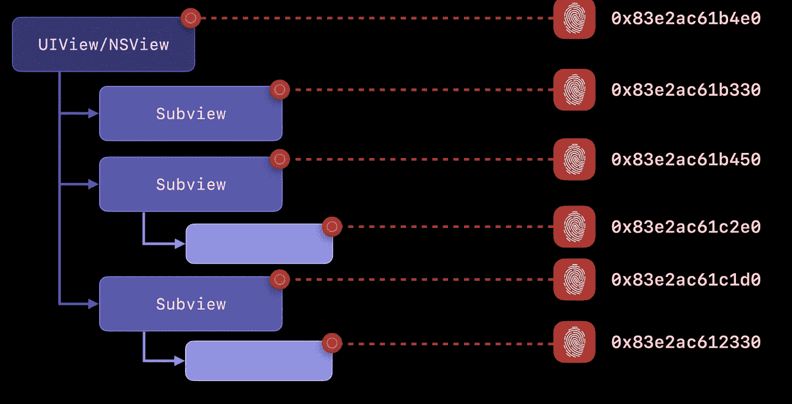
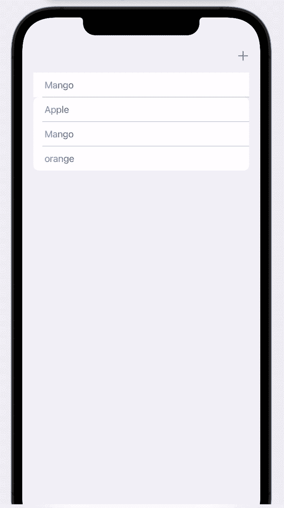
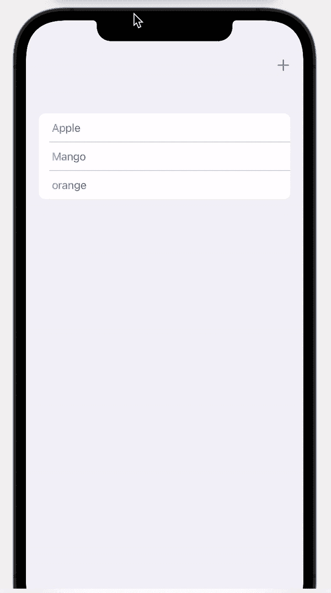

# SwiftUI 中的身份

> 原文：<https://medium.com/geekculture/identity-in-swiftui-6aacf8f587d9?source=collection_archive---------9----------------------->


Photo by [Brett Jordan](https://unsplash.com/@brett_jordan?utm_source=medium&utm_medium=referral) on [Unsplash](https://unsplash.com?utm_source=medium&utm_medium=referral)

视图的身份在管理 SwiftUI 视图生命周期中起着重要的作用。每个视图都有自己的特性。它可以显式给出，也可以从结构布局中获取。

在 UIKit/APPKit 中，每个视图都有指针标识，因为它们是引用类型。



Source: https://developer.apple.com/wwdc21/10022

但是 SwiftUI 中的视图是值类型。SwiftUI 中视图的身份有两种类型。他们是

1.  结构同一性
2.  显式身份

# 结构同一性

SwiftUI 中的每个视图都有自己的身份。如果没有显式给出视图的标识，则 SwiftUI 会根据其在视图层次结构中的位置给出一个标识。让我们考虑一个有条件变化的观点。

```
**struct** TestingStructuralIdentity: View {@State **var** changeView = **false** **var** body: **some** View { VStack { Button { changeView.toggle() } label: { Text("Change View") }.buttonStyle(.bordered) **if** changeView { Text("View 1") } **else** { Text("View 2") } } }}
```

在上面的例子中，每次 changeView 切换时，一个新的文本视图会以新的身份创建。让我们以保留文本视图身份的方式重写上面的代码。

```
**struct** TestingStructuralIdentity: View {@State **var** changeView = **false** **var** body: **some** View { VStack { Button { changeView.toggle() } label: { Text("Change View") }.buttonStyle(.bordered) Text(changeView ? "View 1" : "View 2") } }}
```

在每次 changeView 切换时重写的代码中，只有显示内容发生变化，而视图不会每次都被创建。

创建具有稳定身份的视图有助于围绕您的视图创建漂亮的动画。

# 显式身份

与结构化标识不同，SwiftUI 视图可以使用 id()创建显式标识。我们用来给出显式标识的最常见的情况是使用 ForEach。

很多时候，当我们需要用 ForEach 显示字符串列表时，我们可以简单地编写

```
List(0..<list.count) {(l) **in** Text(list[l])}
```

但是从 SwiftUI 3.0 开始，我们不能使用非常数范围，我们需要在上面明确指定身份以进行无声警告

```
List(0..<list.count, id: \.self) {(l) **in** Text(list[l])}
```

这看起来不错，但是让我们理解为什么 identity 在使用 ForEach 创建视图列表中起着重要的作用。

为此，我们创建了一个带有字符串列表的视图，该列表随着用户交互而变化。然后，我们将字符串映射到一个新的值类型，该值类型除了字符串之外还具有标识。从这里开始，我们使用不同的标识符进行测试，例如索引、随机标识符和自定义序列号。然后，我们测试在所有场景中向列表添加一个新值。

```
**//StringWithId value type holds identity for every string****struct** StringWithId: Identifiable { **let** string: String **let** id: String}/// extension to map array of strings to custom stringWithID objects**extension** Array **where** Element == String { **func** customStringMapper() -> [StringWithId] { **var** stringsWithId = [StringWithId]() **for** (i,string) **in** **self**.enumerated() { stringsWithId.append(StringWithId(string: string, id: "\(i)")) } **return** stringsWithId }}**struct** ListView: View {@State **var** list = ["Apple","Mango","orange"] **var** body: **some** View { NavigationView { List { ForEach(list.customStringMapper(), id: \.id) {(fruit) **in** Text(fruit.string) } }.listStyle(InsetGroupedListStyle()) .toolbar { ToolbarItem(placement: .navigationBarTrailing) { Button { withAnimation { list.append("heelo") } } label: { Image(systemName: "plus") } }} } }}
```

在上面的例子中，如果我们在列表中添加了一个新的条目，那么列表中的所有视图都会被重新创建，因为每个视图的标识都会随着 UUID()而动态变化。这工作完美，但结果出乎意料的动画。



using UUID as identifier

相反，我们用字符串索引创建标识，

```
// Maps list of strings to list of StringWithId**func** customStringMapper() -> [StringWithId] { **var** stringsWithId = [StringWithId]() **for** (i,string) **in** self.enumerated() { stringsWithId.append(StringWithId(string: string, id: 
       "\(i)")) } **return** stringsWithId}
```

在这种情况下，视图具有稳定的身份。每个对象都有自定义的序列号，这很好。

```
// Maps list of strings to list of StringWithId**func** customStringMapper() -> [StringWithId] { **var** stringsWithId = [StringWithId]() **for** (i,string) **in** self.enumerated() { stringsWithId.append(StringWithId(string: string, id: 
       "\(i)-\(string)")) } **return** stringsWithId}
```

第二种和第三种情况都有流畅的动画效果。



using custom serial number as identifier

在现实世界的场景中，如果我们只想显示字符串而不需要任何用户交互，那么下面的方法就可以了。

```
List(0..<list.count, id: \.self) {(l) **in** Text(list[l])}
```

最好设计具有稳定标识符的真实对象，这样有助于管理视图的生命周期。例如，每个核心数据对象都有唯一的标识符。

有关 View 的生命周期和最佳实践的更多信息，请参考本次 WWDC [演讲](https://developer.apple.com/wwdc21/10022)

感谢阅读..))