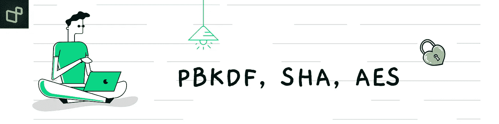

# 惯用加密:PBKDF2、SHA、AES

> 原文：<https://medium.com/geekculture/idiomatic-cryptography-pbkdf2-sha-aes-f118de735d3e?source=collection_archive---------3----------------------->

# 目录

1.  [沙](#aa51)
2.  [HMAC](#1933)
3.  [HKDF](#be1b)
4.  [应用](#6a7a)
5.  [参考文献](#93b2)

# 🔥恒星时角

SHA 代表**安全哈希算法**:

*   **1993 |沙(SHA-0) (FIPS 180):** 美国国家安全局推出