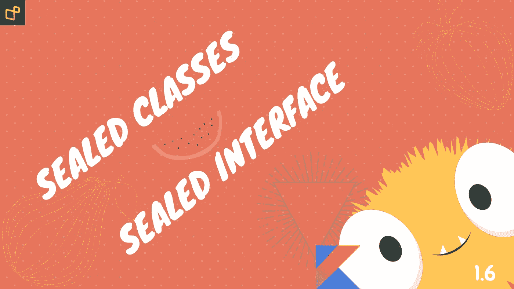
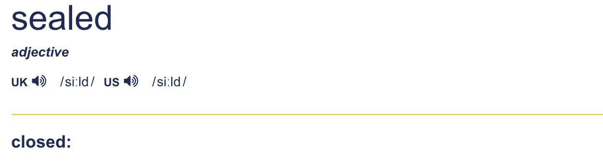

# 科特林:2022 年的密封类和密封接口

> 原文：<https://medium.com/geekculture/idiomatic-kotlin-sealed-classes-and-sealed-interfaces-in-2021-79009d82c6ff?source=collection_archive---------0----------------------->

# ⚡1.️Why 密封？

[https://dictionary.cambridge.org/dictionary/english/sealed](https://dictionary.cambridge.org/dictionary/english/sealed)

# ⚡️2.密封类

*   密封类允许我们修复类型层次结构，并禁止开发人员创建新的子类。