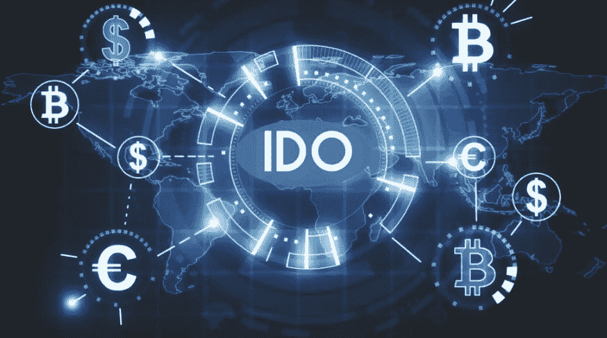

# IDO 开发如何帮助商务人士？

> 原文：<https://medium.com/geekculture/ido-development-3f23e5da9a00?source=collection_archive---------10----------------------->

IDO

正是因为创新，密码行业每年都在不断发展和增加其用户群，这吸引了更多的密码投资者进入市场。其中一项主要创新是 IDO，也称为初始 DEX，它发生在分散式交易所(DEX)中。在本文中，让我们深入了解什么是 IDO 以及它们的一些优势

# 什么是 IDO？

首次公开发行 DEX 或 IDO 是一种在分散交易所进行的筹资模式，这在加密领域开辟了一种新的筹资方式。如果一个人在 IDO 平台上启动了一个项目，平台上的每个人都可以交易或交换这个代币或硬币。首次发行 DEX 的项目从个人投资者那里获得融资。IDOs 可用于各种项目，首个 IDO 于 2019 年 6 月由 raven protocol 推出，并在币安 DEX 上市

# IDO 是如何工作的？

IDO 的工作方式非常简单，一个项目出现在公众面前，通过 Polkastarter、币安 DEX 等平台或任何其他提供 IDO 服务的平台筹集资金。如果一个项目满足 launchpad 的要求，那么 IDOs 就可以启动了。还有， [IDO 开发](https://maticz.com/ido-development)需要大量的技术支持。

# IDO 平台的优势

ido 有几个好处，下面将讨论其中一些，

**公开公正的募捐**

使用 IDO 模式的筹资者不必依赖传统的私人投资来启动他们的业务。代币销售上市，投资者以较低的价格购买许多代币。他们会将这些代币转售给公众，从而获得可观的利润。而且不需要 CEX 或者许可就可以开始筹款，任何人都可以发起 IDO。

**即时流动性**

ido 提供即时流动性，不像 ico 和 ieo 需要一段时间等待流动性。这也是 IDO 得到更多关注的原因。

**即时交易**

IDO 的另一个好处是，IDO 硬币可以立即交易。这样，投资者可以在代币发行时快速购买代币。后来它可以以更高的价格转售，从项目启动之日起，投资者可以开始交易他们的代币，交易也发生在瞬间。但是 ICO 和 IEO 需要一个初始等待期

**降低成本**

DEX 在自动执行智能合约的基础上发挥作用。如果一个项目在没有中介的情况下使用 DEX，他们只需为部署智能合同支付汽油费，这就是为什么它具有成本效益的原因。

**可靠交易**

通过智能合约，DEX 在区块链执行交易和记录，以实现可靠的交易。

# 趋势 IDO 平台

*   刀匠
*   波尔卡斯塔尔
*   BSCPad
*   红色风筝
*   BullPerks

# IDO 平台开发

你正在为你的生意寻找资金来源吗？那么 IDO 就是你的完美解决方案。IDO 开发是一个需要大量技术需求的过程。Maticz 是一家顶级的 IDO 开发公司，在区块链开发方面，您可以依赖 Maticz 技术。在这里，你可以从区块链的专家那里获得最好的 IDO 开发服务。

# 包扎

让我总结这篇文章，大多数企业筹集资金，并得到深刻的使用 IDO。那么，为什么不是你？最初的 DEX 产品开发是全球用户讨论最多的话题，因为它的效率使他们受益于无缝交易和更快的交易，以更少的投资获得利润。这是你发起 IDO 的绝佳时机。如果您正在寻找一家 [IDO 开发公司](https://maticz.com/ido-development)，那么 Maticz 可以成为您可靠的技术合作伙伴