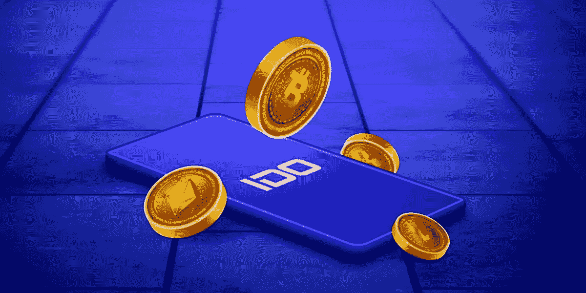

# 最高评级的 IDO 营销策略

> 原文：<https://medium.com/geekculture/ido-marketing-strategies-a94aece68e25?source=collection_archive---------9----------------------->

# 营销您的加密项目的终极方式！

加密货币的价值在全球市场上飙升，大约有 10，000 种加密货币。最终，它们为企业家提供了一个突出的平台，让他们投资于在数字和分散领域运行的各种密码元素。

空间的创新和原创性维持着市场的标准。但你有没有考虑过这些公司，尤其是市场初创公司，是如何获得流量的？如果你找不到合适的答案，我们会帮你解决。与市场上的其他筹款活动一样，IDO 通过提供可行的 IDO 营销服务 来激起更多观众的兴趣，从而实现其在 [**区块链网络上的目标。**](https://www.cryptocurrencyexchangescript.com/ido-marketing-services?utm_source=medium&utm_medium=guestblog&utm_campaign=vigneshraju)

# **首次发行 Dex:一瞥**

首次分散发行(IDO)是一种现代的、在巨大且不断扩大的市场中非常受欢迎的融资策略。与其他产品不同，IDO 为企业家提供了更多的流动性。因此，用户被吸引到收回初始投资和吸引新投资者到平台的过程中。这些平台还为代币上市提供更便宜的费用，并提供其他额外服务，如快速交易、相当安全的融资等。

支持 IDO 机制的分散式交易所是初创企业战略生成和列出其硬币和代币的地方。这不是结束；销售对上市没有贡献，但定期的追踪、正确的洞察力、品牌信任和各种其他因素都很重要。这种方法也吸引了对项目投资感兴趣的投资者。

# **IDO 营销策略**

**IDO MARKETING STRATEGY**

如前所述，营销对所有企业都有利。如果你想激起大量观众的兴趣，你必须运用营销手段来吸引他们。随着市场竞争的加剧，尽快开始你理想的 IDO 营销服务以激起全世界人们的好奇心是至关重要的。

它可能是用于游戏、交易、虚拟世界等的任何 IDO 令牌。另一方面，潜在投资者是任何企业家的目标受众。具有战略方法的 IDO 营销服务基于巨大的潜力和胜任的 IDO 营销服务。

您可以根据您的项目及其需求，通过有效和独特的活动和计划宣传和品牌化您的 IDO 令牌，吸引全球投资者的注意，并帮助您的企业在更短的时间内扩张。

# **您的加密项目的 IDO 营销的不同属性**

**IDO MARKETING PROJECTS**

*   **社交媒体**

毫无疑问，Instagram、脸书和 Twitter 等社交媒体网站是向更多受众传播你的创意业务的理想方式。数字领域正在迅速扩大，这是找到目标受众的简单方法。在这种情况下，营销很大程度上依赖于原创和内容。

*   **社区建设活动**

聚集你的观众，让你感受到闪亮的粉丝，是有趣的部分。培养你的专属社区并让他们保持兴趣、好奇、更新和知情是至关重要的。Telegram 和类似 Discord 的应用程序对于扩大你的社区非常有用。管理通过特定的渠道和服务器进行隔离和组织。与此同时，这个平台是在一个地方进行营销和重新利用数据的绝佳工具。它的能力还延伸到偶尔为客户提供帮助。

*   **直接接触投资者**

企业家可以通过公关活动、电子邮件营销以及其他专业和直接的营销工具，直接接触到他们的个人贡献目标。这是一个更官方的方法来促进你的录音工作。使用公共关系和时事通讯可以帮助解决与市场相关的问题和顾虑。虽然使用传统策略，但这是接触投资者的绝佳方式。

*   **创意内容**

内容是营销最重要的组成部分，它有多种用途。从白皮书到营销活动，所有需要的是完整的和令人信服的内容，为搜索引擎优化，网站，营销和接触的影响者。纹理，海报，博客，字幕，视频材料，音频和其他媒体都可以使用。这演变成一种知识转化，包括商业理念、路线图、洞察力和受众教育。

# **顶级 IDO 营销策略:增加资金的理想方法**

**BOOST YOUR FUNDS**

*   **公共关系和审计**

为了在你的项目中建立信任感和信心，尽快得到你的智能合同。与类似的企业组成合法性俱乐部作为密码行业的合作伙伴。这可以带来更多的见解，并聚集巨大的牵引力。此外，通过频繁的公关活动，你可以在媒体和市场之间架起一座桥梁，让你分享信息、定期更新和对公司的见解。

*   **令牌组学权利**

IDO 项目经常错过作为筹资形式的象征性经济权利。即使你正在做一个独特的项目，你的机会也可能会减少。在专家的帮助下准备好你的令牌机制，然后在众筹市场上出售你的 [**IDO 令牌**](https://www.cryptocurrencyexchangescript.com/ido-launchpad-script?utm_source=medium&utm_medium=guestblog&utm_campaign=vigneshraju) 。寻找创新的项目协议，如果你在时尚市场交易，它可以帮助你吸引投资者。根据趋势分析您的令牌协议。

*   **白皮书**

即使在加密领域，白皮书也迎合了不同的受众和趋势。为了获得对业务的深刻理解，必须遵循传统。该文件必须是创造性的，创新的，同时不要太长或太复杂。就业务功能而言，它必须简洁而详细。在营销方面，这些商业白皮书是受众了解商业并获得兴趣和信任的计划和见解。

*   **大肆宣传的赠品和空投**

计划接受恐怖和壮观的空投。以前，通过互动和筹款活动将你的社区聚集在一起可以帮助你抓住更多用户的兴趣。您的社区可以参与实时任务和活动，以获得独家奖品。这是一种吸引全球观众注意力的欺骗性策略。确保你的竞赛是真实的、有趣的、令人愉快的。此外，给参与者一个奖品。你也可以将你的赠品计划和奖励与你的下一次空投联系起来，这将激起观众的兴趣。

 [## 首次发行 Dex 最新筹资模式的来龙去脉

### 这是非常真实的，加密空间一直在努力找出一种新的方法来鼓励有前途的…

www.cryptocurrencyexchangescript.com](https://www.cryptocurrencyexchangescript.com/blog/initial-dex-offering-the-ins-and-outs-of-the-latest-fundraising-model/) 

**接下来呢？联系专业的 IDO 服务提供商**

联系专业人士可以帮助你获得对公司有价值的信息。说到推广你的 IDO，你有很多选择。另一方面，让它成为你公司的一部分是有问题的，因为你无法完全专注于它。相反，收集你所有的需求，为你的企业雇佣一个专业的[**IDO 营销服务商**](https://www.cryptocurrencyexchangescript.com/ido-marketing-services?utm_source=medium&utm_medium=guestblog&utm_campaign=vigneshraju) 。有了它，你就能发挥出最佳水平，轻松获得更多行业见解。