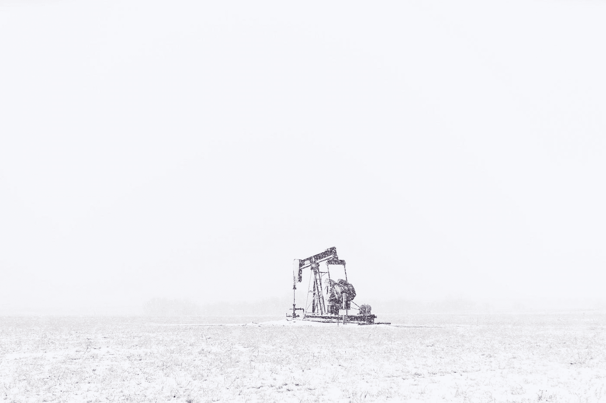

# 如果数据是新的石油…谁是新的石油商？

> 原文：<https://medium.com/geekculture/if-data-is-the-new-oil-who-are-the-new-oilmen-43df2f01e4bf?source=collection_archive---------22----------------------->

Photo by [Josh Redd](https://unsplash.com/@joshredd?utm_source=medium&utm_medium=referral) on [Unsplash](https://unsplash.com?utm_source=medium&utm_medium=referral)

“数据是新的石油”是近来经常被重复的一句话。它是由英国数学家兼企业家克莱夫·罗伯特·亨比在 2006 年创造的，他是我们现在称之为数据科学的专家，仅仅在几年前我们还会称之为 T2 统计学。事实上，几十年来，统计学一直是数据科学，或者是致力于数据分析的数学学科，无论其性质如何。从人口普查数据到经济数据，IBM 于 1911 年建立了人口普查数据分析系统，这就是为什么统计学被认为是经济学家的数学。

然而，近年来，出现了一种新的趋势，即倾向于将数据分析与人工智能(AI)联系起来。

人工智能直到最近几年才通过引入基于一个相对较新的概念的计算技术取得了重大进展:人工神经网络。这个新概念背后的思想相对来说很容易解释。人工神经网络(基于大脑构造的灵感)是一组相互连接的节点。每个节点相对于它所连接的节点正在做什么可以处于开或关状态。网络中有输入节点和输出节点，根据如何建立接通或断开规则以及各个连接的重量，可以对计算算法进行编码，从而在输出节点中提供结果。使用这种类型的方案，有可能在当前人工智能的基础上实现被称为*深度学习、*的计算技术。它们已经被有效地用作分类器方案，并成功地用于图像识别和语音分析。

这些强大的技术，为了工作，需要数据大量的数据。例如，为了“训练”一个包含一只猫的图像识别算法，我们需要许多(数万或数十万)描绘一只猫的图像。这些图像用于创建人工神经网络，然后必须实现深度学习算法。同样，在其他部门，需要有大量数据来创建将在实际应用中使用的算法(因此有“大数据”这一说法)。

一个使这些分析技术具有国际相关性的新闻案件与英国公司“剑桥分析公司”的丑闻有关，该公司在 2018 年成为司法调查的焦点，因为它使用了脸书获得的个人数据，以便在英国退出欧盟和美国总统选举等政治事件中建立选民档案。从那时起，许多人已经意识到数据具有巨大的潜在价值，尽管正如美国全国广告商协会的麦可尔·柏默所说，“数据就像原油一样”。它很有价值，但如果未经提炼，就不能真正使用”。

# **新石油商**

正如老石油商是那些从地下提取原油然后提炼的人一样，新石油商是那些能够**捕捉**数据并分析它们以获得有用预测的人。

在剑桥分析公司的经历之后，油田的所有者(脸书、亚马逊、谷歌……)效仿了一些阿拉伯国家:他们赶走了外国石油商，开始自己提取和提炼数据。这项新政策最有趣的应用之一是所谓的“预测营销”。每当我们通过电子邮件或网络收到关于购买船只(在过去几天访问过与船只有关的网站和对话后)或特殊防晒霜(在访问过皮肤病学和海滩主题的网站后)的建议时，我们都会体验到这种技术。

在所有这一切中，我们绝不能忘记一个基本方面:谁生产钻头？事实上，不钻井就无法开采石油，而那些开发出开采技术的人比所有有抱负的石油商都有相当大的优势。苹果、三星等公司迄今为止一直是现代数据采集钻机的生产商，事实上他们也开始增长石油野心(想想 *Siri* 或 *Alexa* 的微妙入侵)。

# ***智能传感器*是新的数据钻**

在未来，非常有趣的场景正在向所有能够产生超越智能手机的新型*数据训练*的人开放。这是一片被称为物联网( ***物联网*** )的广阔草原，在这里，将不再只是人类将产生数据，而是大部分是东西。*智能传感器*是新的数据钻。

**黑色淘金热已经开始，那些想要参与的人被警告:我们在新的遥远的西部，给你的马装上马鞍，设计好你的传感器。**