# 否则，对于每一个，除非，动态数据，布局，在 Express.js 中带有模板的手柄的注释

> 原文：<https://medium.com/geekculture/if-else-for-each-unless-dynamic-data-layout-comments-with-handlebars-templating-in-express-js-55fbc79169f2?source=collection_archive---------7----------------------->


再次嗨，新年快乐！！我忙于所有的聚会，以及所有拜访我的亲戚，最后我带来了一些关于车把模板的好信息，if 和 for each 以及一些提示。

# 创建目录

我已经创建了一个名为 handlebarsprc 的目录，您需要在其中创建 JSON 包

# 启动 NPM

我们需要启动运行这个命令所需的包 JSON

```
npm init -y
```

当我们可以安装包时，它将创建包 JSON

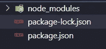

Initiate the package JSON

# 安装快速把手和快速把手

你必须安装快速和快速手柄与此命令

```
npm i --save-dev express express-handlebars
```

# 视图和布局结构

因为我们将使用视图和布局，所以我们应该添加这些目录，并添加视图和布局，例如 home、404、500，另一方面是布局的 part main 和 layout2

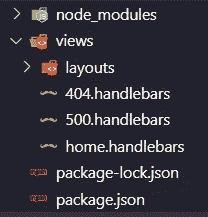

Example structure for views and layouts

在主布局和 layout2 中，您需要添加所有基本的 HTML 结构

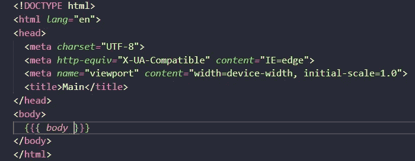

Example main basic HTML structure

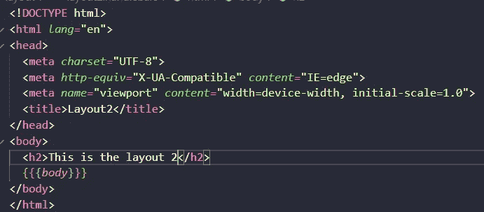

Example layout 2 basic HTML structure adding some info

如果你仔细看，我添加了{{{body}}}这是为快速手柄发送所有来自视图的信息。

# 创建我们的服务器

要创建我们的服务器，创建一个名为 project_handlebars.js 的文件并添加基本结构以在端口 1024 和 localhost[http://127 . 0 . 0 . 1:1024](http://127.0.0.1:1024)上运行服务器是非常重要的，基本代码分享如下。

```
const express     = require( 'express' ),
app         = express(),
port        = process.env.PORT || 1024,
{ engine }  = require( 'express-handlebars' )
app.disable( 'x-powered-by' )
app.engine( 'handlebars', engine({
defaultLayout: 'main'}))app.set( 'view engine', 'handlebars' )
app.get( '/', ( *req*, *res* ) => *res*.render( 'home' ))
app.use( ( *req*, *res* ) => *res*.status( 404 ).render( '404' ) )
app.use( ( *err*, *req*, *res*, *next* ) => *res*.status( 500 ).render( '500' ))
app.listen( port, console.log( `http://127.0.0.1:${ port }` ))
```

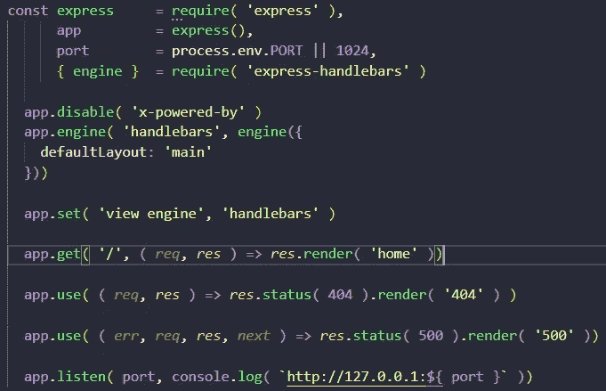

Example basic structure for express server with handlebars

我们首先需要 express 库并将其保存在一个名为 express 的变量中，然后启动 express 服务器并将其保存在一个应用程序变量中。其次，我们需要将端口保存在一个端口变量中。第三，我们需要调用库 express——手柄和带花括号的引擎， **这是针对 6.0.2 版本的**然后为了安全起见，我们禁用了 x-powered-by，之后我们可以设置引擎，在这种情况下，我们需要传递一个对象作为参数，我们可以将默认布局添加为 main(我们创建的布局)，然后我们将默认视图设置为 view engine 和 handles。

稍后，我们需要创建渲染，因为现在我们有一个 home、404 和 500，最后我们用两个参数启动 listen 函数，第一个是端口，第二个是 console.log，以显示我们的服务器在哪里运行请求。

如果我们运行我们的服务器，我们将看到类似这样的内容:

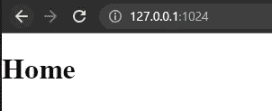

Example running our server and checking the first home page

# 让我们找点乐子

好了，让我们创建一个目录调用 lib，我们可以在里面添加一个 funny.js 文件，这个文件是一个返回随机名称的函数，让我们创建一个名为 fun.handlebars 的新视图，也作为视图添加到我们的 project_handlebars.js 中

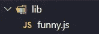

Example library and funny.js file and directory

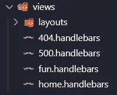

Example adding the fun.handlebars file

```
const RandomNames =['Sarah','August','Via','Jack','Allison','Emos','Julian','Mile']
*exports*.randomName = () => {return RandomNames[ Math.round( ( Math.random() * RandomNames.length ) + 0 ) ]}
```

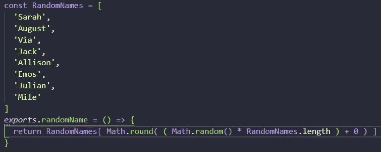

Example exporting random names from our funny.js file

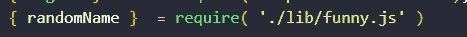

Calling our randomName from our funny.js file

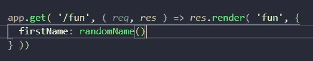

Example using our randomName in fun’s view

运行我们的服务器，进入[http://127 . 0 . 0 . 1:1024/fun](http://127.0.0.1:1024/fun)，我们会有什么？

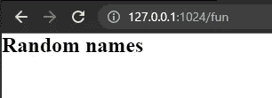

Example fun page

没事哈哈哈哈

我们将添加动态数据，如果有的话，为每一个不同的布局到我们新的有趣的车把文件。

要添加随机名称，我们需要将变量作为 project_handlebars.js 中的一个对象进行传递，并且要实现它，就要在我们的 fun 视图中添加{{}}或{{{}}}花括号

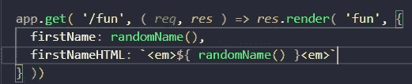

Example adding an object in the response object

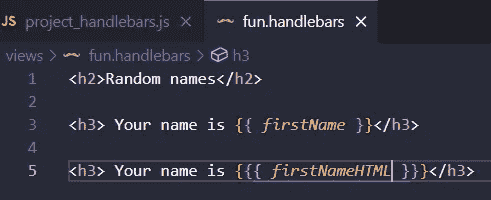

Example printing the names into the fun handlebars view

如您所见，我添加了一个带两个花括号的，另一个带 3 个花括号的，结果是这样的:

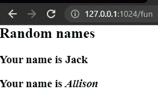

Example printing names into the fun’s view and with HTML tags

让我们使用把手内的 if，首先我们需要添加{{#if key}}和{ {/if } }来关闭 if，但关键是我们将从我们的对象传递的变量，在这种情况下将为 if 值将为 true。

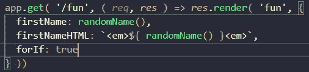

Example adding forIf property to the object and the value to true

然后，我们需要将 if 添加到 handlebars 视图中

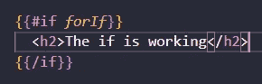

Example adding the if to the handlebars view

重新运行我们的服务器

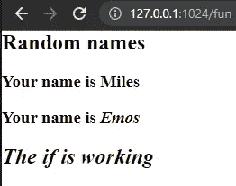

Example the if on the web page

让我们添加 else 和一个注释，对于注释您需要添加！在大括号{{！注释}}然后我们将添加 else，您应该在 if 中添加才能正常工作。

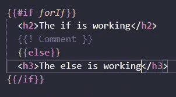

Example adding comment and the else if we have false as a value

让我们成功吧

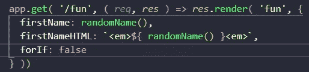

Changing the forIf value to false


Example using the else on the fun page

# 添加 For each 和 unless

对于 for each，我们只使用{{#each key}} {{/each}}和 for unless { { # unless key } } { {/unless } }

对于每个数组做一次迭代，我们需要添加{{。}}对于数组中的每个值，如果键为 false，则除非显示某些内容

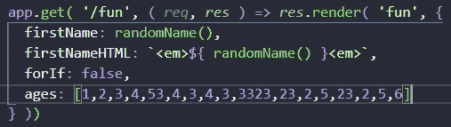

Example adding an array to the object

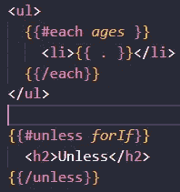

Adding the each and the unless to the handlebars view

重新运行我们的服务器

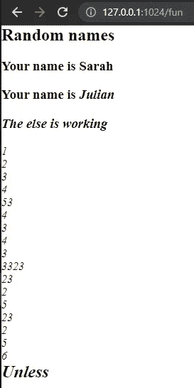

Example fun’s web page

迭代和打印动态信息，但使用{ }搜索对象../}}

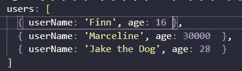

Adding users array to iterate

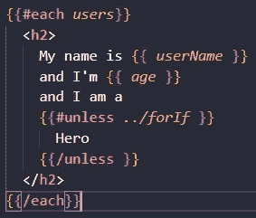

Adding for each, unless and using the ../ to seek for the forIf value inside of the for each

重新运行我们的服务器，我们会有这样的东西

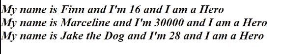

Example fun’s page outcome

添加自定义布局，在这种情况下，您必须在我们要传递给视图的对象中插入布局属性和自定义布局的名称

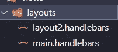

Example layout2 on the layouts directory

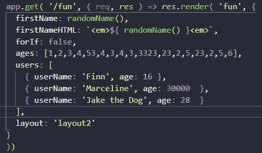

Example adding the custom layout to our fun view

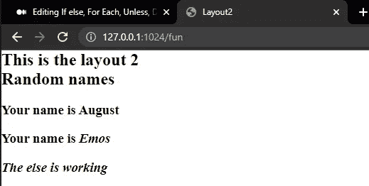

Example custom layout in the fun’s page

```
const express         = require( 'express' ),
app             = express(),
port            = process.env.PORT || 1024,
{ engine }      = require( 'express-handlebars' ),
{ randomName }  = require( './lib/funny.js' )
app.disable( 'x-powered-by' )
app.engine( 'handlebars', engine({
defaultLayout: 'main'
}))
app.set( 'view engine', 'handlebars' )
app.get( '/', ( *req*, *res* ) => *res*.render( 'home' ))
app.get( '/fun', ( *req*, *res* ) => *res*.render( 'fun', {
firstName: randomName(),
firstNameHTML: `<em>${ randomName() }<em>`,
forIf: false,ages: [1,2,3,4,53,4,3,4,3,3323,23,2,5,23,2,5,6],
users: [{ userName: 'Finn', age: 16 },{ userName: 'Marceline', age: 30000  },{ userName: 'Jake the Dog', age: 28  }],layout: 'layout2'} ))app.use( ( *req*, *res* ) => *res*.status( 404 ).render( '404' ) )app.use( ( *err*, *req*, *res*, *next* ) => *res*.status( 500 ).render( '500' ))app.listen( port, console.log( `http://127.0.0.1:${ port }` ))
```

有趣的完整代码

```
<h2>Random names</h2>
<h3> Your name is {{ *firstName* }}</h3>
<h3> Your name is {{{ *firstNameHTML* }}}</h3>
{{#if *forIf*}}
<h2>The if is working</h2>
{{! Comment }}
{{else}}
<h3>The else is working</h3>
{{/if}}
<ul>
{{#each *ages* }}
<li>{{ *.* }}</li>
{{/each}}
</ul>
{{#unless *forIf*}}
<h2>Unless</h2>
{{/unless}}
{{#each *users*}}
<h2>
My name is {{ *userName* }}
and I'm {{ *age* }}
and I am a
{{#unless *../forIf* }}
Hero
{{/unless }}
</h2>
{{/each}}
```

# 结论

总之，我们有我们想要的 if，else，the for each，the unless 注释，并寻找正确的属性的对象

# 来源

[](https://www.amazon.com/Web-Development-Node-Express-Leveraging-dp-1492053511/dp/1492053511/ref=dp_ob_title_bk) [## 使用 Node 和 Express 进行 Web 开发:利用 JavaScript 堆栈

### 使用 Node 和 Express 进行 Web 开发:利用 Amazon.com 的 JavaScript 堆栈。*免费*送货到…

www.amazon.com](https://www.amazon.com/Web-Development-Node-Express-Leveraging-dp-1492053511/dp/1492053511/ref=dp_ob_title_bk)