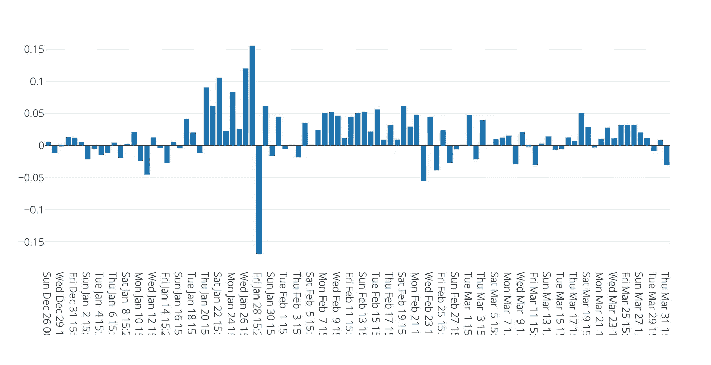
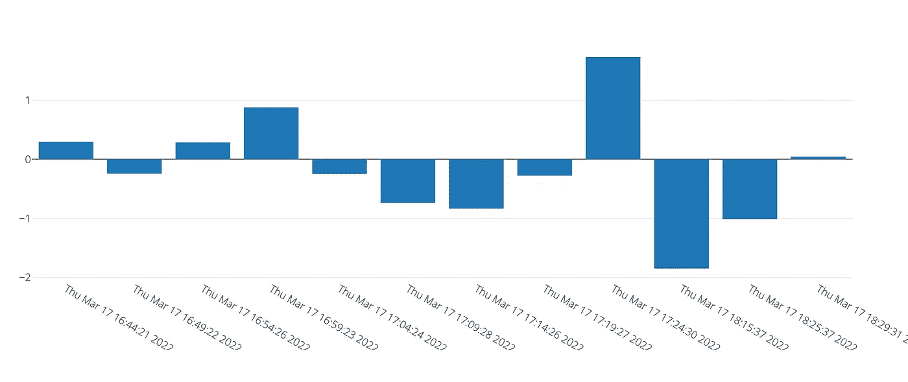
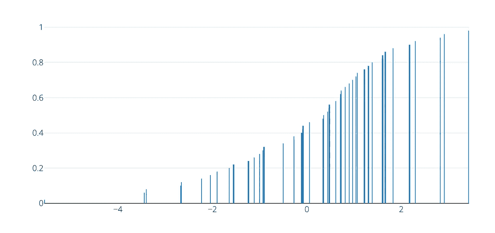
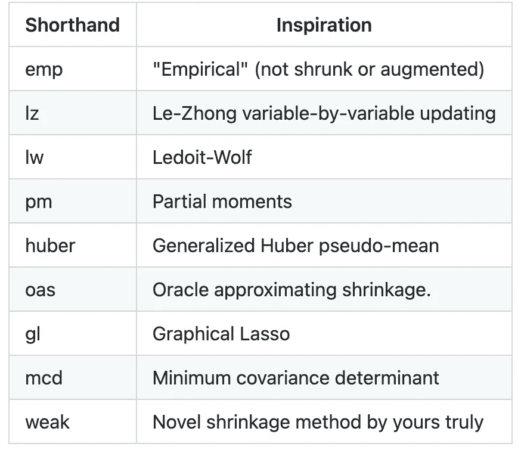
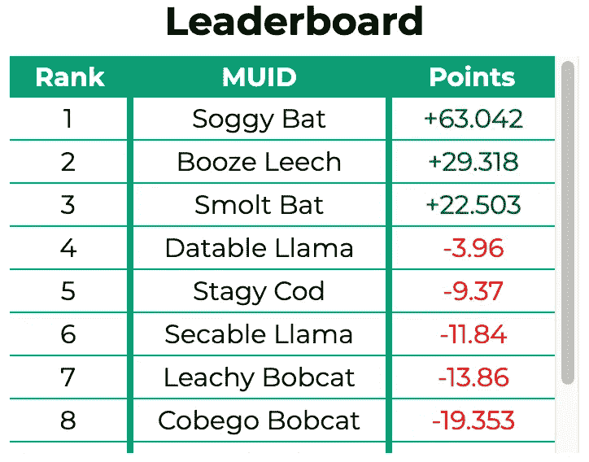
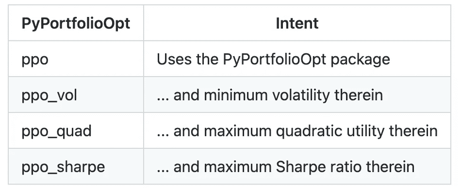
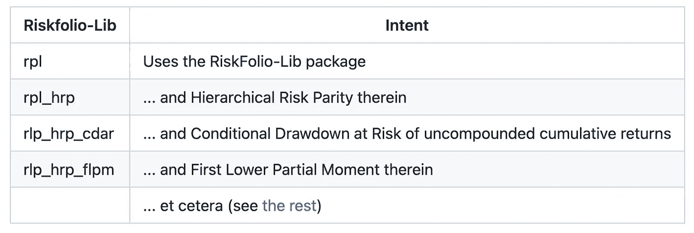
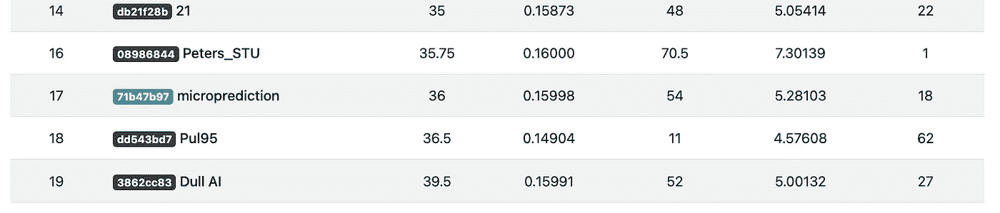

# 如果这个疯狂的实验成功了，它可能会动摇基金管理

> 原文：<https://medium.com/geekculture/if-this-crazy-experiment-works-it-might-shake-up-fund-management-b494249b8010?source=collection_archive---------5----------------------->

如果你读了[一篇没有立即过时的实证文章](/geekculture/an-empirical-article-that-wasnt-immediately-stale-720abfb4678f)，并且在文章撰写后跟踪了[的实时结果](https://www.microprediction.org/stream_dashboard.html?stream=c2_daily_info_minus_rebalanced_50)，你可能会和我一样吃惊。

这该死的东西起作用了！

你看到的是*人群决定的*以太坊和比特币组合的平均净回报，每 15 分钟调整一次，相对于不断重新平衡的 50/50 投资组合。直播结果这里[这里](https://www.microprediction.org/stream_dashboard.html?stream=c2_daily_info_minus_rebalanced_50)。(我不能在原文中包含这些结果，因为我发誓永远不会编辑它，无论出于什么原因。)

*告诫，告诫！由于表面上的自相关，结果有点可疑，是的，当然，我发现了一个错误，现在已经修复了。尽管如此，结果似乎总的来说是积极的。当然，一个更大的警告和使用障碍是交易成本。然而，尽管如此，有人可能会说，市场并没有吸收所有信息，甚至没有充分利用历史价格信息——如果你想提出一个学术观点的话。*

现在人群不再是任何人群。正是这一群算法监控着微预测流，并通过 API 或客户端把对未来值的猜测传回。任何人都可以贡献算法。实际上，你现在就可以通过对这个 Python [脚本](https://github.com/microprediction/microprediction/blob/master/crawler_skater_examples/datable_llama.py)做一些小的修改并运行它。

这群人还能有什么用？

# 脸书，苹果，亚马逊，网飞，谷歌

我开始了一个更加雄心勃勃的实验——确定 FAANG 股票的最佳投资组合。是的，这些公司的名字已经改变了，但是 FAANG 这个缩写仍然存在。(我将用数字标签来证明未来:0=FB，1=AAPL，2=AMZN，3=NFLX，4=GOOGL。)首先考虑一个投资组合，其中包括 *15.0%的 FB、15.0%的 aapl、15.0%的 amzn、15.0%的 nflx 和 40.0%的 googl。*下面是这些定标对数收益的时间序列。

Example return time-series for a candidate FAANG portfolio

我们需要这个时间序列中下一个值的分布估计，它将随着时间的推移不断变得更好，纳入时间序列和自主机器学习的最佳进展，并随着时间的推移引入外源数据。听起来很辛苦吗？

那鸿这有一个 API。

如果您从未向 microprediction API 提交过实时数量，那么，好吧，您可以访问 [hello world](https://github.com/microprediction/microprediction/tree/master/hello_world) 目录，您会发现这有多简单。你发布的任何东西都将被足够准确地预测到*所有主要的自动机器学习供应商都害怕与它进行比较**。懦夫。*

*也许我应该公开我的动机。与机器学习供应商不同，我为一家历史悠久的大型 AUM 投资公司工作。因此，就我将新预测技术货币化的能力而言，我非常幸运。*

*如果你使用我们的免费开源平台来预测你关心的事情，你可能会意外地引入生态系统算法(或数据)来帮助我们进行预测。提示无耻插头为一个[书](https://mitpress.mit.edu/books/microprediction)扩展这一思想。*

*无论如何，我非常喜欢这个 API，以至于在这个例子中，我创建了一百多个不同的流——每个流报告一个稍微不同的投资组合的回报。您可以查看[投资组合流的完整列表](https://raw.githubusercontent.com/microprediction/microprediction/master/stream_examples_faang/stream_list.json)。为了您的利益，我希望您的浏览器能够很好地呈现 JSON。*

*如果没有，这里有一个[例子](https://www.microprediction.org/stream_dashboard.html?stream=gnaaf_00000)和[另一个](https://www.microprediction.org/stream_dashboard.html?stream=gnaaf_00024)和[另一个](https://www.microprediction.org/stream_dashboard.html?stream=gnaaf_12224)。正如你所看到的，每个投资组合的 15 分钟回报率都是用有点晦涩的名字公布的，比如 [gnaff_00234](https://www.microprediction.org/stream_dashboard.html?stream=gnaaf_00234) 或 [gnaff_00224](https://www.microprediction.org/stream_dashboard.html?stream=gnaaf_00224) 。名字 **gnaff_00234** 表示 FB 超重(0 出现两次)，而 AAPL 体重不足(1 没有出现)。*

*我提请大家注意 CDF，例如[这个](https://www.microprediction.org/stream_dashboard.html?stream=gnaaf_12224&horizon=3555)，它整合了所有选择加入争论的算法的视图。*

**

*Example of a scaled 15–minute log-return CDF rendering, for a FAANG portfolio that is overweight Amazon*

# *预测玩家*

*当然，为了让这个实验成功，我们需要确保在组合中有一套合适的方法。我想，一点现金会有所帮助，我们很可能很快就会增加。吹牛的权利看起来几乎同样重要，代表 microprediction 社区的一些成员推进开源软件包的愿望也是如此(如果 slack invite 是过时的，可以找我麻烦，或者查看我的主页获得新的邀请)。*

*在这个例子中有一点不同的是，我们可以利用几十个不同的在线[协方差估计](https://github.com/microprediction/precise/blob/main/LISTING_OF_COV_SKATERS.md)的一行程序，我已经把它们放在 [precise](https://github.com/microprediction/precise) Python 包中了。因此，有人可能会说，存在合理的基准。*

**

*Examples of covariance estimation algorithms that compete to predict distributional portfolio returns.*

*事实证明，我自己的虚张声势目前毫无价值，因为我利用自己的方案所采用的方法正被彻底击败。我不是你下面看到的前三个算法的创造者。有些人会在这个[排行榜](https://www.microprediction.org/leaderboard.html)上透露他们的代码，但有些人不会。*

*以这种方式被击败，当然是使用开放、竞争的形式进行现场预测的好处。*

**

# *不同的策略？*

*有趣的是，我们不需要算法总是准确的。它们在不同的投资组合中保持一致就足够了。可以说，我们是众包优势功能。*

*然而，在这个节骨眼上，对众包(包括这种新的自主类型)持怀疑态度的读者可能会怀疑这种方法是否过于简单。或许我们应该预测各种辅助量，如贝塔系数、已实现离差、波动率、相关性度量、尾矩等等，然后用它们来构建我们自己的投资组合。*

*这第二条道路是完全合理的，我同时追求它。为此，我整理了大量在线增量[投资组合构建](https://github.com/microprediction/precise/blob/main/LISTING_OF_MANAGERS.md)的一句话。其中一些调用流行的包，如 PyPortfolioOpt 或 Riskfolio-Lib。*

*如果你是那些四处闲逛的 T4 人，这里有一些提示:*

**

*同样:*

**

*Examples of Riskfolio-Lib portfolio methods, that might be applied to crowd-sourced covariances*

*你明白了。我有一些非常初步的证据表明， [precise](https://github.com/microprediction/precise) 组合中的一些本土投资组合方法也很不错，这是基于我目前在正在进行的 M6 比赛中排名第 17/174 的事实——参见 volatile [排行榜](https://m6competition.com/Leaderboard)。*

**

*M6 Leaderboard. The microprediction entry uses the precise Python package and is 19th overall out of 174 entrants at the time of writing. It also placed 13th overall in the Pilot.*

*然而，根据我对比特币和以太坊的经验，我怀疑可能只是简单的道路是最好的——所以这就是为什么我使用大量的投资组合流直接追求最终结果。时间会证明这是否明智。*

# *大众推荐投资组合的回报*

*撇开这一点，我们将:*

1.  *等待算法的到来。*
2.  *检索每个投资组合的隐含指标(从预测中)*
3.  *构建一个投资组合的投资组合，增加那些具有良好比率的投资组合的权重。*

*在步骤 2 中，请注意提交预测的算法实际上会将可能被认为是蒙特卡罗样本的东西扔给 API。如果 20 个算法竞争，我们就有 4500 个未来回报的“样本”。*

*实现步骤 3 的精确方式是透明的。所有的[代码](https://github.com/microprediction/microprediction/tree/master/stream_examples_faang)已经提供。在撰写本文时，实际上有九种不同的方法来构建投资组合，因此有九种不同的流来报告这些推荐投资组合的回报。那些是 [naafg_0](https://www.microprediction.org/stream_dashboard.html?stream=naafg_0) 到 [naafg_8](https://www.microprediction.org/stream_dashboard.html?stream=naafg_8) 。*

*想要运行几个选项的原因是，没有明确的指标选择应用于分布预测或投资组合回报，这显然是加权 FAANG 投资组合的正确方法。我使用信息比率、半信息比率和峰度只是为了好玩，对于每一种比率，我们有三种选择。*

*如果这听起来像一个树篱，让我现在说，如果我在这里不做进一步的工作，我将提名第一个作为这个想法是否可行的测试，我们将看到这个选择如何老化。但我可能会做的是创建一个由 [naafg_0](https://www.microprediction.org/stream_dashboard.html?stream=naafg_0) 到 [naafg_8](https://www.microprediction.org/stream_dashboard.html?stream=naafg_8) 组成的单一群体驱动组合，从而以一种更优雅的方式消除任何事后偏见的指责，并产生三层三明治投资组合方法。*

*作为备注，你会发现我们避免了直接使用历史数据。当然，历史会告诉那些以某种方式参与形成的算法，除非它们相当反常。避免所有常见陷阱取决于算法，而不是我们。*

# *未完待续…*

*暂时就这样了。我只是试图通过一开始就写一个实证实验来养成良好的卫生习惯，而不是事后再去挑选。*

*可以说，股票市场的众包并不是什么新鲜事，但这种特殊方法的粒度、速度和预测的多层次都是新的。所以我期待着在未来的某一天完成这篇文章。*

*同时，你有[这个](https://www.microprediction.org/stream_dashboard.html?stream=daily_naafg_0)表演日志。*