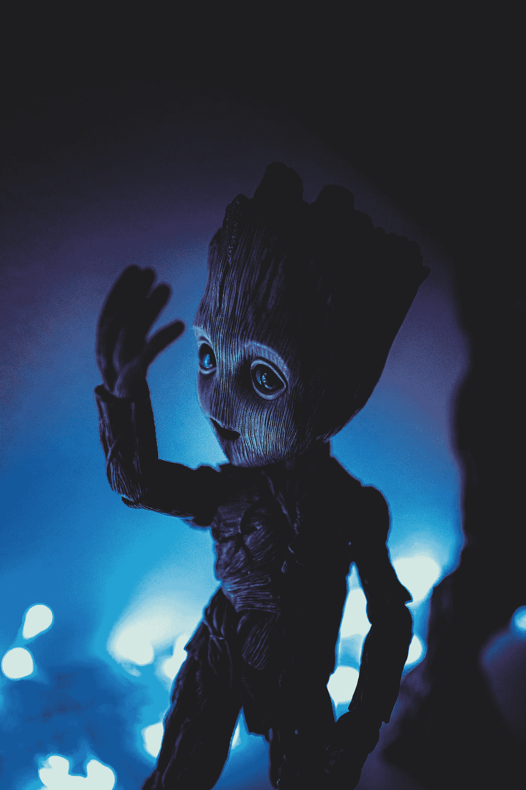

# 如果你不相信外星人，你应该相信

> 原文：<https://medium.com/geekculture/if-you-dont-believe-in-aliens-you-should-2adae23c496d?source=collection_archive---------9----------------------->

## 令人不安的事实是，认为我们是不合逻辑的。

Photo by [Jaromír Kavan](https://unsplash.com/@jerrykavan?utm_source=medium&utm_medium=referral) on [Unsplash](https://unsplash.com?utm_source=medium&utm_medium=referral)

几乎不可否认的事实是，我们在这个宇宙甚至这个星系中并不孤独。认为生命只存在于地球上的观点让人想起过去地球是万物中心的观点。很久以前，人们相信…