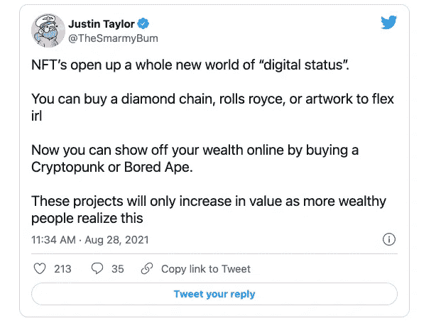
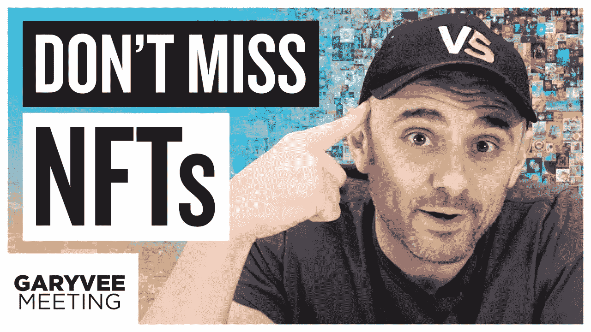

# 如果你在谷歌上搜索了“可替代的”，请阅读这篇文章。

> 原文：<https://medium.com/geekculture/if-you-googled-fungible-read-this-article-b21d681e4e7a?source=collection_archive---------20----------------------->

link to [Photo](https://www.frieze.com/article/what-are-nfts-and-why-are-they-changing-art-world), credit frieze

由于其疯狂的估值，NFT 吸引了疯狂的媒体。在我的 [*首次 NFT 发布的那天(我的约翰·迈克菲访谈*](https://auction.nftvirals.com/#/auction/285) *)，我想分享一下我对这些现象的想法。我制作 youtube 视频，我是非技术性的，如果你想要一些关于 NFTs 历史的好的半技术性文章，请查看一下 Andrew Steinwold 的。*

我最喜欢的一句台词来自电影《大空头》。在最后一幕中，迈克尔·伯里在他反对房地产泡沫的“做空”被证明是正确的之后，向他的投资者写了辞职信。该行内容如下:

> *“人们想要一个权威来告诉他们如何评价事物，但他们选择了* ***这个权威不是基于事实或结果*** *，而是因为它看起来权威且熟悉。”*

没有什么地方比 NFTs 更能体现 Burry 现象了。NFT，不可替代的代币，今天已经变得巨大，因为其中一些代币已经卖到了疯狂的价格。幼虫实验室的 Cryptopunks 项目已经卖出了数百万美元的单个 NFT。推特上充斥着 NFT 的个人照片。运动员、科技摇滚明星和说唱歌手都在展示他们的 NFTs 许多人正在创建自己的项目。对一些人来说，这是一个信号，表明我们正处于一个即将破裂的巨大金融泡沫之中。对其他人来说，这是参与下一波金融革命的机会。

那么，这种价值观是否完全基于将风险投资家、科技创始人和名人视为权威？或者这种技术是下一阶段资本创造和分配的开始？

NFTs 的真正价值会凸显出来吗？

# 什么是 NFT？

观看 NFT 的最佳方式是在一张单独的区块链上贴上邮票。这些图章用于显示特定数字文件的所有权:图片、gif、youtube 视频。每一枚邮票都是独一无二的，而且只有发行该邮票的区块链的 1/1。正如弗里兹所写的

> *“大多数 NFT****的功能类似于真实性证书*** *，只是它们依赖以太坊区块链的密码协议作为其权威，而不是官方的纸质文档。这种高科技令牌是独一无二的，可以证明你的所有权，但你拥有的东西——通常是 JPEG、GIF 或 MOV——仍将一如既往地保持为***。”**

*最常用的区块链是以太坊，第二大加密货币。由以太坊的联合创始人查尔斯·霍斯金森(Charles Hoskinson)创建的 Cardano 和由著名风险投资公司安德里森·霍洛维茨(Andreeson Horowitz)支持的 Solana 等重大项目旨在打破以太坊目前的主导地位。由于 NFT 的原因，这三种加密货币在过去的一年里都上涨了疯狂的数量。*

# *NFTs 的价值*

*NFTs 对我的价值可以用这五个论点来概括。*

1.  *遗产-你将可以永久拥有一件特殊的不可损耗(如艺术品)、不可替代(如金钱或黄金)、独特的物品。就像永远，永远。从理论上讲，一个 NFT 会比王朝持续的时间更长，比如有 3000 年历史的埃及帝国。理论上，区块链上的 NFT 印记将在未来持续数千年，甚至超过生活在地球上的人类。当你买了 NFT，它将永远与你的身份联系在一起。你家族的几代人将会知道你的兴趣是什么，你当时是个多么出色的球员。*
2.  *声望——人类本性的一个基本方面是渴望拥有源于年龄的财富。在法国，这被称为刀剑贵族:贵族的影响力来自他们的祖先在十字军东征中的战斗。他们被视为比当时的富人更重要，比长袍贵族更重要:贵族的地位是从“资产阶级”商业中获得的。正是这种情绪，盖茨比想成为“老钱”的愿望，推动了 NFT 的重大投资。*

**

*The main argument for an NFT now-Show off your status online.*

***3。额外津贴-** 有额外津贴！无聊猿游艇俱乐部(BAYC)是 NFT 最大的项目之一，斯蒂芬·库里(Steph Curry)将他的猿作为他的 Twitter 个人资料图片而闻名。拥有一辆 BAYC NFT 让您有机会参加大型“精英”和“专属”活动。最近，我在 NFT。纽约会议。BAYC 会员可以和、这样的名人一起玩，在陶这样的纽约主要俱乐部排队，并被邀请参加独家网络活动和游艇派对。*

***4。光顾-** 与额外津贴的想法携手，是光顾你最喜欢的艺术家的想法。我对约翰·迈克菲的采访的 NFT 今天就要上线了，最终购买它的人将帮助我继续创作内容。现在，艺术家、音乐家和网络名人正在把更多接触自己的机会作为他们 NFT 套餐的一部分。这在理论上可以升值。如果我最终成为下一个乔·罗根，我的第一辆 NFT 的价值会上升**很多！**从浪漫的角度来看，这是关于 NFTs 最酷的部分。一个支持你最喜欢的崭露头角的艺术家的机会，**也从他们的失败中获利。***

***5。翻转——“**更大的傻瓜理论是指，在市场泡沫期间，一个人可以通过**购买高估的资产并在稍后以盈利的价格出售它们来赚钱**，因为总是有可能找到愿意支付更高价格的人。”许多密码交易员已经进入翻转 NFT 游戏，以便快速赚钱。**我总是对这种行为保持警惕**但是人各有志！只要确保做好你的尽职调查。*

# *我就不能截图吗？*

**

*加里·维纳查克(Garyvee)对这种说法有很大的争议。让我们以《独立宣言》为例，它是大卫·鲁宾斯坦借给史密森尼博物馆的。你可以去史密森尼博物馆给那份文件拍张照，你甚至可以从礼品店买一份一模一样的复制品。但是，你**对它的所有权**没有任何要求。从更个人的角度来说，你会对你最喜欢的名人的假签名感到高兴吗？或者你想知道它实际上是由你的粉丝签名的吗？*

*另一个大问题是“它只是一个数字文件，它不是一个我可以穿着、驾驶或炫耀的实体东西，谁在乎呢？”Garyvee 再次给出了一个很好的回应，如果你在家里拥有昂贵的物品**没有人会真正看到它**。你要么把它放在家里，停在车库里，要么戴在办公室里。然而，如果你有一个蓝色的勾号，或者 900 万 Instagram 粉丝，或者像他所说的，一个很酷的 NFT 钱包，这是非常公开的，向人们显示你是一个球员。**NFT 与地位密不可分。***

*最后，有一种观点认为这是“获得税收注销的一种方式”我认为这是摒弃新技术的最基本也是最不必要的怀疑理由，类似于“比特币只是给罪犯用的”首先，是的，虽然艺术一直被用作税收制度的一种手段，但这并不排除艺术带来的价值，无论是经济价值还是个人价值。我对此的一般原则是，如果人们将自己的生命奉献给了某件事，那么就假定他们是真诚的。*

*每当有新技术就会有阴谋家，在我看来，最重要的是“找出”谁是进入这个领域的人。如果它的知名人士像安德烈森·霍洛维茨、亚历克西斯·奥哈尼安的 776 风险投资公司和文克莱沃斯资本公司，也许它是一些不值得从表面上忽视的东西。*

# *区块链战役*

*对 NFT 的价值具有开创性的是区块链的“ [*密码协议，它是在*](https://argoblockchain.com/bitcoin-mining-101-how-new-crypto-is-minted/) *铸造的。”*通俗地说，这就意味着**区块链一 NFT 被踩决定了它的很多价值**。正如斯坦福大学教授 Dan Boneh 在 Andreeson Horowitz 的[播客](https://www.youtube.com/watch?v=sKxxc_cfwR0&t=543s)中解释的那样，区块链的重要性在于，NFT 可以作为一份永久有效的真品证书**。因此，**区块链是在很多事情上铸造的。如果以太坊区块链像亿万富翁风险投资家 Tim Draper 和 Reddit 创始人 Alexis Ohanian 所说的那样成为我们日常生活的一部分，那么在以太坊的区块链上拥有你有价值的互联网文件的真实性证书就很重要了。如果以太坊没有文化影响，只是一种“时尚”，那么在区块链上打上所有权的标记也没什么区别。*****

*这是目前围绕这一问题的一场大辩论。在索拉纳或者卡尔达诺看来，以太坊的区块链是老的，[环境成本](https://fortune.com/2021/07/29/ethereum-going-green-ether-crypto-carbon-footprint/#:~:text=Currently%2C%20a%20single%20Ethereum%20transaction,10%2C595%20hours%20of%20watching%20YouTube.)，[昂贵](https://decrypt.co/84866/ethereum-gas-fees-have-risen-2300-since-june)。然而，**因为它拥有市场主导地位、多年的历史和强大的支持者**，现在大多数严肃的项目都在以太坊区块链建造。记住，这个数字邮票最重要的部分是它所印的区块链。*

# *谨慎的理由-*

# ***好的 NFT 是努力的结果***

*虽然看起来有很多人只是“通过在网上出售廉价照片赚了数百万美元”，但你会看到大多数制作照片的人都在努力出售他们的照片！虽然有几个最近项目的主要销售，通常与像[Grimes](https://www.theverge.com/2021/3/1/22308075/grimes-nft-6-million-sales-nifty-gateway-warnymph)这样的名人有关，但那些做得好的项目**通常不是随机的**。最好的项目通常是由努力工作多年的人完成的，他们的工作没有得到认可。Beeple 也许是这方面最好的例子。他凭借其作品《T21》6900 万美元的销售额而一举成名。十多年来，他一直是著名的数字创作者。自 2007 年 5 月 1 日以来，他几乎每天都在制作他出售的特定艺术品。他做这项工作时并没有想到它会带来数百万美元的销售额。其他主要项目，如 2017 年制作的幼虫实验室的 Cryptopunks，在创作过程中反映了这种长寿和真诚。*

*总之，不要认为你可以带着涂鸦或者发财的目的进入这个空间。*

# *每个人都有不同的购买成本*

*由于目前的牛市，这些高价出售的非功能性食物可能价格过高。不过，**游戏里不是每个人的皮肤成本都一样的！**如果你从 2010 年初就开始投资加密货币，那么你每枚以太币的成本**会比现在进入加密领域的人低得多**。例如,“gonzo Rap Genius”的创始人 Mahbod Moghadam，现在正在制作 helladoge.com 的，据传他已经投资了 69420 美元(巨魔金额，69 =性行为，420 =大麻)到以太坊，大约每枚 **1 美元。在写这篇文章时，每枚硬币现在价值约 4700 美元。**因此，当像他这样的人不管花多少钱买一台 NFT 时，**他并没有花掉该数字资产的当前市场价值**，而是花掉了**一笔应该被视为与他多年前购买每台以太网的美元相关的金额**。维格内什·孙达雷森**，**买下了皮普尔·NFT，自从以太坊成立以来，他就一直投资以太坊[。他出价高于另一位长期加密投资者 Justin Sun。维格内什的那辆 NFT 的真实价格更有可能是几千到几万美元，而不是 T21 的几千万美元。](https://vigneshsundaresan.com/about/)*

# *鲸鱼和市场的扩大*

***鲸鱼鲸鱼鲸鱼***

*正如 NDTV [报道](https://gadgets.ndtv.com/cryptocurrency/news/ethereum-whales-few-own-majority-nfts-available-blockchain-report-moonstream-2587362#:~:text=New%20research%20revealed%20that%20the,80%20percent%20of%20the%20market.)的那样，80%的 NFT 为以太鲸所有。以太币鲸鱼就像 Mahbod Moghadam，Justin Sun 和 Sundaresan，他们拥有足够的以太币，他们的个人交易可以改变市场状况。鲸鱼现象植根于所谓的帕累托法则，即 80%的结果源于 20%的原因。这在整个加密世界中得到了很好的反映，通常加密货币的大部分财富都被创造者、先行者、交易所以及像安东尼·斯卡拉穆奇(Anthony Scaramucci)这样的非常富有的人所掌握，他拥有大量的投资者资金。*

*鲸鱼需要被视为 NFT 繁荣的建筑师。在经济学中，你希望扩大公司销售产品的市场。使用 crypto，您需要扩展用例以及钱包持有者(用户)。因此，尽管维格内什本可以把他的 6900 万美元换成现金，但当他买下毕普的艺术品时，却引起了媒体的狂热。通过这样做，他帮助引发了目前的 NFT 热潮，并通过这样做吸引了数百万新的人来加密。他通过赋予这个用例价值，扩大了加密货币的市场和公众利益。这种产品吗？他自己的以太坊可能会更值钱。此外，根据艺术界的[经济学](https://acupofcloudy.com/2019/09/11/generate-hype-to-sell-more-art/)，随着时间的推移，这一资产可能会升值，因为它具有新闻价值，也是 NFT 的第一笔大拍卖。*

*这个想法的最大收获应该是，拥有最多 NFT 的人是这些以太鲸。我不认为这是因为他们想要部落，而是因为**他们想要说服你**这是以太坊技术的一个很好的投资和使用案例。这并不意味着完全不考虑 NFTs。事实上，大多数资产都遵循帕累托原则。我们知道，美国的财富不成比例地掌握在一小撮人手中。比尔·盖茨个人拥有美国大部分的农田。*

# *我应该投资吗？*

***如果你有现金***

*如果你是一个富裕的人，并希望分散到高风险高回报的加密相邻资产，那么这可能是一个伟大的方式看到一些惊人的回报！2020 年 8 月，我的播客上有安东尼·斯卡拉穆奇。不久之后，他开始亲自采访许多秘密人员，如迈克尔·塞勒和文克莱沃斯双胞胎。然后，他押注比特币，当时风险要大得多。这在一年后获得了丰厚的回报。因此，你自己做几个月的尽职调查，与业内人士交谈，然后你就可以进行一场明智的赌博了。*

*请记住，NFTs 的价值应该被视为与互联网文化交织在一起。因此，一个在现实世界中有价值的东西的 NFT，即一个不了解互联网的名人，可能没有像 Nyan Cat meme 这样有互联网影响力的东西的价值。*

***如果你有影响力-***

*今年早些时候，音乐家 3LAU 以 1100 万美元的价格卖出了他的 NFT。然而，很少有人看到的是，在他的大滴之前有多次不成功的滴。作为一个商学院的辍学生，他实际上在放弃之前就已经建立了大量的关系网来融入 NFT 的生活。*

*如果你正在读这篇文章，并且你已经或者你知道有人有一个互联网社区，让或者敦促他们参与进来！这可能不会带来 1000 万美元的 NFT 销售额，但标记化你的内容将有助于增加你的收入，并有望奖励你真正的粉丝！*

***如果你两者都没有-***

*如果你刚刚开始你的职业生涯，我个人认为你应该暂缓投资非功能性测试。相反，把重点放在建立你的资本或者建立你的影响力上。资本会让你参与到一个严肃的 NFT 项目中，比如由宇迦实验室这样的大公司支持的项目。网上的影响力来自于围绕你的兴趣建立一个品牌，这将让你为自己的项目建立一个支持基础。它还会帮助你像 3LAU 一样进入职场，并与这个领域的“大佬”建立联系。*

# *总结一下-*

*NFT 是投资界的**摇滚明星。**在技术、艺术、文化和金融的交汇点，它们理所当然地吸引了很多关注，有好有坏。如果其前提成立，NFTs 将彻底改变我们投资/储存财富的方式，支持我们最喜爱的创造者，最重要的是我们谋生的方式。*