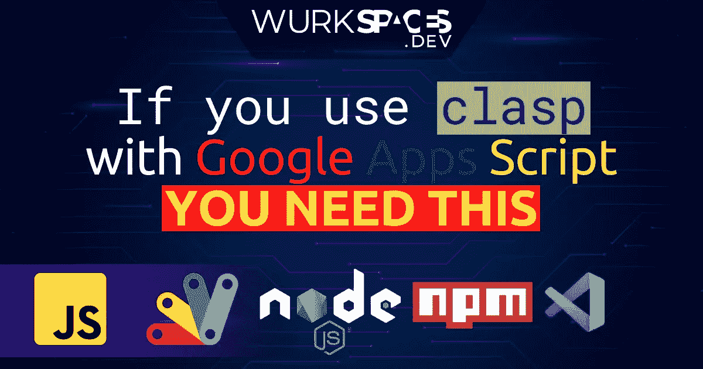

# 如果你在 Google Apps 脚本中使用 Clasp，你现在就需要这个工具

> 原文：<https://medium.com/geekculture/if-you-use-clasp-with-google-apps-script-you-need-this-utility-right-now-de61fd4e67c8?source=collection_archive---------4----------------------->

## 轻松在不同的 Google Apps 脚本环境之间切换。

# 在环境之间切换

当您在本地编写代码并用`clasp`部署您的 Google Apps 脚本代码时，它会创建一个包含`scriptId`属性的`.clasp.json`文件。这个…