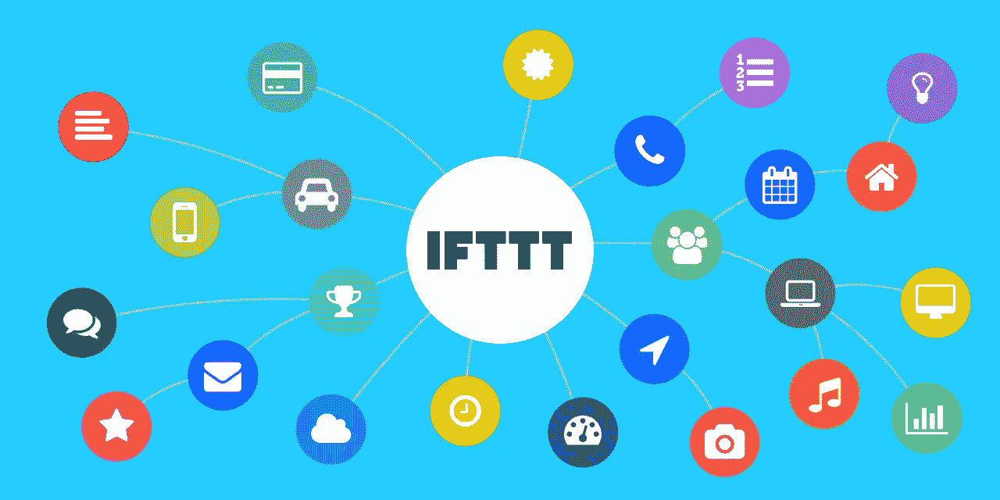

# IFTTT 滤波器实际上很有能力

> 原文：<https://medium.com/geekculture/ifttt-filters-are-actually-quite-capable-29fdd2fe122f?source=collection_archive---------52----------------------->



我一直在订阅 [IFTTT](http://ifttt.com) 的专业版，直到最近我才决定真正加入进来，看看它到底能做什么。

我使用 IFTTT 本身已经很多年了，所以已经建立了相当多的工作流，其中许多只是从 Reddit 或 Medium 这样的网站上发布我喜欢的文章，但这通常也意味着在我的 [Twitter](https://www.twitter.com/RemeJuan) 账户上一次发布几个或几个新帖子。我决定这可能是更好的涓滴一点，并把[缓冲](https://buffer.com)到组合中，对我来说，在队列中有多达 10 个职位的自由将是好的，即使有几个丢失也没关系。

一旦我更新了所有这些工作流，直接使用 Buffer 而不是 Twitter，我想也许过滤器可以帮助另一个不能直接使用的工作流。

## 过滤器，第一次稳定…

第一次尝试真的很简单，我想在推特上发布我喜欢的照片(upvoted)，但只有当它来自 [/r/EarthPorn](https://www.reddit.com/r/EarthPorn) 时，这才会触发一个附有图片的帖子。

我认为过滤器应该是这种有点复杂的拖放逻辑，这就是为什么它还没有在移动设备上可用，我很高兴看到我们得到的实际上是一个采用 JavaScript 的代码窗口，其中还合理地加入了 ES6。

这也解释了为什么它在手机上不可用，我确实设法通过我的 iPad 在他们的网站上为/r/EarthPorn 整合了我想要的非常简单的工作流程，但是当我进入一个移动复杂的工作流程时，很快就失败了。

为了设置一个过滤器，您首先需要提供`if`和`then`，这是您能够获得可用的正确环境变量所必需的。

```
const sub = Reddit.newLikeByYouReddit.Subreddit.toLowerCase();if (sub != 'earthporn') {
  Buffer.addToBufferWithPhoto.skip();
}
```

这是我设置的非常简单的一个，正如你所看到的，我所做的就是检查 SubReddit 的名称是否为 EarthPorn，如果不是，它就跳过这个 post，然后不会将它添加到我的缓冲队列中。

## 让我们增加复杂性…

这是我进入一个更有创造性的过滤流程的地方。

很多被分享的内容通常是我从 Reddit 上看到的有趣的文章，给帖子加书签是触发自动化流程的最简单方式，比我自己手动分享 Twitter 的 URL 简单得多。

> 我会花 2 天时间自动完成一个 2 分钟的重复任务，这样我就不用一直重复它了…

在这种情况下，过滤器实际上不仅允许我自动发布，涓涓细流以避免淹没我的提要，还允许我增强它们，因为通过一些合理简单的逻辑，我可以操纵整个帖子，在这种情况下，非常简单地添加可能适当的 hast 标签。

```
const sub = Reddit.newSaveByYouReddit.Subreddit.toLowerCase();
const title = Reddit.newSaveByYouReddit.Title.toLowerCase();const tags = [];// FE/JS Dev
const feSub = sub == "frontend" || sub == "javscript";
if (feSub) {
  tags.push("frontend", "development", sub);if (title.indexOf("css") != -1) tags.push("css", "styles", "web");
  if (title.indexOf("html") != -1) tags.push("html", "layout", "web");
  if (title.indexOf("javascript") != -1) tags.push("javascript");
  if (title.indexOf("ecmascript") != -1) tags.push("javascript", "ecmascript");
}const uniqueTags = tags.filter((value, index, self) => {
  return self.indexOf(value) === index;
});const hashTags = tags.map((t) => `#${t}`);const url = Reddit.newSaveByYouReddit.PostURL;const message = `
${title} vi a/r/${sub} ${url}
${hashTags.toString().replace(/,/g, ' ')}
`;Buffer.addToBuffer.setMessage(message);
```

正如你所看到的，这一次比我的第一次尝试要复杂一些，这还不是全部，但它是相当重复的，因为我只是在不同的潜艇上应用了许多相同的逻辑。

为了便于比较，我将标题和子编辑都以小写形式提取到变量中，并有一个空数组来放入标签。

根据 sub，我添加了一组基本标签，并检查其他可能的相关标签的关键字标题。

为了安全起见，我还遍历了生成的标签列表，以确保没有重复的标签，从那里我构建了一个要在 tweeted 上发布的新消息，并使用缓冲过滤器提供的可用的`setMessage`函数来覆盖已经发送的消息。

## 最后的想法…

正如你所看到的，第二个更复杂，就其核心而言，这两个都是非常简单的用例，我可以想象，这将需要一点创造性思维，可能还需要 IFTTT 的一些进一步增强，这可能会成为一个非常强大的自动化工具。

Tweets 可能是通过 IFTTT 可以实现的最简单的事情之一，我知道我还有一些其他简单而有趣的事情，包括当我完成一个周期时打开我的间歇泉。谁不喜欢淋浴呢…哈哈。

我希望这篇文章对你有所启发，或者有娱乐性，并且希望给你一些想法，告诉你在你的数字生活中，甚至在现实生活中，还有哪些事情可以自动化。

如果你喜欢，鼓掌(或 50)会很棒，如果你真的喜欢，一杯[咖啡](https://www.buymeacoffee.com/remelehane)会很棒。

感谢您的阅读，祝您度过愉快的一天/一周。

[](https://remelehane.medium.com/working-from-home-it-works-for-me-2904c9edc0a4) [## 在家工作适合我…

### 在过去的一年多时间里，我们中的许多人都发生了很大的变化，有些变化非常剧烈。

remelehane.medium.com](https://remelehane.medium.com/working-from-home-it-works-for-me-2904c9edc0a4)