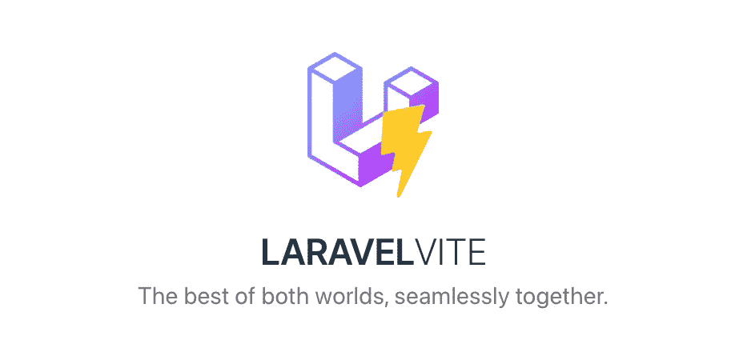

# 将传统的 Laravel 混合迁移到 Vite

> 原文：<https://medium.com/geekculture/ill-add-it-to-the-queue-to-be-published-on-geek-culture-within-the-next-24-hours-52109612e6f4?source=collection_archive---------4----------------------->

2022 年 6 月，laravel 宣布了 Laravel 团队的一项巨大成就，即 [Vite](https://vitejs.dev/) 现在是新 Laravel 应用程序的默认前端资产捆绑器，Breeze 和 Jetstream 包的更新取代了 L [aravel mix](https://laravel-mix.com/docs/6.0/what-is-mix) 。

正如我们所知，Laravel 附带了 [Laravel Mix](https://laravel-mix.com/) ，一个 Webpack 的抽象。Vite 采取了一种新的水平方法来改善前端开发的体验。他们也…