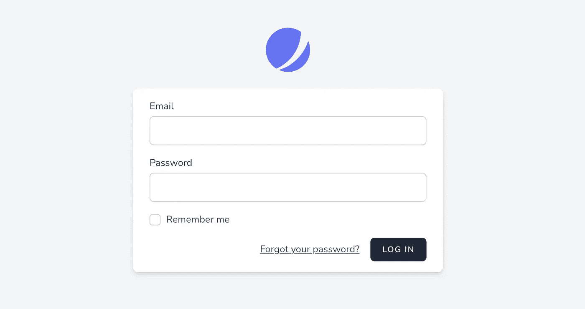

# 具有多个用户表的 Laravel Jetstream 数据库会话

> 原文：<https://medium.com/geekculture/ill-add-it-to-the-queue-to-be-published-on-geek-culture-within-the-next-36-hours-81bfa92072aa?source=collection_archive---------5----------------------->

Source: Jetsream login page

如果你正在使用 Jetsream，你可能会注意到有一个叫做[浏览器会话](https://jetstream.laravel.com/2.x/features/browser-sessions.html#browser-sessions)的特性。此功能允许用户查看与其帐户相关的浏览器会话。另外，用户可以撤销除了他们当前使用的设备正在使用的浏览器会话之外的其他浏览器会话。

# 那么，问题是什么呢？