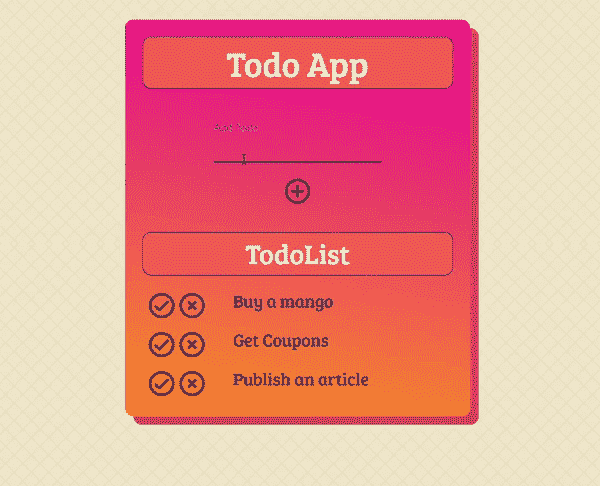
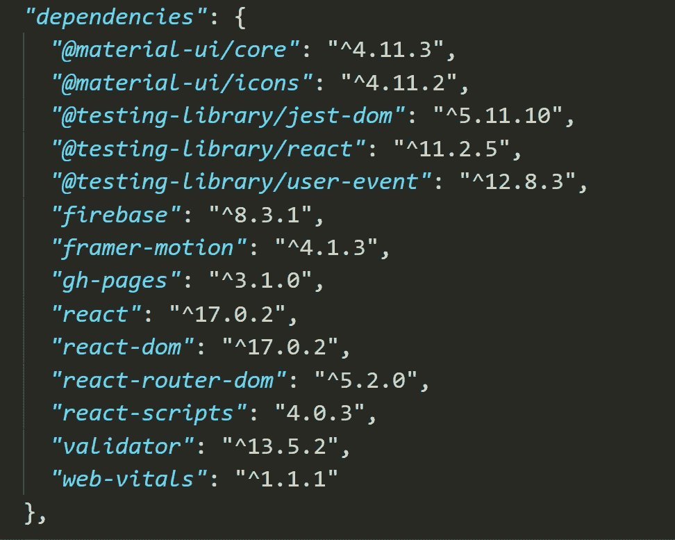

# 带有 React 和 Firebase 的 Todo 应用程序

> 原文：<https://medium.com/geekculture/ill-be-building-a-todo-app-with-one-of-the-most-popular-web-application-frameworks-react-and-75ffe4b32dc4?source=collection_archive---------6----------------------->



[Todo App](https://deep-0301.github.io/Todo/) by [**D.k.Patel**](https://github.com/deep-0301)

我将用最流行的 web 应用程序框架之一来构建一个 todo 应用程序，这个故事中的[](https://reactjs.org/)****和实时数据库[**firebase**](https://firebase.google.com/)**。** Todo app 触及了构建任何数据驱动 app 的所有重要部分，包括**C**create、 **R** ead、 **U** pdate 和 **D** elete (CRUD)操作。我们将 Todo 存储在 firebase 控制台中。 [**点击这里**](https://github.com/deep-0301/Todo) 下载完整代码，查看 [**现场演示**](https://deep-0301.github.io/Todo/) **。**我没有涉及 CSS 文件。请在此下载 [CSS 文件。](https://github.com/deep-0301/Todo/blob/master/src/App.css)****

# ******开始之前******

****要安装基础项目，请在终端中运行以下命令:****

```
**npx create-react-app todo** 
```

****打开 todo 文件夹中的 package.json 文件，并安装以下依赖项。npm firebase = >这个命令在你的 package.json 上安装 firebase。****

****否则，您从这里的[复制](https://github.com/deep-0301/Todo/blob/master/package.json) [package.json](https://github.com/deep-0301/Todo/blob/master/package.json) 并简单地运行 npm install。****

********

****package.json****

# ****从 Firebase 开始:-****

****去 console.google.com 的[创建一个新项目。我们制作一个新的实时数据库来检查这个](http://console.google.com)[视频](https://youtu.be/1wZw7RvXPRU)。在 firebase 中创建一个 app，复制 CDN 文件。在 Todo 文件夹中创建一个名为 firebase.js 的新文件，粘贴 CDN 文件 firebase 文件，我们添加数据。firebase.js 示例****

# ****我们构建什么组件:-****

1.  ******创建 Todo:** 创建一个组件来提交表单和按钮，可以在 firebase 中存储 Todo。****
2.  ******显示待办事项:-** 在这个组件中，我们使用 firebase 控制台中的一个键来显示待办事项。****
3.  ******删除和更新 todo:-** 我们在 Todo 完成时更新阶段，并使用 remove 方法从 firebase 存储中删除 Todo。****

# ******创建待办事宜:******

****当提交表单时，输入项被提交。要处理此操作，请在 TodoList 中添加 onSubmit to form 标记。单击+按钮时，将待办事项添加到待办事项列表中。****

******代码解释:******

******createTodo** 用于保存 Todo ref 数据库中的数据。我们保存标题并完成(对或错)到 firebase 中。todoRef 是我们数据库的参考。todoRef.push()方法已将标题和完整值推入 Todo 数据库。****

# ******显示待办事项:******

****我们用一个键来显示 Todo，并用一个 id 为的快照来显示 TodoList。****

******代码解释:******

******从 Todo 实时数据库提取数据时，使用 todolist.map()** 。我们使用每个 todo 的索引来提取 Todo。使用 **push()** 方法，我们在网页上显示数据。****

# ****删除和更新待办事项:****

****我们通过点击 **X** 删除待办事项，并点击待办事项列表中的**更新完成状态。******

********代码解释:********

******deleteTodo()= >** 该函数用于用 todoref.remove()方法删除 Todo。****

******completeTodo()= >******

> ****[点击此处](https://github.com/deep-0301/Todo)获取代码**。** [**点击此处**](https://deep-0301.github.io/Todo/) 观看**现场演示。******

****感谢你阅读这篇博客，如果你喜欢这篇博客或者它对你有任何帮助，请鼓掌并与他人分享。****