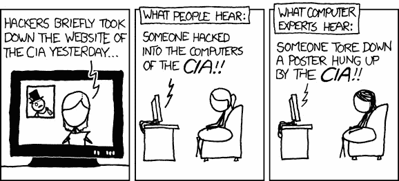
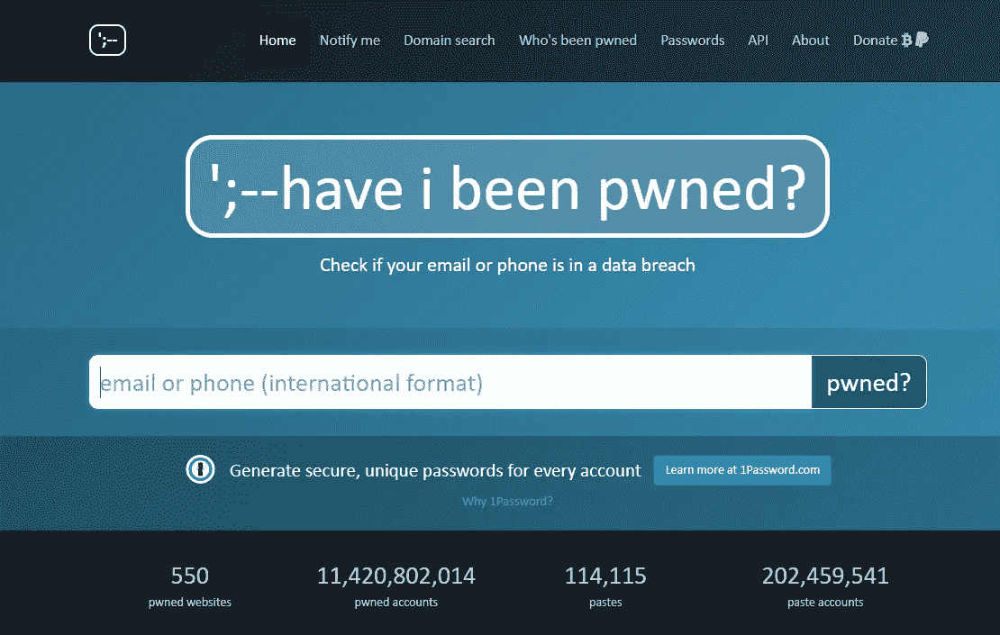
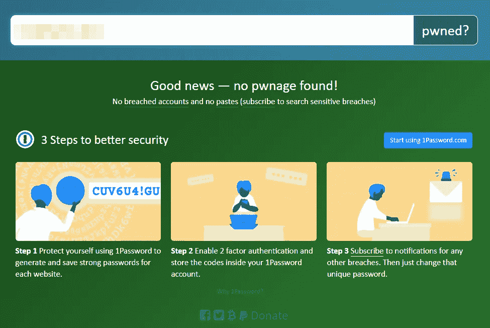
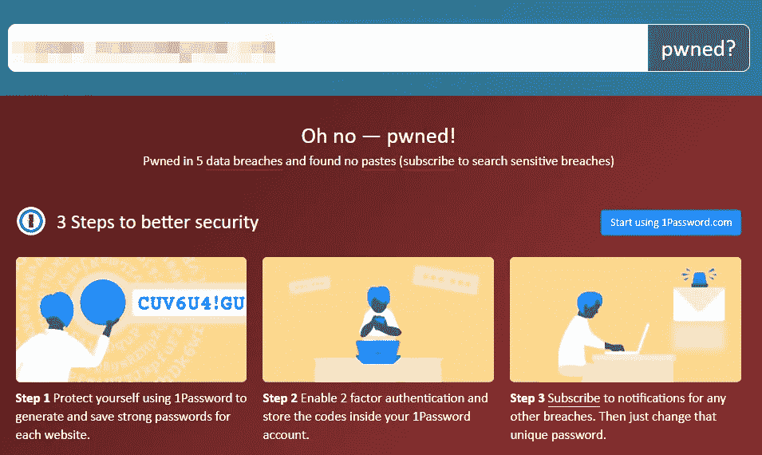
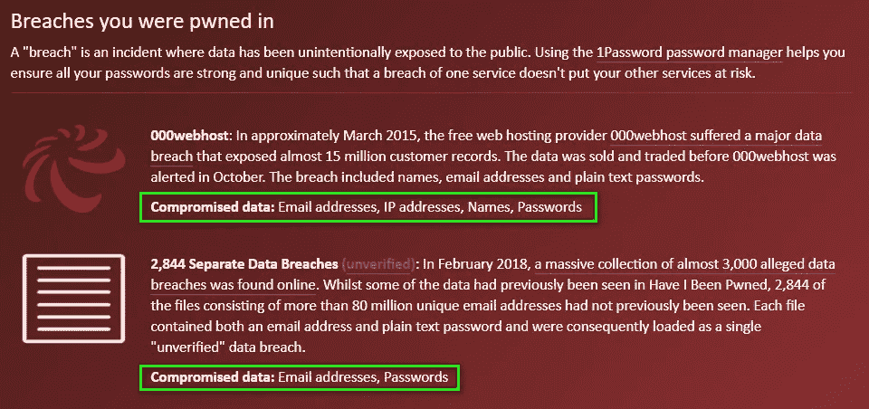
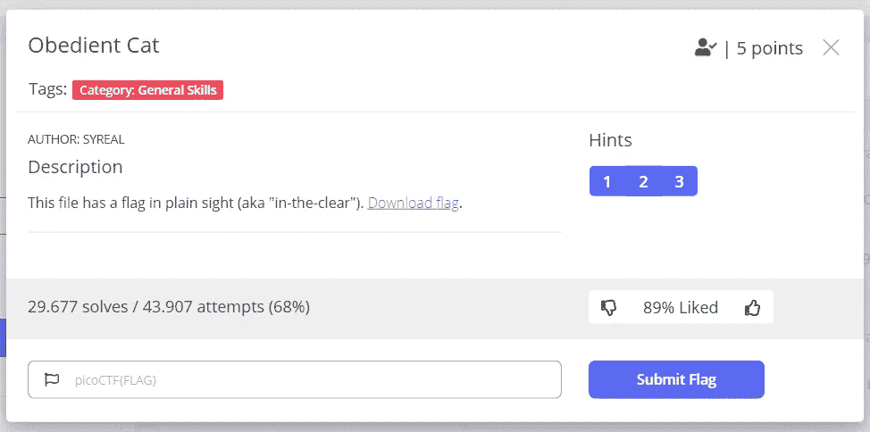

# 我正在学习道德黑客，下面是我如何从 0 到 1

> 原文：<https://medium.com/geekculture/im-learning-ethical-hacking-here-s-how-i-got-from-0-to-1-9c594ebc75d4?source=collection_archive---------5----------------------->



[XKCD Comic Link](https://xkcd.com/932/)

网络安全可能是 2020/21 年最热门的话题之一。
疫情和 smart working 极大地增加了被称为“个人电脑”的神奇事物的使用:来自世界各地的成千上万名几乎没有任何 IT 知识的人，重新发现了他们旧的未使用的个人电脑，其中有他们 90 年代末的照片和灰尘下的恶意软件，以及他们储存的旧报纸，因为它们有一些超过 10 年没有阅读的有趣文章。

在过去的两年里，我收到许多电子邮件，他们说

> “嘿，伙计，我们被黑客攻击了，你的电子邮件和一些数据现在被放在一个公共数据漏洞上，可以从网上下载，你却无能为力”。

我就想

> "哦很高兴知道这件事……也可能不知道."

一旦您的数据涉及数据泄露，垃圾邮件就会加剧。在过去的一年里，我收到的钓鱼邮件、短信甚至电话数量几乎翻了一番。

# 数据泄露？

> 数据泄露是将私有或/和机密数据释放到不可信环境的行为。

它通常是由于网络攻击而发生的，而这通常不是随机放在那里的。想象一下你注册了一个网站，其中的管理员凭证是“admin ”,密码是“admin ”,想象一下攻击者随机发现了它们。一旦攻击者进入网站，他就可以访问那里的所有数据(包括你的登录凭证和所有相关数据)，将它们转储到一个文件中并出售，甚至更糟的是，在互联网上自由发布。你可能认为“admin”作为密码是愚蠢的举动，系统管理员也不傻…你可能会感到惊讶。

如果你很想知道你的数据是否在某个地方泄露了，你可以使用一个很好的服务，叫做“[我被 Pwned 了吗](https://haveibeenpwned.com/)”(“Pwned”字面意思是“拥有别人”)。



Have I Been Pwned Homepage

很简单:你打开网站，输入你的电子邮件或电话号码(加上你的国家前缀)，然后点击“pwned？”。



No leakage found

如果足够幸运，您会看到类似“没有找到 pwnage”的内容。你是安全的，但不要宣称胜利，保持警惕，更改你的密码，并保持对数据泄露的关注！



Leakage found

但是如果你有很多账户，即使是那些你没有删除或者一直在尘封的未使用的账户，不管你愿不愿意，你都可能会看到红色的信息“哦，不——讨厌！”。

如果您继续在 pwnage 页面上滚动，您可以看到您参与的违规事件以及泄漏的数据。



Data breach your data are in

例如，我的一封电子邮件是关于 2015 年以来一项名为“000webhost”的服务的数据泄露。这项服务提供 PHP 和 MySQL 的免费虚拟主机，我在实验中经常使用它，但我确实用我的数据支付了那些“免费实验”的费用。你可以看到泄露的数据有:我的电子邮件地址，我登录的 IP 地址，名字和密码。

如果你发现你的数据遭到破坏，你应该做的第一件事就是更改你泄露的电子邮件地址上使用的密码，或者你不止在一个网站上使用的密码。最好的做法是为你使用的每个网站使用不同的密码，这有点难，因为如果你愿意使用复杂的密码，你可能会在几分钟后忘记它们(如果你像我一样有红鱼的记忆力)，所以我最好的建议是使用密码管理器，在那里你存储所有的密码，你只需要记住一个主要密码就可以解锁所有的密码！

选择一个密码管理器并不容易:密码管理器有许多种，每一种都侧重于不同的方面，但是本文的目的不是比较它们，所以我将只向您推荐我使用的那一种: [BitWarden](https://bitwarden.com/) ！它是开源的，你可以免费拥有它，你可以为一个家庭计划付费，你甚至可以拥有一个自己托管的版本。由你决定，做你想做的，并保持你的密码安全和定期更新！

# 黑客…道德黑客…说说吧。

我一直迷恋网络安全，事实是，在这个话题上，我甚至比我想象的知道得更多(不足以被认为是一个圣灵降临者，但可能是…一天)。我从八年前开始开发软件，你学到的第一件事(如果你的老师足够好的话——剧透:我是)就是“**不要相信用户，永远不要相信用户**”。

User inputs?

在这些年里，我见过很多环境:从区块链和应用数据结构到 WordPress 插件，路过 Android 开发和 REST APIs。我真正从这些变化中学到的是架构、模式，总的来说，思考、设计和构建一个应用程序总是比简单地编码重要得多。毫无疑问，编码是有帮助的，因为了解语言技巧可能会使投射部分变得更容易，然而，对你想要的软件有一个宽广的视野是最重要的部分。

接下来是网络安全。很多时候，当你对你正在编码的东西没有一个清晰的概览，或者你必须更快地构建它，因为它必须为昨天做好准备，你就开始做蠢事。这种事我见过很多次了。

几年前，我接到一个同事的电话(*为了保密，我将更改人们的名字*)，他说:“我给乔纳森分配了一份工作，但他搞砸了，然后消失了。我需要有人尽快解决这个问题，因为它必须在下周上线，而你是我知道的唯一一个能解决这个问题的人，你能帮我吗？”我没有否认，所以他们与我分享了项目的 git 库和规范，开始查看代码，我注意到的第一件事是没有数据验证。所有的输入都是从请求中提取出来的，没有经过任何处理就扔进了数据库。
这个项目是低预算的，我几乎没有得到任何报酬。我和客户谈过一次，警告他们说他们正在使用一个不安全的版本，但是他们不想付更多的钱，并且对他们所得到的很满意。谁知道他们是否躲过了疫情的袭击。

无论如何，如果安全，尤其是网络安全得到重视，这种情况是可以避免的。了解如何保护应用程序的最佳方式是学习如何破解它。

> “我知己知彼，百战不殆。如果你了解自己但不了解敌人，那么每一次胜利都会让你遭受失败。不知己知彼，百战不殆。”― **《孙子兵法》**

# 如何入门？

正如莱纳斯·托瓦尔所说:“空谈是廉价的，给我看看代码”。多亏了 YouTube 算法，我决定开始学习道德黑客(等等，什么？).有一天，我看了约翰·哈蒙德频道的一段视频。我很惊讶他是如何谈论攻击的，他是如何轻松地解释东西和探索工具的。我知道在这种轻松的背后，有许多小时的学习、尝试和探索，但这让我兴奋了一段时间。我真的被他和他的能力迷住了，我一直在看他的视频，他总是让我吃惊。

David Bombal interviews John Hammond

后来，我偶然发现了另一个大卫·邦巴尔对约翰·哈蒙德的采访视频。那是一切开始的地方，那是我真正被触发的地方。大卫·邦巴尔是一位了不起的老师。我个人并不认识他，但他的视频、内容以及他鼓励你做事情来提高自己而不是被动的方式，给了我开始做事情的灵感。

**我喜欢练习**。我一生中大部分时间都在学习理论，我在大学时也一直在学习，当我第一次有客户付钱让我动手写代码时，我非常高兴。约翰的哲学是让你的手脏在道德黑客开始，这就是我想要的。

我是一个非常好奇的人，一种方式是不够的，所以我选择了两种方式:

*   大卫之路:参加完全为初学者开设的道德黑客课程。当我写这篇文章时，我已经看了课程的前七部分，我认为这是一个复习，因为我每天都在我的台式电脑上使用 Fedora Linux，我已经有了很好的编程和网络基础，但我看的都做得很好，任何人都可以理解每个概念。
*   约翰方式:玩 [PicoCTF](https://www.picoctf.org/) 。我以前从没玩过 CTFs(夺旗)。对于那些不知道什么是 CTF 的人来说:这是一个隐藏着一面旗帜的挑战，你应该聪明地用你的知识绕过这个挑战。当我写的时候，我的分数是 2810。

# 如何开始使用 PicoCTF

PicoCTF 非常容易使用，你注册然后登录，打开练习部分，你就可以开始了。


PicoCTF practice page

一旦你选择了一个挑战，它会显示一个名称，一个描述，一些标签，如其类别，提示部分(你不会总是有提示)，用户的百分比“得到了旗帜”，显然是挑战的要点。



Obedient Cat

第一个挑战名为“听话的猫”，它会给你 5 分。如果您曾经在 linux 上使用过 bash，您可能会想起那个`cat`命令。描述如下:

> 这个文件有一个明显的标志(也称为“清晰”)。下载标志。

“下载标志”部分有一个链接。你可以用任何你想要的方式得到你的旗帜。我会告诉你两个很容易使用 bash。第一种是使用`curl`命令:

```
$ curl [https://mercury.picoctf.net/static/33996e32dce022205a6a36f69aba56f0/flag](https://mercury.picoctf.net/static/33996e32dce022205a6a36f69aba56f0/flag)
```

第二个包括`cat`命令:

```
$ wget [https://mercury.picoctf.net/static/33996e32dce022205a6a36f69aba56f0/flag](https://mercury.picoctf.net/static/33996e32dce022205a6a36f69aba56f0/flag)
$ cat flag
```

无论如何，输出将是:

```
**picoCTF{s4n1ty_v3r1f13d_2aa22101}**
```

那是旗子。找到它后，你只需要把它提交到 picoCTF 上的前一个挑战页面。每面旗都会`picoCTF{flag_here}`。现在，你要做的就是练习。

我曾经在一本 O'Reilly 的书([构建微服务](https://www.oreilly.com/library/view/building-microservices-2nd/9781492034018/))上读到过，当你开始一个项目时，没有适合这种项目的“编程语言”，你必须选择一种你觉得舒服的语言。

一些编程语言会比其他语言更适合“*网络安全任务*”，因为它们的扩散性，Python 就是其中一个例子。有很多用 Python 编写的工具，你甚至可以在 Pentesting 发行版上找到它们中的许多，比如 [Kali Linux](https://www.kali.org/) ，但这并不意味着如果你擅长 Java，你不能使用 Java 来练习，你可能会为一些任务花费更多的代码行，但是嘿，保持冷静和练习，这就是目标！

# 保持道德


Photo by [JESHOOTS.COM](https://unsplash.com/@jeshoots?utm_source=medium&utm_medium=referral) on [Unsplash](https://unsplash.com?utm_source=medium&utm_medium=referral)

好的和坏的黑客之间有一条微妙的界限，由你来选择一顶帽子。为什么是帽子？因为黑客有白帽和黑帽之分:白帽是那些出于正当理由、为了帮助或为了工作而这样做的人，他们通过渗透测试和漏洞报告获得报酬，而黑帽是那些你在新闻中读到的、破坏数据的人。如果你想开始学习黑客，做好它，并保持它的道德性。

如果你是通过阅读来到这里的，并且你喜欢这个，让我知道，如果你开始学习黑客，记得永远保持冷静，🥂