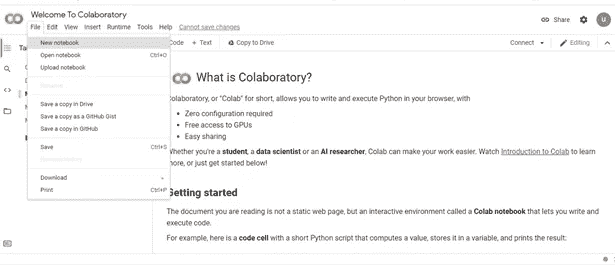
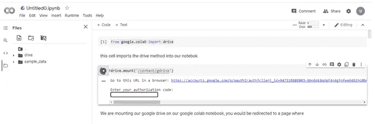
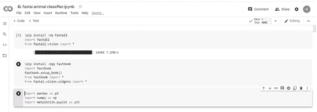
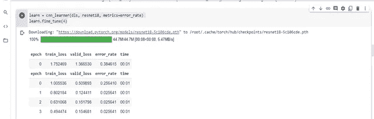
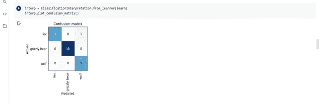
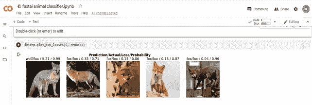
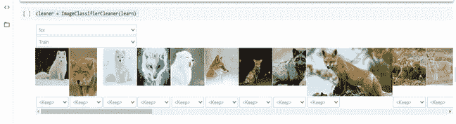
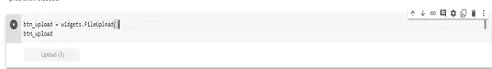
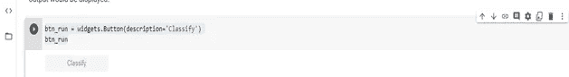
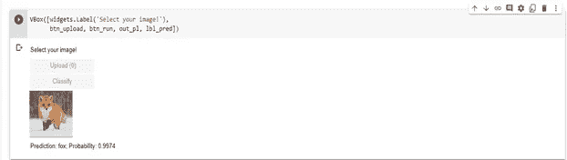

# 基于 Fastai 的图像分类

> 原文：<https://medium.com/geekculture/image-classification-with-fastai-c23c38f77352?source=collection_archive---------7----------------------->

嘿伙计们，今天我们将使用 Fastai 库来创建一个图像分类器。Fastai 库是一个深度学习库，有很多非常酷的功能，它可以用于从数据采集阶段到数据清理、模型开发和评估。我对它的功能感到惊讶。

关于这个库，你首先应该知道的是，它有不同的版本；因此，在某些版本中，某些方法/功能可能不起作用。如果您没有使用所需的版本，这可能会变得非常令人沮丧。我们将在这个项目中使用 **fastai2** 库，所以请确保这是您已经加载到笔记本中的版本。我会用 google Colab 笔记本工作。要使用 google Colab，您可以谷歌搜索“Google Colab”并使用您的谷歌帐户登录。那你就可以走了。

(我推荐在这个项目中使用 Google Colab，因为它使 GPU 配置更加容易。在 google Colab 中，确保进入运行时->更改运行时类型-> GPU。)

# **第一部分。**数据(**图像)采集**

这个项目中使用的图像来自 google images，我们首先必须下载一个 google chrome 插件进行批量下载。

1.  只要在谷歌上搜索“fatkun”，点击出现的第一个结果，然后下载。
2.  下一步是在谷歌上输入“谷歌图片”，点击出现的第一个结果，你就会被引导到谷歌图片主页。
3.  键入您想下载和搜索的图像的名称。
4.  点击 chrome 浏览器右上角的 google chrome 扩展图标，选择 fatkun batch downloader。
5.  通过取消选择您不需要的图像并单击下载来进行一些数据清理。在您的下载文件夹中会自动创建一个包含下载图像的文件夹。
6.  重复步骤 3 到 5，搜索你选择的任何图像(我们将使用狐狸、狼和灰熊的图片)。
7.  下面是展示步骤 2 到 5 的视频示例。

下一步是用我们下载的图像制作一个数据集。由于我们将使用 google Colab 作为我们的 IDE，我们必须将下载的图像上传到 google drive 以便于访问。
登录你的 google drive 账户，创建一个文件夹(我的文件夹是“动物分类器”,位于“人工智能项目”文件夹中),上传包含下载图像的文件夹。

# 第二部分。模型开发

1.  在浏览器上打开一个新标签，搜索“google Colab”。单击第一个结果。
2.  点击“文件”并选择新笔记本，如下图所示。



3.使用下图中的代码将 google drive 安装到 google Colab 笔记本上。您将被重定向到一个页面，在该页面中，您授权您的笔记本访问 tour google drive，复制提供的密钥并将其粘贴到笔记本的字段中。



4.前三个单元格用于导入这个项目所需的所有库。请确保您导入的是“fastai2”而不是“fastai ”,因为此笔记本中的代码不能与“fatsai”一起使用。



5.我们将创建一个动物列表，在下面的单元格中用第一行进行分类，确保名称与用于命名包含每个数据集的文件夹的名称相同。第二行和第三行是初始化我们数据集的路径/目录，这应该遵循用于在 google drive 上保存文件的格式。最后几行获取我们路径中每个文件夹中的所有图像(来自上面的几行)。

```
animals = 'grizzly bear', 'fox','wolf'path = 'gdrive/MyDrive/Ai_projects/animal classifier'p_path=Path(path)fns = get_image_files(path)fns
```

6.创建一个数据加载器类，用于将数据集转换为训练集和验证集。

```
class DataLoaders(GetAttr):def __init__(self, *loaders): self.loaders = loadersdef __getitem__(self, i): return self.loaders[i]train,valid = add_props(lambda i,self: self[i])
```

7.接下来是我们的 datablock API，我们使用它向我们的数据加载器类传递有关我们正在处理的数据类型的信息(' blocks=(ImageBlock，CategoryBlock)')，数据加载器类如何获取数据(' get_items=get_image_files ')，如何创建验证集(' splitter = random splitter(valid _ pct = 0.2，seed=42)')，以及如何获取我们的数据集的标签(' get_y=parent_label)，在本例中，该数据集的名称来自这可以看作是我们的数据加载器类将使用的模板。

```
bears = DataBlock(blocks=(ImageBlock, CategoryBlock),get_items=get_image_files,splitter=RandomSplitter(valid_pct=0.2, seed=42),get_y=parent_label,item_tfms=Resize(128))
```

8.这里，我们将数据块传递给数据加载器类，并指定数据集的位置。

```
dls = bears.dataloaders(path)
```

9.让我们看看来自我们的验证集的一批图像。

```
dls.valid.show_batch(max_n=4, nrows=1)
```

10.这是我们使用 resnet18 架构创建学习者/模型的地方，resnet 18 架构是一个预训练的模型，错误率是我们的衡量标准。我们在第二行的 4 个时期内训练我们的模型，与第一时期的 0.256 相比，我们的模型在第四时期能够获得 0.0256 的错误率。这是一个好结果。

```
learn = cnn_learner(dls, resnet18, metrics=error_rate)learn.fine_tune(4)
```



11.现在让我们看看模型在验证集上的表现。从下面的混淆矩阵中，我们的模型已经能够正确地将除了狐狸以外的所有图像分类。它在预测中被错误地归类为狼。我们将在下一个单元中查看错误预测的图像。

```
interp = ClassificationInterpretation.from_learner(learn)interp.plot_confusion_matrix()
```



12.让我们来看看预测损失最高的图像，以及下面单元格中的代码。每个图像分别标有其预测标签、实际标签、损失和概率。这就是我们如何检查分类错误的图像。从上图来看，只有左边第一张图分类错误。它被归类为狼而不是狐狸。让我们看看下面一些狼的图片，看看我们是否能找出这个错误的原因。

```
interp.plot_top_losses(5, nrows=1)
```



13.下面使用的方法是 imageClassifierCleaner，它允许我们查看三个不同类别中损失最大的图像，它还允许删除或重新标记图像。在这里，我们使用该方法来查看验证集中狼的图像。被错误分类的狐狸的图像与左起第 4 和第 7 幅图像之间有非常明显的相似性；因此，我们不能指责我们的模型。然而，我们可以用图像捕捉狐狸的整个身体。



14.我们的模型已经准备好了，我们需要保存我们的模型以便在这个单元中使用。fastai 将我们的模型保存为“export.pkl”。最后一行只是检查我们的模型是否有文件扩展名。' pkl '出现在我们的路径中(任何以扩展名'保存的文件)。将搜索“pk1”并显示为输出)。我们可以使用这个保存的模型在其他图像上生成预测，这个过程被称为“推理”。当以这种方式使用时，我们的输出将是预测的输出、在一组可能的类中预测的类的索引以及预测的输出的概率。

```
learn.export()path = Path()path.ls(file_exts='.pkl')#Output (#1) [Path('export.pkl')]
```

# **创建我们的笔记本应用**

1.下面单元格中的第一行将我们的模型加载到“learn_inf”中。这不是必需的，因为我们已经在这个笔记本中有了我们的模型，相反，当运行一个新的笔记本时，这是一个必需的步骤，这个笔记本上还没有我们的模型。最后一行用于访问预测类的数据加载器。

```
learn_inf = load_learner(path/'export.pkl')learn_inf.dls.vocab#output ['fox', 'grizzly bear', 'wolf']
```

2.我们将利用 ipy 小部件为我们的应用程序创建一个 GUI。我们要做的第一件事是使用下面单元格中的代码制作一个上传小部件。

```
btn_upload = widgets.FileUpload()btn_upload
```



3.为了测试运行我们的按钮，我们将向它输入一个图像(从数据集中复制任何图像的目录/文件路径并放在括号中的引号中)，创建一个输出小部件并运行它。

```
btn_upload = SimpleNamespace(data = ['gdrive/MyDrive/Ai_projects/animal classifier/fox/Z.jpg'])img = PILImage.create(btn_upload.data[-1])out_pl = widgets.Output()out_pl.clear_output()with out_pl: display(img.to_thumb(128,128))out_pl# the output should be whatever image you fed into the button upload widget.
```

4.下面单元格中的代码调用我们的模型(learn_inf ),使用“predict”方法对 img 进行预测。我们的输出将是预测的输出、在一组可能的类中预测的类的索引以及预测的输出的概率(pred，pred_idx，probs)。

```
pred,pred_idx,probs = learn_inf.predict(img)
```

5.我们现在需要创建一个“标签”小部件，并初始化它来显示我们预测的输出标签。

```
lbl_pred = widgets.Label()lbl_pred.value = f'Prediction: {pred}; Probability: {probs[pred_idx]:.04f}'lbl_pred#output  Prediction: fox; Probability: 0.9974
```

6.接下来是我们的分类按钮，下面的单元格创建了另一个小部件，我们将使用它作为我们的分类按钮。

```
btn_run = widgets.Button(description='Classify')btn_run
```



7.我们现在必须将上面第 2 步到第 6 步的代码组合成一个函数。

```
def on_click_classify(change):img = PILImage.create(btn_upload.data[-1])out_pl.clear_output()with out_pl: display(img.to_thumb(128,128))pred,pred_idx,probs = learn_inf.predict(img)lbl_pred.value = f'Prediction: {pred}; Probability: {probs[pred_idx]:.04f}'btn_run.on_click(on_click_classify)btn_upload = widgets.FileUpload()
```

8.这个单元格用于使用 VBOX 方法将 GUI 中的所有按钮排列在一个垂直框中。

```
VBox([widgets.Label('Select your image!'),btn_upload, btn_run, out_pl, lbl_pred])
```



我们今天的会议到此结束。你所要做的就是点击上传，选择一张图片，然后点击分类，你会得到如上图所示的结果。

这个笔记本可以通过下面的链接从 google colab 获得

[](https://colab.research.google.com/drive/1E4QFXkUmQg4FL0WEgg9YHIYsk3DFTypa?usp=sharing) [## 谷歌联合实验室

Fastai 图像分类器笔记本。colab.research.google.com](https://colab.research.google.com/drive/1E4QFXkUmQg4FL0WEgg9YHIYsk3DFTypa?usp=sharing) 

您也可以在 github 上下载这个项目的存储库(包括使用的数据集)。

[](https://github.com/usmanbiu/fastai-animal-classifier.git) [## usman biu/fastai-动物分类器

### 数据科学项目示例使用深度学习进行图像分类为了这个示例项目，我制作了一个球…

github.com](https://github.com/usmanbiu/fastai-animal-classifier.git) 

我将很快分享我的笔记本给 kaggle 的泰坦尼克号数据集，所以别忘了回来看看。再见了。