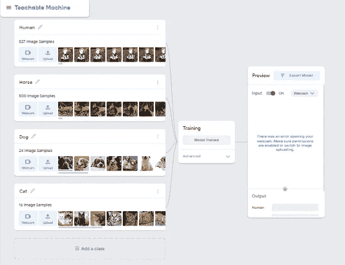
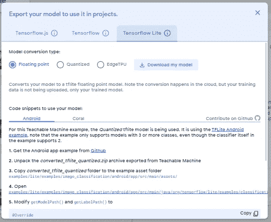
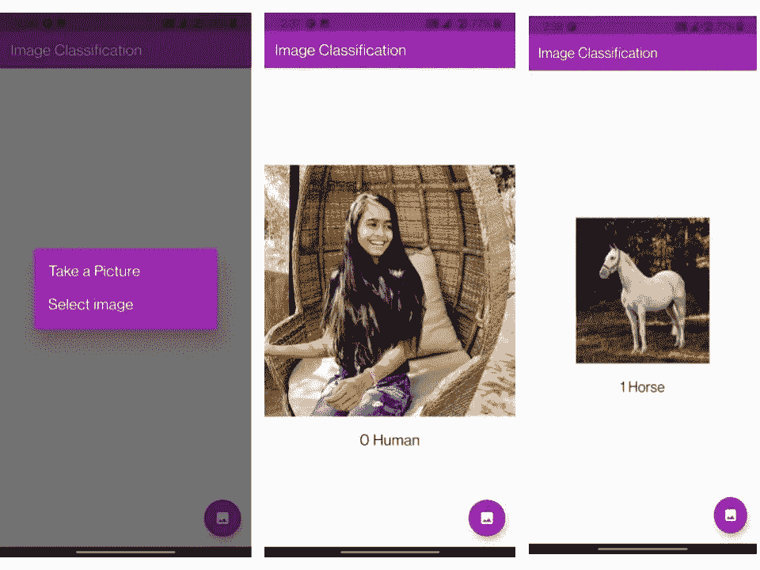
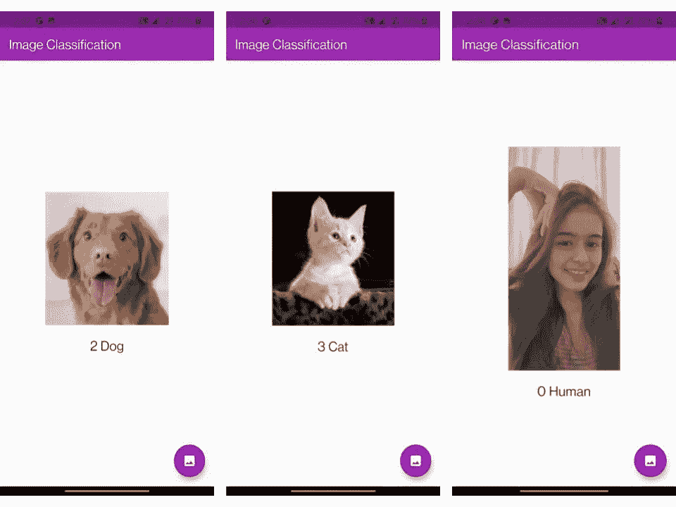

# 带抖动的图像分类

> 原文：<https://medium.com/geekculture/image-classification-with-flutter-182368fea3b?source=collection_archive---------3----------------------->

> **使用 flutter 和 Teachable machine 和 Tenserflow lite 在移动应用中进行图像分类。**


Flutter and Tensorflowlite

将机器学习模型实现到移动应用程序中很难，但是， [**Goggle 的可教机器**](https://teachablemachine.withgoogle.com/train) 通过其简单的方式，快速地为应用程序、web 和许多其他应用程序创建机器学习模型。

在本文中，我将使用 Tenserflowlite、flutter 和 Teachable machine(用于图像分类的机器学习训练模型)创建一个图像分类移动应用程序。

> 我们将使用从图库或相机中选取的图像来查看图像是人、马、猫还是狗。

所以让我们开始吧🎉

> **用可教机器训练机器学习模型**

要识别图像，进入[可示教机器](https://teachablemachine.withgoogle.com/train)网络工具，必须选择图像项目。但是，在训练模型之前，收集用于图像分类的数据，您需要在 [Kaggle](https://www.kaggle.com/) 上找到数据集。收集完数据后，我们要把它整理成相关的标签(即类)。唯一的东西就是可教机器的力量。

在此应用中，我们必须将数据集分为 4 类(即标签)。下载的数据集有四个不同的文件夹，取决于四个标签。在一台可教的机器中，我们必须通过添加新的类来为四个不同的类提供四个文件夹。



Image training model

训练模型后，您可以通过输入文件或网络摄像头预览它，分析训练模型的输出。导出模型，下载它。



Exporting model and download

现在，创建一个新的 flutter 应用程序来开始实现不是很容易吗？

**需要下载的 Flutter 包有**

**image_picker、tflite 和 meta。**

[](https://pub.dev/packages/image_picker) [## 图像拾取器| Flutter 包

### 一个适用于 iOS 和 Android 的 Flutter 插件，用于从图像库中拾取图像，并使用…

公共开发](https://pub.dev/packages/image_picker) [](https://pub.dev/packages/tflite) [## tflite |颤振包

### 一个访问 TensorFlow Lite API 的 Flutter 插件。支持图像分类、对象检测(固态硬盘和 YOLO)…

公共开发](https://pub.dev/packages/tflite) [](https://pub.dev/packages/meta) [## 元| Dart 包

### 这个包定义了 Dart SDK 附带的工具可以使用的注释。…中的注释

公共开发](https://pub.dev/packages/meta) 

我们从可示教机器中训练的模型，我们必须将这些文件放入 assets 文件夹并添加到 pubspec.yaml 文件中。

```
assets:
  - assets/labels.txt
  - assets/model_unquant.tflite
```

您必须将这些包放到 pubspec.yaml 文件中，

如果您没有在文件中指定版本，它将自动下载最新的软件包。如下所示的 main.dart 文件，将 HomePage.dart 文件放入 lib 文件夹。

有状态部件主页我们必须创建三个变量，其中上传文件的 **_image** 变量，输出**列表的**变量，用于错误检查的布尔变量 **_loading** 。

```
PickedFile? _image;
bool _loading = false ;
List<dynamic>? _outputs;
```

将 tflite 模型加载到 HomePage.dart 文件

```
*//Load the Tflite model* loadModel() async {
  await Tflite.loadModel( model: “assets/model_unquant.tflite”,
   labels: “assets/labels.txt”,
  );
}
```

通过模型对图像进行分类，

```
classifyImage(image) async {var output = await Tflite.runModelOnImage( path: image.path,
      numResults: 2,
      threshold: 0.5,
      imageMean: 127.5,
      imageStd: 127.5,
);
setState(() {_loading = false;*//Declare List _outputs in the class which will be used to show the classified classs name and confidence* _outputs = output;
 });
}
```

为应用程序制作最终用户界面、小部件，

浮动操作按钮，用于使用图像拾取器从图库和相机中选择用于分类的图像天气图像是人、马、猫或狗。

🥳，我们已经完成了编码，现在是运行应用程序的时候了！

P.S waiting for the output of the application

耶！！！🤩，我们成功地创建了一个图像分类的应用程序，让我们看看这里的输出快照，



Floating button selection, Human, Horse classification with label using gallery



Dog, Cat using the gallery, and Human recognizing using the camera

感谢你阅读这篇文章，🥰，如果你觉得这很有见地，然后分享给你👏 :)

Github 仓库，并与我联系，祝您愉快！🤗

[](https://github.com/nenncy/ImageClassificationwithflutter/tree/main) [## nency/image classificationwithfutter

### 一个新的颤振项目。这个项目是颤振应用的起点。一些帮助您入门的资源…

github.com](https://github.com/nenncy/ImageClassificationwithflutter/tree/main)