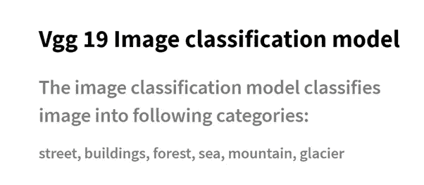
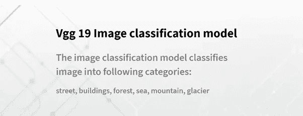
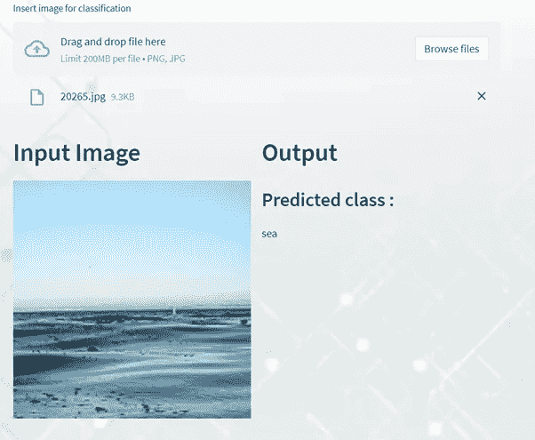

# 具有 Streamlit 的图像分类器

> 原文：<https://medium.com/geekculture/image-classifier-with-streamlit-887fc186f60?source=collection_archive---------0----------------------->

## 让我们使用 streamlit 在简单的代码行中构建深度学习模型。


Photo by [Lee Campbell](https://unsplash.com/@leecampbell?utm_source=medium&utm_medium=referral) on [Unsplash](https://unsplash.com?utm_source=medium&utm_medium=referral)

[**Streamlit**](https://www.streamlit.io/) 是一个开源的 Python 库，可以轻松创建和共享漂亮的、定制的机器学习和数据科学 web 应用。我们将用几行代码来看看如何构建一个简单的图像分类器。

## **Streamlit 特性**

*   用几行代码构建应用程序的简单 API。
*   保存源文件时自动更新。
*   不需要写后端，连接前端，定义路由，处理 HTTP 请求，写 HTML，CSS，JavaScript。
*   添加小部件与声明变量是一样的。

## **安装**

首先，使用以下命令在 python 环境中安装 streamlit。

```
pip install streamlit
```

## **入门**

对于这个演示，我将使用预训练的 VGG19 模型进行图像分类。该分类器将对类别*海洋、冰川、山脉、森林、街道和建筑物*的图像进行分类。查看 [**Github 库**](https://github.com/poojatambe/VGG-Image-classification) 使用迁移学习构建一个简单的图像分类器，并对其进行训练。

最初，我们将创建一个 python 文件，并在其中编写以下代码。

使用以下命令执行 python 文件。

```
streamlit run filename.py
```

我们将在浏览器上得到输出。



Fig-1

Streamlit 提供不同的文本格式，如**标题、页眉、副标题**和**标题**。在这种情况下，使用降价。

我们可以为我们的 web 应用程序设置背景图像，以增加视觉效果。

在 streamlit 中，我们需要在修改 python 文件时保存它。Streamlit 识别源文件中的更改，并询问我们是否要重新运行它。此外，我们可以选择“始终重新运行”来自动反映更改。添加背景后，我们的应用程序将如下所示:



Fig-2

首先，我们需要将图像上传到我们的图像分类器。上传的图像在馈送到分类器之前进行预处理。

我们的分类器需要输入。使用 st.file_uploader 小部件将指定类型的图像(本例中为“png”和“jpg ”)提供给分类器。输入图像以模型所需的格式进行处理。我们将使用 st.columns()函数，该函数允许在并排放置的容器中插入元素。

最后，我们将加载我们的模型，应用预处理的图像，生成输出并将其写入容器。

当我们保存 python 文件时，这些更改将反映在浏览器上:



FIg-3

Streamlit 允许您用几行代码创建一个 web 应用程序。我希望这个演示能帮助你用 streamlit 创建你的应用。

## 参考

1.  [https://docs.streamlit.io/](https://docs.streamlit.io/)

**编码快乐！！**