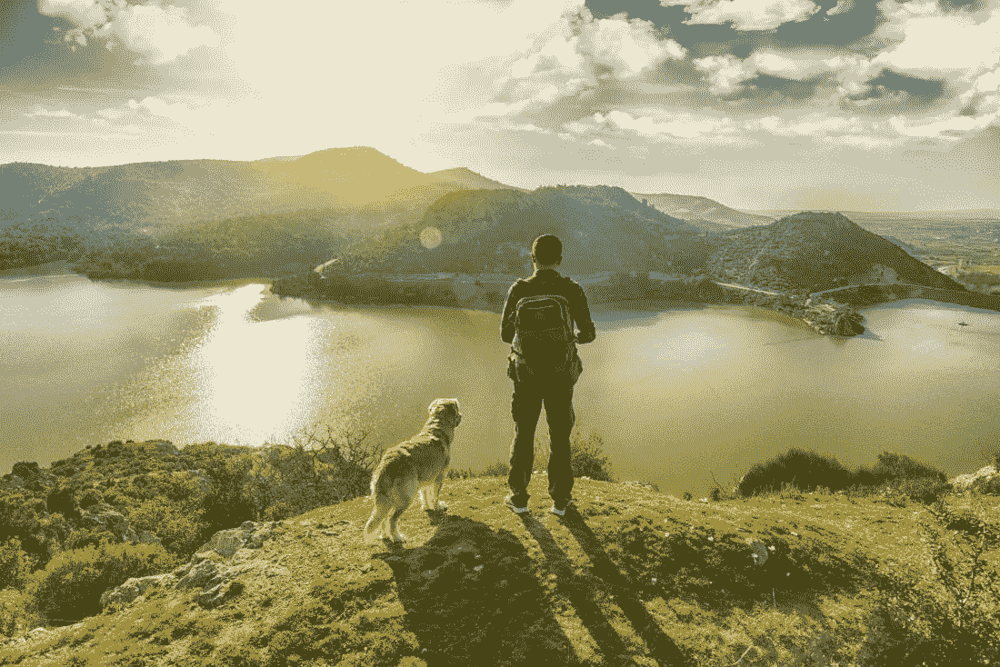
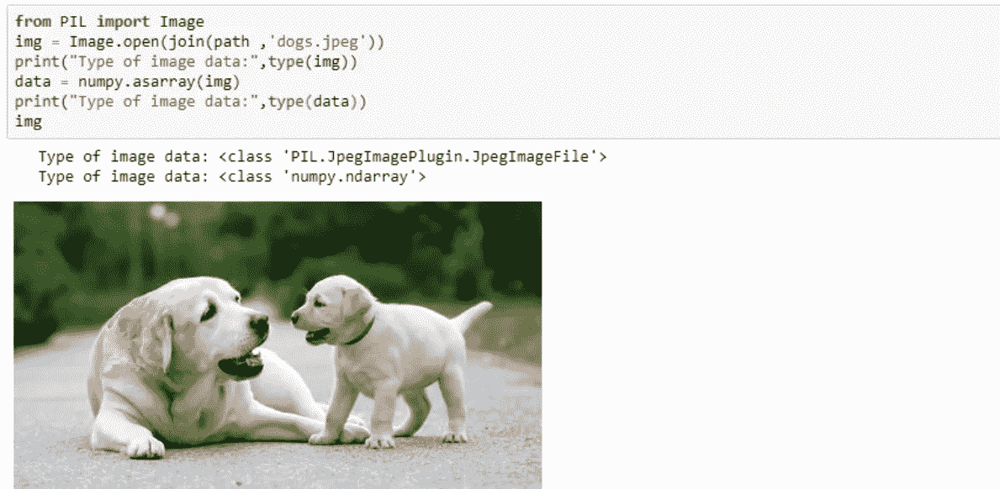
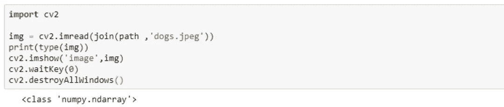
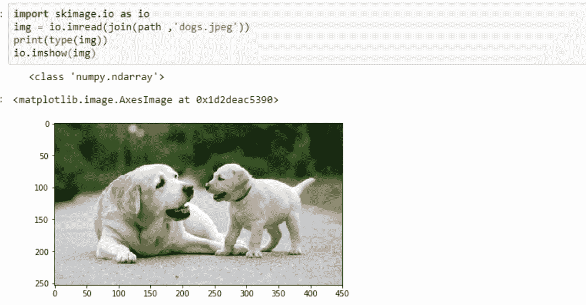
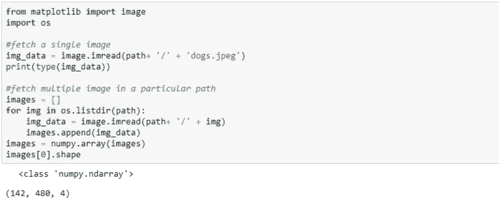
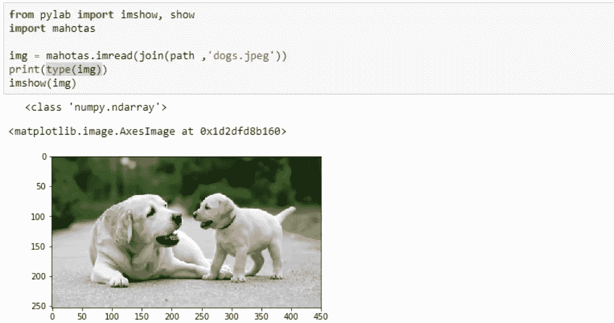
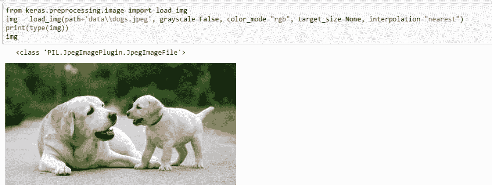

# 在机器学习和深度学习中加载图像数据的图像处理库

> 原文：<https://medium.com/geekculture/image-processing-libraries-to-load-image-data-in-machine-learning-and-deep-learning-4c6ca538cc95?source=collection_archive---------20----------------------->

问候！😃



[Source](https://www.medicalnewstoday.com/articles/325466)

计算机视觉是人工智能中非常迷人的新兴领域之一。它就像人类的视觉一样，现在机器需要看到(图像)，理解数据(过程)，并解释结论。就像我们的视网膜和视神经足以完成理解视觉的任务一样，我们同样也在计算机视觉中运行某些算法和工具。

# 动机

曾经对使用哪个图像处理库感到困惑吗？嗯，对我个人来说是的！在从事任何与计算机视觉相关的项目时，我个人会对选择哪个图像处理库来读取和操作我的图像数据集感到困惑。有各种各样的库和技术最适合特殊情况。例如，Mahotas 是一个专门为生物信息学数据集设计的库。此外，有些最适合 ML 或 DL 的情况。

所以，让我们探索我们的选择。

# 现场研究

## 1.枕头(PIL)

*   PIL (PythonImagingLibrary)是一个开源的 python 库，用于处理图像处理任务，如转换、增强、读取和显示，而枕头是一个分叉的库。
*   为了加载图像，使用图像模块的 **open()** ，返回一个图像对象。这个对象有像素数据，这对处理图像很有用。因此，可以使用 **fromarray()** 将 image 对象转换成一个数组，稍后再转换回一个对象，如图 1 所示。

**文档:**[https://pillow.readthedocs.io/en/stable/](https://pillow.readthedocs.io/en/stable/)
**图像类型读取对象:**图像类型



Figure1

## 2.OpenCV

*   OpenCV(OpenSourceComputerVision)库是一个开源的计算机视觉和机器学习库
*   它有广泛的优化算法，从最先进的算法到典型的图像处理
*   它是用 C++编写的，充当 C++、Matlab、Java 和 Python 的通用接口。
*   **OpenCV-Python** 是基于 Python 的 OpenCV 的包装器。在这里，cv2 库的 **imread()** 将图像文件作为数组读取，而 **imshow()** 将图像显示在一个单独的窗口中，如图 2 所示。

**文档**:【https://opencv.org/】T21
图像读取对象类型: Numpy 数组类型



Figure 2

## 3.sci kit-图像

*   Scikit-Image 是一个基于 python 的开源图像处理库。
*   它是用 Cython 编写的，cy thon 是用 C 语言编写的 Python 的超集，以使它运行得更快。

**文档:**
**图片读取对象类型:** Numpy 数组类型



Figure 3

## 4.Matplotlib

*   Matplotlib 是一个基于 python 的可视化库，尤其适用于 2d
*   它主要用于绘制散点图、条形图等
*   它不是像上面的库那样专门为机器学习任务设计的，例如分割或对象检测，但是，它可以用于图像处理。
*   *CV 上下文限制:*不支持所有文件格式。
*   matplotlib 的 image 模块的 **imread()** 读取图像并将其转换为 NumPy 数组，如图 4 所示。

**文档:**[https://matplotlib . org/stable/tutorials/introductive/images . html](https://matplotlib.org/stable/tutorials/introductory/images.html)
**图片读取对象类型:** Numpy 数组类型



Figure 4

## 5.马霍塔斯

*   Mahotas 是一个用 C++实现的计算机视觉库
*   它是专门为生物图像信息学设计的，它使用 NumPy 阵列作为图像对象
*   mahotas **imread()** 函数用于加载图像，导入 **pylab** 库用于显示图像对象，如图 5 所示

**文档:**[https://mahotas.readthedocs.io/en/latest/#](https://mahotas.readthedocs.io/en/latest/index.html)
**图像读取对象类型:** Numpy 数组类型



Figure 5

6. **keras load_img 函数**

*   一个叫 Keras 的深度学习框架有一个函数叫 load_img
*   **load_img** 函数加载 PIL 格式的图像，如图 6 所示



Figure 6

通常，要准备任何深度学习计算机视觉模型，建议有一个庞大的数据集(至少超过 500 张图像)，否则传统的机器学习将足以完成任务。此外，当内存不足以加载、处理或训练庞大的数据集时，批处理的概念就出现了。与其一次加载所有图像，为什么不批量加载、扩充和处理呢？图像通过翻转、旋转、缩放或剪切来增加数据集的大小。所以，让我们来看看 Keras 如何能提供同样的帮助。

7. **Keras 增强图像流**

*   Keras 使用 ImageDataGenerator 类提供图像增强。这个类可以动态地批量增加你的图像，你可以把它保存在硬盘上或者直接传递给你的模型。
*   在高总览中，
    1。构造一个 **ImageDataGenerator 对象**2。为位于以下位置的图像数据集创建一个**迭代器**:
    2.1 通过 *flow()*
    调用内存中的数据 2.2 通过*flow _ from _ directory()*
    调用磁盘中的数据 2.3 通过 *flow_from_dataframe()* 调用数据帧中的数据
*   迭代器在每次迭代中返回一批扩充图像。这个迭代器可以进一步用于使用 fit_generator()训练网络。
*   让我们上场吧。
    ***步骤 1:*** 构造一个 **ImageDataGenerator 对象**
    用扩充参数实例化一个 ImageDataGenerator 对象

```
from keras.preprocessing.image import ImageDataGenerator
img_gen = ImageDataGenerator(rotation_range=40, zoom_range=0.3, horizontal_flip = True, fill_mode='reflect') 
```

***步骤 2.1:*** 加载到内存中的数据调用通过 ***flow()*** 将一幅图像加载到内存中。一个生成器被创建，它将保存 5 个增强的图像到一个目录中。

```
from skimage import io
# load image in memory
x = io.imread(join(path ,'data\\dogs.jpeg'))
x = x.reshape((1,)+ x.shape) # iterator should have rank 4# iterator generates batches of randomly transformed images
iterator = img_gen.flow(x, batch_size=4, save_to_dir = path_to_save ,save_prefix='pre', save_format='png')
```

***步骤 2.2:*** 保存在磁盘中的数据称为 via****flow _ from _ directory()*** 图像作为目录保存在磁盘中。假设有两类图片分别存储在“ *train* ”和 flow_from_directory()的子文件夹中，直接从目录中读取。*

```
*# directory where images stored on disk in respective subfolders
folder = '/train'
# iterator generates batches of randomly transformed images
iterator = img_gen.flow_from_directory(
                   directory = folder, 
                   target_size = (100,100), 
                   batch_size=4, 
                   save_to_dir = path_to_save)
x,y = iterator.next()
print('Batch Image Shape:', x.shape)# outputs 
# Found 12 images belonging to 2 classes.
# Batch Image Shape (4, 256, 256, 3)*
```

****步骤 2.3:*** 不在本博客范围内*

*如果你更好奇，那么应该访问[这一页](https://keras.io/api/preprocessing/image/)。*

*我们已经包括了 ML/DL 中使用的最常见和最流行的库。然而，还有其他可用的库，如 **SimpleITK、SimpleCV、Pgmagick、**和 **SciPy。***

*检查我的 [GitHub repo](https://github.com/shachi01/machine-learning/blob/master/load_images_ml_dl.ipynb) 总结了这里演示的所有代码。*

*如果你喜欢这位作者的博客，请随意关注他，因为这位作者保证你会回来看更多有趣的人工智能相关的东西。
谢谢，
学习愉快！😄*

****可以通过***[***LinkedIn***](https://www.linkedin.com/in/kaul-shachi)***取得联系。****