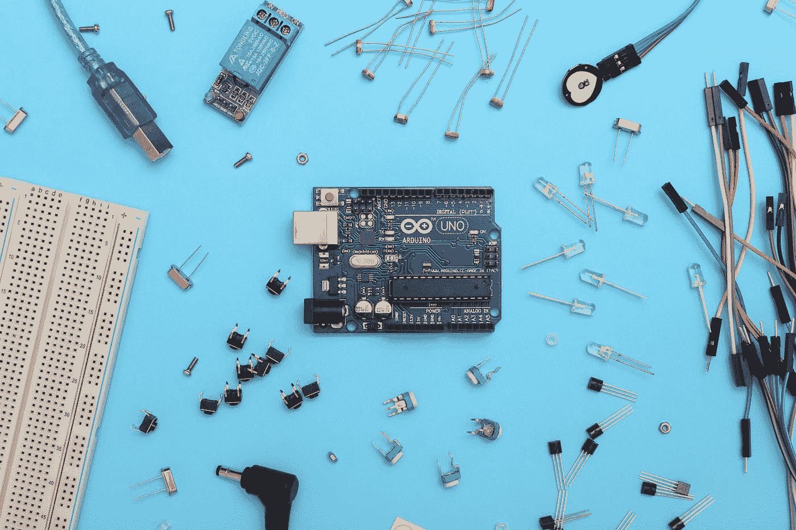

# 使用 Arduino 进行图像处理？

> 原文：<https://medium.com/geekculture/image-processing-using-arduino-3feac27dd250?source=collection_archive---------3----------------------->

通过 python 脚本与电子硬件通信。



Photo by [Sahand Babali](https://unsplash.com/@sahandbabali?utm_source=medium&utm_medium=referral) on [Unsplash](https://unsplash.com?utm_source=medium&utm_medium=referral)

微控制器已被广泛用于创建大多数电子产品的原型。您甚至可能已经使用 Arduino 板创建了一些简单的项目。但是你有没有尝试过把它链接到更高级的编程语言，比如用 python 写的 ML 模型？

让我们开始一个简单的项目，将 python 脚本连接到 Arduino 板。这个项目的目标是看看使用一个 ML 模型的预测来执行一些使用 Arduino UNO 的任务有多容易。

# 先决条件

1.  Arduino UNO 板
2.  [Arduino 软件](https://www.arduino.cc/en/software)
3.  计算机编程语言
4.  Pyserial
5.  Opencv

`pyserial`是用于串行传输数据的 python 包，可以通过从终端运行`pip install pyserial`来安装。`opencv`是用于图像处理的软件包，可以通过运行`pip install opencv-python`来安装。将以下代码复制并粘贴到 Arduino 软件的一个新文件中。

```
void setup() {
  pinMode(LED_BUILTIN, OUTPUT);
  // Setting baud rate to 9600
  Serial.begin(9600);
  digitalWrite(LED_BUILTIN, LOW);
}void loop() {
  if(Serial.available() > 0){
      String s = Serial.readString(); // for incoming serial data
      Serial.println(s);
      digitalWrite(LED_BUILTIN, HIGH);
  }
}
```

您可以通过打开串行监视器(右上角的放大镜图标)并尝试发送一些数据来检查此代码。确保波特率与代码中指定的相同(此处为 9600)。

接下来，对于 python 脚本。

```
import serialwith serial.Serial('com4', 9600, timeout=0.1) as arduinoSerial: data = '12345' print('pyserial version: ' + serial.__version__) # Transmit data serially arduinoSerial.write(data.encode('utf-8'))
```

下面的代码只是将数据(' 12345 ')发送到 arduino 板。注意 Serial()函数有 3 个参数:arduino 板使用的端口号、波特率和最大超时时间。

要确定您的主板使用的端口号，请单击“工具”->“端口”。你可以在 Arduino 软件的左上角找到它们。使用命令`python name-of-file.py`运行 python 脚本

到目前为止，我们已经完成了该项目的最低要求，即向 Arduino 板发送一些数据。接下来，让我们在 python 脚本中执行一些图像处理，并传输有意义的数据。我们将使用基于 Haar 特征的级联分类器方法来识别图像/视频中的人脸。级联分类器的工作超出了我们项目的范围，因此我们将在代码中使用预先训练的模型(单击[此处](https://github.com/opencv/opencv/blob/master/data/haarcascades/haarcascade_frontalface_default.xml)下载文件)。

请注意，您必须更新端口和波特率，并将 Haar cascode _ frontal face _ default . XML 放在工作目录中。

*感谢阅读。*