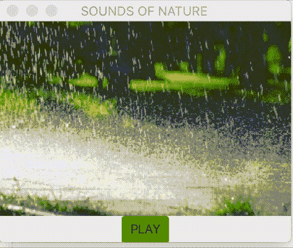
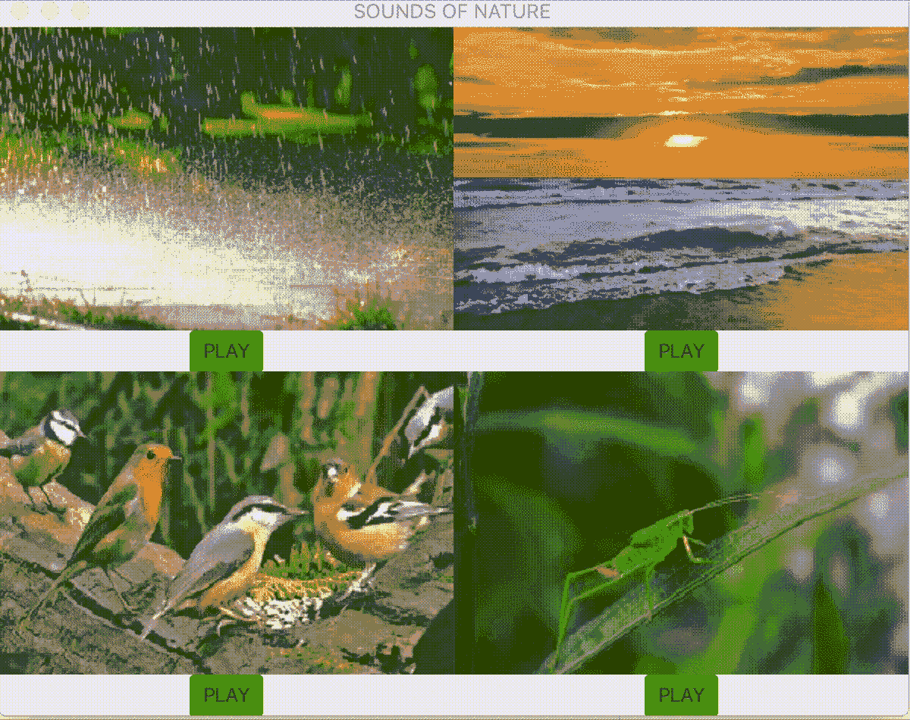
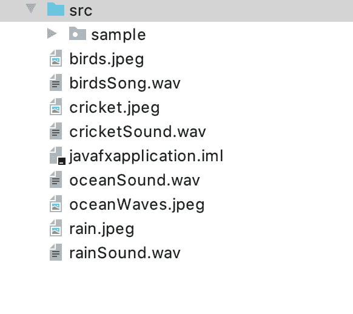

# JavaFX 应用程序中的图像和声音

> 原文：<https://medium.com/geekculture/images-and-sounds-in-javafx-applications-ca07f6a16030?source=collection_archive---------24----------------------->

在 java 应用程序中有许多显示图像和播放声音文件的方法。我们将看看使用 Image 和 ImageView 类的简短应用程序:

 [## 图像(JavaFX 2.2)

### 导入 Java FX . scene . image . image；//在后台加载图像，在加载时显示一个占位符//…

docs.oracle.com](https://docs.oracle.com/javafx/2/api/javafx/scene/image/Image.html) [](https://docs.oracle.com/javase/8/javafx/api/javafx/scene/image/ImageView.html) [## ImageView (JavaFX 8)

### 导入 Java FX . application . application；导入 Java FX . geometry . rectangle 2d；导入 Java FX . scene . group；导入…

docs.oracle.com](https://docs.oracle.com/javase/8/javafx/api/javafx/scene/image/ImageView.html) 

和声音的音频剪辑:

 [## 音频剪辑(JavaFX 8)

### 片段相对于其他片段的相对优先级。该值用于确定要移除哪些剪辑…

docs.oracle.com](https://docs.oracle.com/javase/8/javafx/api/javafx/scene/media/AudioClip.html) 

我们将使用为 JavaFX 项目设置的 InteliJ Idea。为此，遵循以下说明:

[](https://www.jetbrains.com/help/idea/javafx.html) [## 创建新的 JavaFX 项目| IntelliJ IDEA

### JavaFX 是一个用于开发桌面应用程序的软件平台，这些应用程序可以运行在各种各样的…

www.jetbrains.com](https://www.jetbrains.com/help/idea/javafx.html) 

除了列出的选项之外，在虚拟机选项中执行上述参考中概述的步骤时，我们添加了:

javafx.media

这样,“虚拟机选项”字段看起来就像这样:

—模块路径/路径/到/javafx/sdk —添加模块 javafx.controls、javafx.fxml、javafx.media

其中`/path/to/javafx/sdk`是下载的 JavaFX SDK 发行版的 **lib** 目录的路径。


我们将使用图像文件名作为参数来创建图像类的对象。我们需要使用前缀

`file:`

在图像文件的名称前。我们还将调整图像的大小，以达到一定的宽度和高度，同时设置首选项以保留高度/宽度比率和过滤的质量/速度:

```
Image imageFile = **new** Image(**"file:rain.jpeg"**, 300,200,**false**,**false**);
```

加载我们的图像后，我们将使用 ImageView 类的对象来显示我们的图像。我们将使用我们的图像类对象作为参数:

```
ImageView image = **new** ImageView(imageFile);
```

为了加载我们的声音文件，我们将使用类 AudioClip:

```
AudioClip sound = **new** AudioClip(**"file:rainSound.wav"**);
```

我们的声音文件将与以下内容一起播放:

```
sound.play();
```

为了控制开始和停止播放我们的声音文件，我们将添加按钮。当文件不播放时，按钮将是绿色并显示“播放”。当文件正在播放时，它将是红色的并显示“停止”:

```
Button button = **new** Button(**"PLAY"**);
button.setStyle(**"-fx-background-color: #32CD32 "**);

button.setOnAction(event -> {**if** (button.getText().equals(**"PLAY"**)) {
    sound.play();
    button.setText(**"STOP"**);
    button.setStyle(**"-fx-background-color: #FF0000 "**);
} **else** {
    sound.stop();
    button.setText(**"PLAY"**);
    button.setStyle(**"-fx-background-color: #32CD32 "**);
}
});
```

我们将使用 BorderPane 类来定位我们的图像和按钮。

 [## 边框窗格(JavaFX 8)

### BorderPane 将子项布置在顶部、左侧、右侧、底部和中间位置。顶部和底部的孩子将是…

docs.oracle.com](https://docs.oracle.com/javase/8/javafx/api/javafx/scene/layout/BorderPane.html) 

```
BorderPane container = **new** BorderPane();
container.setTop(image);
container.setCenter(button);
```

在这之后，我们需要使用场景类来设置舞台窗口中的场景:

```
Scene scene = **new** Scene(container);

window.setScene(scene);
window.show();
```

显示图像文件和播放声音文件的完整代码如下所示:

```
**import** javafx.application.Application;
**import** javafx.scene.Scene;
**import** javafx.scene.control.Button;
**import** javafx.scene.image.Image;
**import** javafx.scene.image.ImageView;
**import** javafx.scene.layout.BorderPane;**import** javafx.stage.Stage;
**import** javafx.scene.media.AudioClip;

**public class** Main **extends** Application {

    @Override
    **public void** start(Stage window){

        window.setTitle(**"SOUNDS OF NATURE"**);Image imageFile = **new** Image(**"file:rain.jpeg"**, 300,200,**false**,**false**);
        ImageView image = **new** ImageView(imageFile);
        AudioClip sound = **new** AudioClip(**"file:rainSound.wav"**);

        Button button = **new** Button(**"PLAY"**);
        button.setStyle(**"-fx-background-color: #32CD32 "**);

        button.setOnAction(event -> {**if** (button.getText().equals(**"PLAY"**)) {
            sound.play();
            button.setText(**"STOP"**);
            button.setStyle(**"-fx-background-color: #FF0000 "**);
        } **else** {
            sound.stop();
            button.setText(**"PLAY"**);
            button.setStyle(**"-fx-background-color: #32CD32 "**);
        }
        });

        BorderPane container = **new** BorderPane();
        container.setTop(image);
        container.setCenter(button);

        Scene scene = **new** Scene(container);

        window.setScene(scene);
        window.show();

    }

    **public static void** main(String[] args) {
        *launch*(Main.**class**);
    }
}
```

上面的应用程序看起来像这样:



让我们有四个图像文件和四个声音文件。我们将使用 GridPane 类来显示我们的 BorderPanes，它包含用于播放声音文件的图像和按钮。

 [## 网格面板(JavaFX 2.2)

### 如果没有显式设置行/列索引，那么子代将被放置在第一行/列中。如果行/列…

docs.oracle.com](https://docs.oracle.com/javafx/2/api/javafx/scene/layout/GridPane.html) 

```
GridPane bigLayout = **new** GridPane();
```

我们将编写创建 BorderPanes 的方法，border panes 包含用于播放声音文件的图像和按钮:

```
**public** BorderPane createBorderPane( String imageFileName, String soundFileName) {
    Image imageFile = **new** Image(imageFileName, 300,200,**false**,**false**);
    ImageView image = **new** ImageView(imageFile);
    AudioClip sound = **new** AudioClip(soundFileName);

    Button button = **new** Button(**"PLAY"**);
    button.setStyle(**"-fx-background-color: #32CD32 "**);

    button.setOnAction(event -> {**if** (button.getText().equals(**"PLAY"**)) {
        sound.play();
        button.setText(**"STOP"**);
        button.setStyle(**"-fx-background-color: #FF0000 "**);
    } **else** {
        sound.stop();
        button.setText(**"PLAY"**);
        button.setStyle(**"-fx-background-color: #32CD32 "**);
    }
    });

    BorderPane container = **new** BorderPane();
    container.setTop(image);
    container.setCenter(button);

    **return** container;
}
```

我们将把边框面板添加到网格面板中:

```
bigLayout.add(createBorderPane(**"file:rain.jpeg"**,
          **"file:rainSound.wav"**),0,0);
bigLayout.add(createBorderPane(**"file:oceanWaves.jpeg"**,
         **"file:oceanSound.wav"**),1,0);
bigLayout.add(createBorderPane(**"file:birds.jpeg"**,
          **"file:birdsSong.wav"**),0,1);
bigLayout.add(createBorderPane(**"file:cricket.jpeg"**,
       **"file:cricketSound.wav"**),1,1);
```

和场景类来显示我们在寡妇:

```
Scene scene = **new** Scene(bigLayout);

window.setScene(scene);
window.show();
```

最终的代码如下所示:

```
**import** javafx.application.Application;
**import** javafx.scene.Scene;
**import** javafx.scene.control.Button;
**import** javafx.scene.image.Image;
**import** javafx.scene.image.ImageView;
**import** javafx.scene.layout.BorderPane;
**import** javafx.scene.layout.GridPane;
**import** javafx.stage.Stage;
**import** javafx.scene.media.AudioClip;

**public class** Main **extends** Application {

    @Override
    **public void** start(Stage window){

        window.setTitle(**"SOUNDS OF NATURE"**);

        GridPane bigLayout = **new** GridPane();

        bigLayout.add(createBorderPane(**"file:rain.jpeg"**,**"file:rainSound.wav"**),0,0);
        bigLayout.add(createBorderPane(**"file:oceanWaves.jpeg"**,**"file:oceanSound.wav"**),1,0);
        bigLayout.add(createBorderPane(**"file:birds.jpeg"**,**"file:birdsSong.wav"**),0,1);
        bigLayout.add(createBorderPane(**"file:cricket.jpeg"**,**"file:cricketSound.wav"**),1,1);

        Scene scene = **new** Scene(bigLayout);

        window.setScene(scene);
        window.show();

    }

    **public** BorderPane createBorderPane( String imageFileName, String soundFileName) {
        Image imageFile = **new** Image(imageFileName, 300,200,**false**,**false**);
        ImageView image = **new** ImageView(imageFile);
        AudioClip sound = **new** AudioClip(soundFileName);

        Button button = **new** Button(**"PLAY"**);
        button.setStyle(**"-fx-background-color: #32CD32 "**);

        button.setOnAction(event -> {**if** (button.getText().equals(**"PLAY"**)) {
            sound.play();
            button.setText(**"STOP"**);
            button.setStyle(**"-fx-background-color: #FF0000 "**);
        } **else** {
            sound.stop();
            button.setText(**"PLAY"**);
            button.setStyle(**"-fx-background-color: #32CD32 "**);
        }
        });

        BorderPane container = **new** BorderPane();
        container.setTop(image);
        container.setCenter(button);

        **return** container;
    }

    **public static void** main(String[] args) {
        *launch*(Main.**class**);
    }
}
```

运行上述应用程序的结果如下所示:



图像和声音文件需要放在 src 目录中:



快乐编码我的朋友们！

