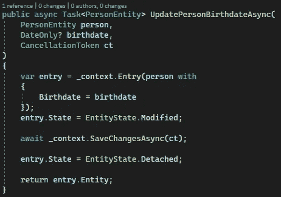

# 不变性和实体框架核心

> 原文：<https://medium.com/geekculture/immutability-and-entity-framework-core-60ac59919c2?source=collection_archive---------0----------------------->

## 使用 C#记录和实体框架核心实现不可变数据访问层

如今，当实现一个直接使用数据库(关系型或非关系型)的. NET 应用程序时，大多数开发人员会选择 Entity Framework Core 来抽象他们的数据层并直接使用实体类。