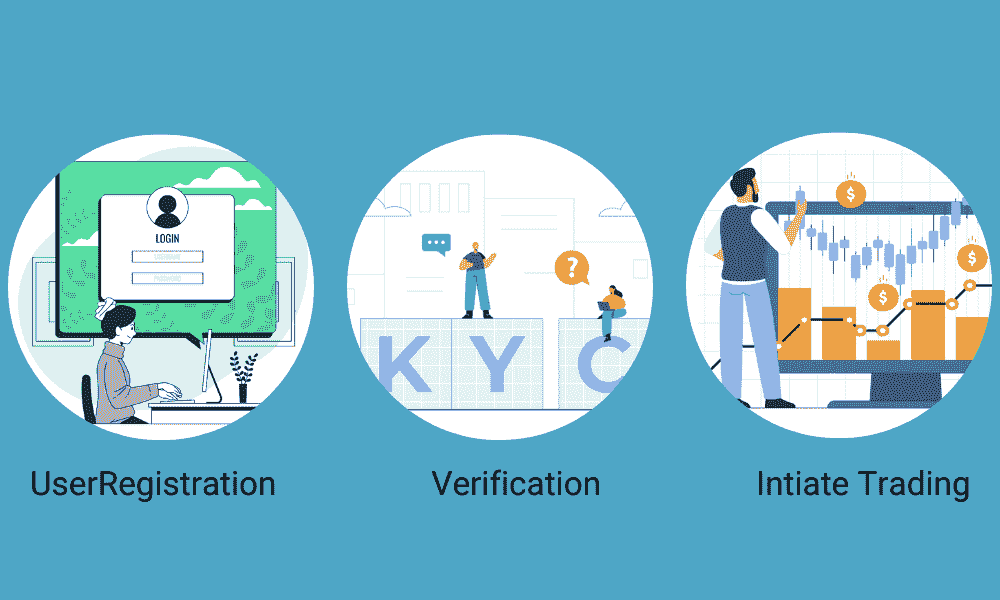
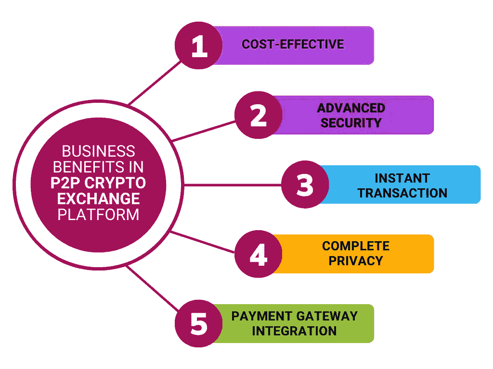

# 2023 年 P2P 加密交易所发展的影响

> 原文：<https://medium.com/geekculture/impact-of-p2p-crypto-exchange-development-in-2023-313c45008907?source=collection_archive---------16----------------------->

当前的形势使加密货币变得突出，如今人们正试图了解这个市场的演变。这种加密货币最近经历了巨大的增长和兴趣。

P2P Crypto Exchange Development

加密货币交易所是用户可以交易数字硬币或数字资产的媒介，以安全地获取一定数量的利润。同样，你可以购买或出售加密硬币，交易完成后，一定数量的钱会作为佣金寄给所有者。

然而，你会想到最好的加密货币交易所，对不对？

这里给大家推荐一个当今时代非常流行的最佳加密货币交易所。

在现代世界中，点对点加密货币交换已经变得流行。许多商人和企业家正在努力创建自己的 P2P 加密货币交易所，以从中获利。由于其高投资回报率和灵活性，这个市场被认为是必不可少的。

让我们发现 P2P 加密交换开发的挑战。

# P2P 加密货币交易所:

P2P Crypto exchange，也称为 Peer-2-Peer 加密货币交易所，帮助用户在没有任何第三方干预的情况下买卖加密货币。P2P 加密交易使买家与卖家直接联系，交易在托管系统的帮助下完成。

p2p 加密交换中提供的安全性是主要优势。你不需要将你的资金存入第三方来启动你的交易，因为你所有的交易都是直接持有的。与传统交易相比，在这种交易中，黑客或欺诈是不可能的。

此外，p2p 加密交换是用户友好的，因为它们有一个简单的界面，还提供了先进的功能，这将有助于初学者。此外，p2p 交易所的交易费用较低，吸引了全球观众。

# P2P 加密交换软件为您的加密业务

一个定制的 P2P 加密交换平台有许多优势，可以帮助您的业务以一种先进的方式发展。

**增强的安全性:**

p2p 加密交换最显著的优势之一是它们比传统的交换更安全。因为每笔交易都是直接发生的。因此，与传统交易所相比，p2p 交易所的订单和交易是高度透明的。

**高级客户支持:**

尽管 p2p 交易所提供实时聊天支持，但它们提供的客户服务比传统交易所好得多。新手从平台提供的支持中受益匪浅。

**更高的可扩展性:**

通过一家知名的 p2p 加密交换开发公司，您可以构建一个更高可伸缩性的平台。原因是 p2p 交易所不依赖服务器或集中的第三方来进行交易。因此，它们可以处理比传统交易所多得多的交易。

# P2P 密码交换平台的工作机制

下面以简单的方式描述 p2p 密码交换平台的工作机制，

*   首先，用户需要注册他/她的电子邮件 id 或手机号码，并需要验证他们的详细信息。
*   一旦验证完成，用户就可以开始与其余通过验证的卖家和买家进行交易。
*   此外，买家和卖家可以浏览现有订单或创建新订单来找到匹配的订单。
*   因此，买家和卖家可以通过聊天来讨论价格和其他事情。

Working Mechanism of P2P Crypto Exchange Platform

P2P 加密交换比传统的交换更简单、更安全。

# P2P 加密货币交易软件的重要特征:

平台特性是用户前来注册时首先要寻找的东西。因此，确保你的 p2p 交易平台比你的竞争对手领先一步。以下是 p2p 加密交换平台的一些重要特性，

**多种加密货币:**

市场上有一些著名的加密货币，如比特币、以太坊、Dogecoin、Cardano 等，加密市场上还有超过 10，000 种加密货币可以交易。有了多种加密货币，这些加密货币中的任何一种都可以交易。

**托管系统:**

托管系统是 p2p 加密交换平台的另一个重要特征。买家放入的钱被放入托管账户，一旦交易完成，托管账户释放该金额，买家将该金额存入他们各自的加密钱包

**强大的交易所交易:**

尝试通过简单的界面、先进的技术和简单的流程来提高交易速度。

**自动 KYC:**

在这个数字世界中，自动 KYC/身份/反洗钱验证被认为是交换平台的必备功能。此功能消除了风险因素，并让管理员能够高效地找到受信任的用户。

**多因素认证:**

管理员和用户都可以使用该功能，以提供高级安全性。这项功能将帮助验证用户获得电子邮件更新，还包括谷歌双因素认证，使您有一个愉快的活动与您的帐户。

**加密交换:**

最新的交易所将加密交换作为一项基本功能。此功能允许加密持有者在不退出当前加密钱包的情况下将一种加密货币兑换为另一种加密货币。通过交易账户进行交易可以快速结算，而且没有网络费用。

**首选交易:**

目前，交易所正在为其用户提供交易选项，用户可以选择自己喜欢的交易方式来获取巨额利润。

# 你如何从你的 P2P 交易所赚取利润？

一旦你的 p2p 加密交易平台创建成功，下一步就是选择最好的方法来赚钱。常见的策略之一是对平台上发生的每一笔交易收取一定金额的费用。此外，允许你在你的平台上放置广告可以通过被动收入产生一定的利润。

另一种通过 p2p 加密交换赚钱的方法是提供只提供给付费用户的高级功能。

# P2P 加密交换平台的商业优势:

额外的好处可以吸引大量的全球受众到您的平台，下面是一些商业好处，

Business Benefits of P2P Crypto Exchange Platform

*   性价比高
*   高级安全性
*   即时交易
*   完全隐私
*   支付网关集成

# 开发 P2P 交易所的成本:

说实话，搭建一个 p2p 密码交换平台并没有一定的固定成本。成本是由某些因素决定的，这些因素取决于你的商业理念。带有基本功能和选项的软件价格大约在 5000 美元左右。如果您正在增强软件的功能和选项，以便为您的用户提供更好的体验，成本可能会有所不同。

# 最后的话:

最后，p2p 加密交易平台比传统交易平台更受欢迎。因此，在精英 [**p2p 加密交易所开发公司**](https://www.alwin.io/p2p-cryptocurrency-exchange-software-development) 的支持下推出 P2P 交易所，可以为你提供长期有利可图的业务。你还在等什么？这是冒险进入密码行业并获取巨额利润的最佳时机。