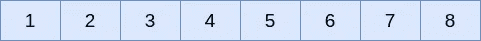
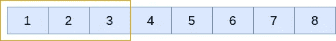
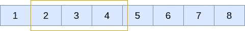
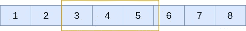
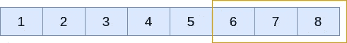

# 使用 python 实现滑动窗口

> 原文：<https://medium.com/geekculture/implement-a-sliding-window-using-python-31d1481842a7?source=collection_archive---------7----------------------->

## 如何使用 python 实现滑动窗口


Photo by [Daniel Alentà](https://unsplash.com/@snidgets?utm_source=medium&utm_medium=referral) on [Unsplash](https://unsplash.com?utm_source=medium&utm_medium=referral)

# 介绍

本文描述了如何使用 python 实现滑动窗口。滑动窗口是给定时间点的数据结构的子集。窗口大小决定了子集中元素的数量。

# 滑动窗口:

让我们以一个包含 8 个元素的列表为例。



A python list with 8 elements as integers

现在，如果我们设置窗口大小= 3，输出应该是，

```
Output: 123 
234 
345 
456 
567 
678
```

注意:在任何给定的时间点，窗口大小应该总是 3。



Iteration 1 window elements[1,2,3]



Iteration 2 window elements[2,3,4]



Iteration 3 window elements[3,4,5]

…



Final iteration window elements[6,7,8]

# 用例

这个概念可以用在以下场景中

*   从一个较长的字符串计算特定长度的子字符串。
*   计算列表中连续 n 个数的和，其中 n 是窗口大小

# 代码:

```
lst = [1,2,3,4,5,6,7,8] def sliding_window(elements, window_size):

    if len(elements) <= window_size:
       return elements for i in range(len(elements)):
        print(elements[i:i+window_size]) sliding_window(lst, 3)Output:[1, 2, 3] 
[2, 3, 4] 
[3, 4, 5] 
[4, 5, 6] 
[5, 6, 7] 
[6, 7, 8] 
[7, 8] 
[8]
```

这实现了滑动窗口的目的。但是，我们不希望任何窗口的元素小于我们的窗口大小。在这种情况下，`window_size`是 3。因此，当我们达到窗口大小时，我们将在代码中做一个小的改变来停止迭代。

# 修改了代码以停止在窗口大小上

```
lst = [1,2,3,4,5,6,7,8] def sliding_window(elements, window_size):

    if len(elements) <= window_size:
       return elements for i in range(len(elements)- window_size + 1):
        print(elements[i:i+window_size])sliding_window(lst, 3)Output:[1, 2, 3] 
[2, 3, 4] 
[3, 4, 5] 
[4, 5, 6] 
[5, 6, 7] 
[6, 7, 8]
```

# 使用生成器实现滑动窗口

滑动窗口技术也可以使用生成器来实现。生成器通常存储执行的状态，并在下次调用时恢复。比方说，出于某种原因，你可能必须保存滑动窗口的状态，然后从你离开的地方恢复，你可以使用一个生成器，而不是一个常规函数。函数内部的`yield`关键字决定了该函数是一个生成器。

这将返回一个生成器对象，你可以调用`next(object)`来获得下一个值，或者在`for`循环中使用迭代器。

```
lst = [1,2,3,4,5,6,7,8] lst = [1,2,3,4,5,6,7,8]def sliding_window(elements, window_size):

    if len(elements) <= window_size:
       return elements for i in range(len(elements)- window_size + 1):
        yield elements[i:i+window_size]sw_gen = sliding_window(lst, 3) print(next(sw_gen)) 
print(next(sw_gen))Output: 
[1, 2, 3] 
[2, 3, 4]
```

# 计算子字符串的滑动窗口

我们将使用滑动窗口技术通过字符串的长度计算子字符串。这可以用来检查一个字符串是否是另一个的排列。要了解更多这方面的内容，请查看这篇文章[这里](https://dineshkumarkb.com/tech/leetcode-challenge-check-if-a-string-is-a-perumutation-of-another-using-python/)检查字符串排列。

```
s = "eidbaooo"def sliding_window(elements, window_size):

    if len(elements) <= window_size:
       return elements for i in range(len(elements)- window_size + 1):
        print(elements[i:i+window_size])sliding_window(s, 2)Output: ei 
id 
db 
ba 
ao 
oo 
oo
```

# 总结:

在本文中，我们讨论了什么是滑动窗口，并使用以下方法实现了滑动窗口

*   使用函数的滑动窗口
*   使用发生器的滑动窗口
*   琴弦滑动窗口

*原载于*[*https://dineshkumarkb.com*](https://dineshkumarkb.com/tech/implement-a-sliding-window-using-python/)*。*