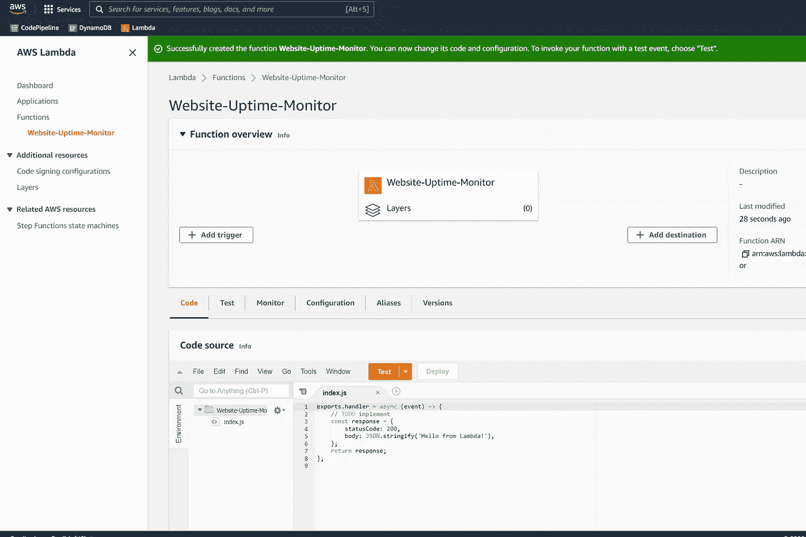
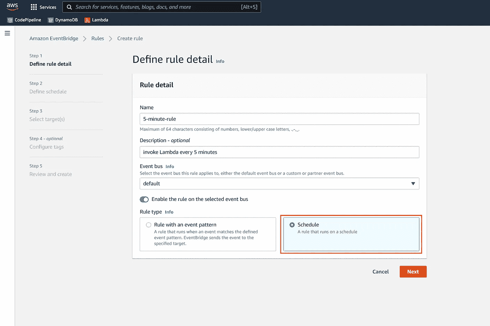
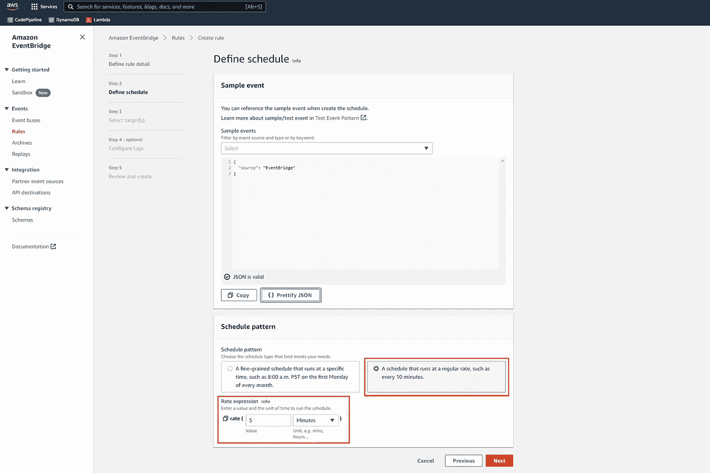
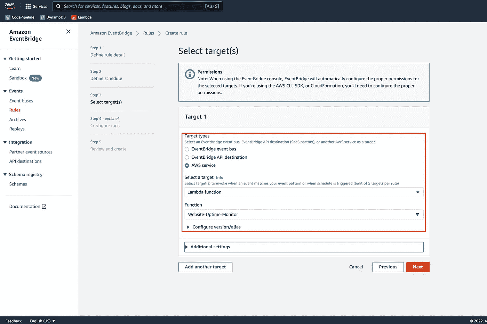
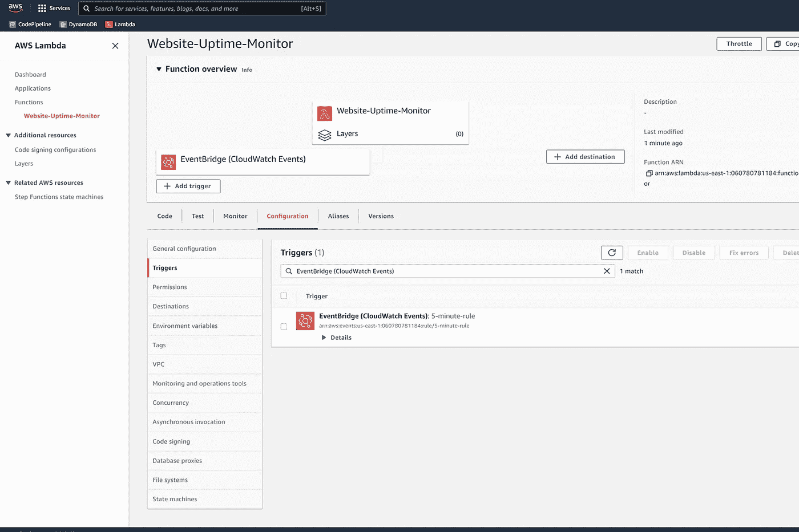
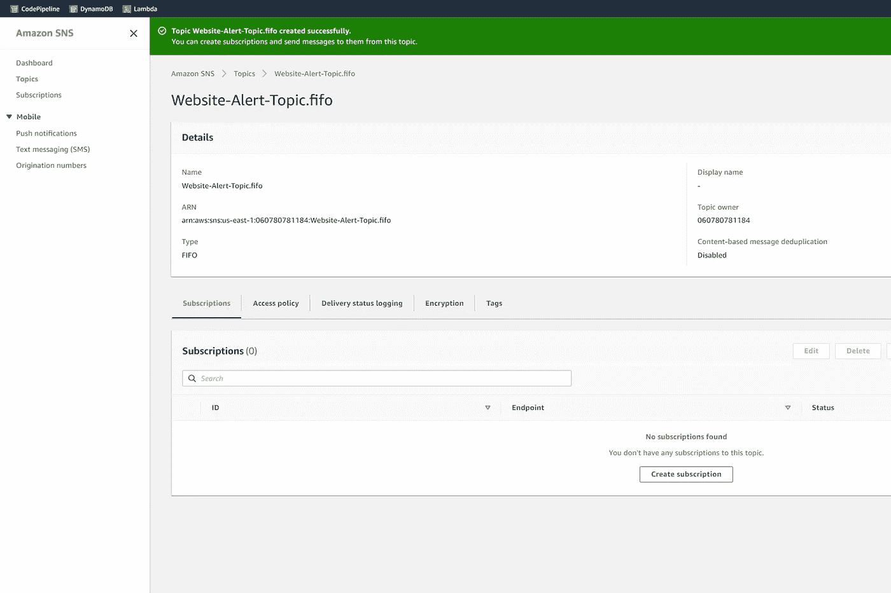
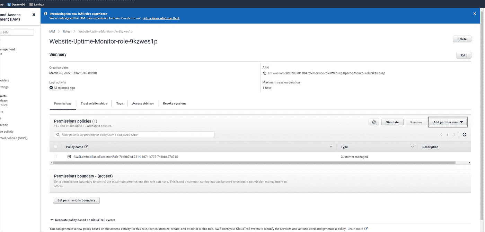
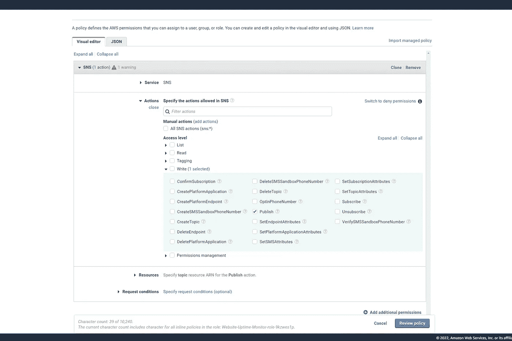
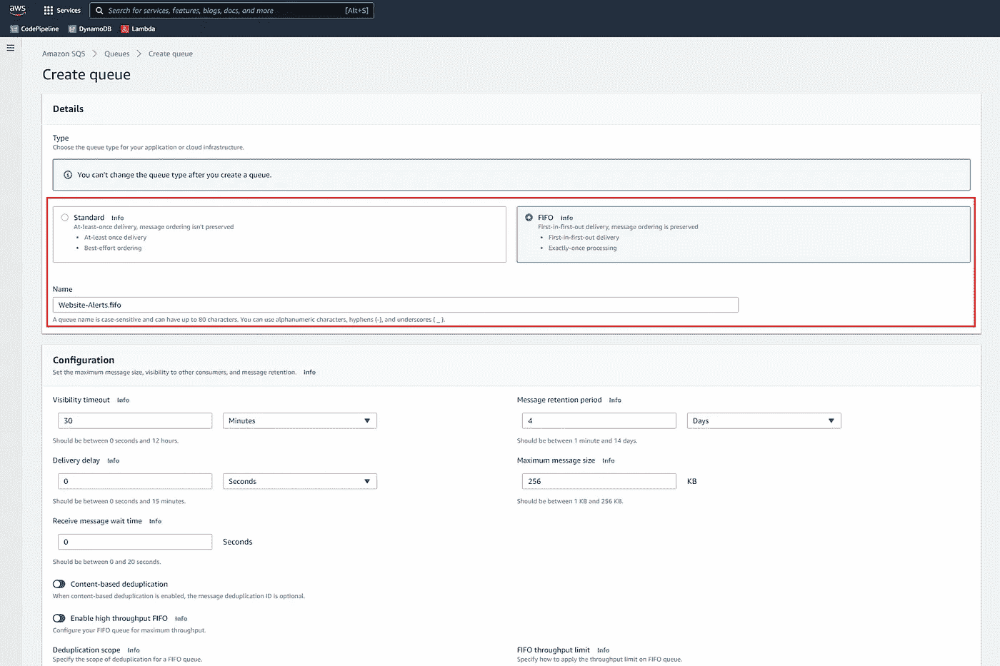
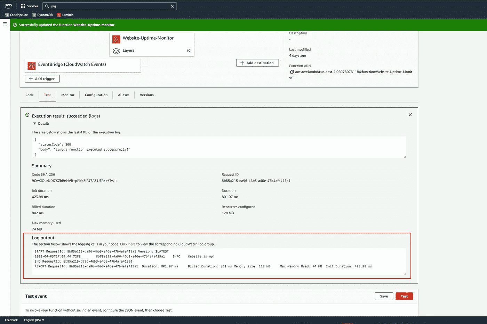

# 使用 AWS Lambda、EventBridge、SNS 和 SQS 实现正常运行时间监控。

> 原文：<https://medium.com/geekculture/implement-an-uptime-monitor-using-aws-lambda-eventbridge-sns-and-sqs-cf35d1ba4c9d?source=collection_archive---------5----------------------->


Photo by [AltumCode](https://unsplash.com/@altumcode?utm_source=medium&utm_medium=referral) on [Unsplash](https://unsplash.com?utm_source=medium&utm_medium=referral)

您可以使用 AWS EventBridge 规则来安排 Lambda 函数在特定时间或设定的时间间隔运行。将这两种服务结合起来，可以释放出大量的使用案例和工作负载。通过使用 EventBridge 规则调度 Lambda 函数，可以实现从常规 web 抓取作业到自动每日提醒的任何事情。

在本文中，我们将安排一个 Lambda 函数每 5 分钟运行一次，以检查网站的健康状况。Lambda 函数将向网站服务器发送一个简单的 HTTP 请求，并检查响应代码。如果响应代码不是 200，Lambda 函数将向可以订阅的 SNS 主题发送一条警告消息。这就是我如何为我的 SaaS 监控和警报系统 [Komonitor](https://komonitor.com) 实现正常运行时间监控的。

本文的惟一先决条件是设置好 AWS 帐户和节点环境。

# 设置 AWS 资源

本节将介绍如何通过 AWS 控制台设置所需的 AWS 资源。

# λ函数

首先，我们需要创建一个 Lambda 函数，用于检查我们网站的健康状况。

导航到 AWS Lambda 控制台，创建一个新的 Lambda 函数并为其命名。

创建后，它应该在控制台中可见，如下所示:



AWS Lambda console with newly created Lambda function

目前，该函数只有打印 hello-world 消息的模板代码。在本文的后面，我们将在 Lambda 函数中实现
正常运行时间检查逻辑。

# 事件桥规则

为了安排 Lambda 函数每 5 分钟运行一次，我们需要创建一个 EventBridge 规则。
导航到 AWS EventBridge 控制台，点击**创建规则**按钮。

在**定义规则细节**步骤中，给规则命名并将**规则类型**设置为**计划**并继续下一步。



AWS EventBridge console — Define rule detail

下一步，定义日程模式，并将**速率表达式**设置为 5 分钟。



AWS EventBridge console — Define schedule pattern

现在，选择该事件规则的目标。选择 **AWS 服务**，然后选择**λ功能**。在下拉列表中，前面创建的 Lambda 函数名称应该是一个选项，选择它。



AWS EventBridge console — Select targets

这就是设置事件规则所需的全部配置，继续执行以下步骤并创建规则。

为了确认规则是针对 Lambda 函数创建和配置的，导航到 Lambda 控制台并查看函数概述
。该规则应该在“功能概述和配置”选项卡中可见，如下所示:



AWS Lambda console with EventBridge rule listed as trigger

# SNS 主题和 Lambda 权限

我们的正常运行时间监视器将通过 SNS 主题捕捉警报，超过 100 个缔约方可以订阅。转到 SNS 控制台，创建一个新的 FIFO 主题。



AWS SNS console with newly created FIFO topic

为了让 Lambda 函数将消息发布到 SNS 主题，我们需要编辑 Lambda 函数的 IAM 角色，并授予它发布到主题的权限。

回到 Lambda 控制台查看该功能，选择**配置**选项卡，然后选择**权限**。您将看到列出了
执行角色。单击它可以导航到 IAM 控制台。

点击**添加权限**，然后点击**创建内嵌策略**。



IAM console for Lambda function execution role

在内联策略可视化编辑器中，将服务设置为 SNS，并在 actions 下，筛选并选择 **Publish** 。



Inline policy visual editor

对于**资源**，进入 SNS 话题 ARN。保存内联策略，并确保它附加到 Lambda 执行角色。

# SQS 排队并订阅社交网站

每当 Lambda 向 SNS 主题发布消息时，我们都希望能够看到我们的警报，因此我们将创建一个 SWS 队列，订阅来自 SNS 主题的消息，并允许我们在 AWS 控制台中查看消息。

转到 SQS 控制台，创建一个新的 FIFO 队列，如下所示:



AWS SQS creation console

创建队列后，您将看到队列的概述。
点击**订阅亚马逊 SNS 主题**，选择您之前创建的 SNS 主题并创建订阅。

现在，每当我们向 SNS 主题发布警报消息时，这些消息就会出现在 SQS 队列中。

所有必需的 AWS 资源现在都已经设置好了。在下一节中，我们将实现 Lambda 函数代码。

# λ代码

现在，让我们编写 Lambda 函数执行正常运行时间检查的代码。我们将使用 JavaScript 编写 Lambda 函数，并在 NPM 中使用 Node.js 运行时。

在您的系统上创建一个新目录，并运行:

然后安装 **AWS SDK** 和**取**包；

```
npm install aws-sdk node-fetch
```

要使用 ESM 模块，打开`package.json`并添加`"type": "module"`。

打开`index.js`，写下面的代码(一定要填写自己的网站网址和 SNS 话题 ARN。):

注意，在这个简单的实现中，我们硬编码了网站 URL 和 SNS 主题 ARN。通常，我们希望从触发 Lambda 函数的事件或环境变量中读取这些值。

为了将代码和依赖项上传到 Lambda 函数，我们需要压缩文件。
在 Linux 上，这可以使用:

```
zip -r package.zip . *
```

这个命令将在当前目录下创建一个`package.zip`文件，它将包含 Lambda 所需的一切。

在 Lambda function overview 上，转到 **Code** 选项卡，上传包含代码的 zip 文件。

# 确保一切正常

我们可以在**测试**选项卡中手动运行 Lambda。
如果 Lambda 从它正在监控的网站收到 200 OK 状态码，它将**而不是**向 SNS 主题
发布消息，而是记录该网站如下所示:



Lambda function execution output

如果我们想看到运行中的警报，将网站 URL 更改为[**https://httpstat.us/400**](https://httpstat.us/400)，这样我们总是会得到一个 400 状态代码。
重新加载一个新的 zip 文件到 Lambda 函数，然后再次测试。Lambda 日志将指示该网站已关闭，它向 SNS 主题发布了一条消息。

要查看消息，请到队列的 SQS 控制台，点击**发送和接收消息**。点击**轮询消息**，您应该能够看到队列中的消息。单击它以查看消息细节，它应该类似于这个 JSON 对象:

```
{"Type": "Notification","MessageId": "a44c27f8-9c68-507e-8ba9-7d3b45a76115","SequenceNumber": "10000000000000011000","TopicArn": "arn:aws:sns:us-east-1:060780781184:Website-Alert-Topic.fifo","Subject": "Website Down Alert","Message": "Received 400 status code from https://httpstat.us/400","Timestamp": "2022-04-03T17:21:19.940Z","UnsubscribeURL": "<URL>"}
```

如果您在队列中看到类似上面的消息，您的正常运行时间监视器正在工作！尝试扩展这个简单的实现，以覆盖多个 URL、地区等等。

# 清除

为了避免从 AWS 获得随机的账单，我们需要清理我们创建的资源。

确保删除不再需要的 Lambda 函数、EventBridge 规则、SNS 主题和 SQS 队列。

*原载于 2022 年 4 月 4 日*[*https://*komonitor.com](https://komonitor.com/blog/posts/implement-simple-uptime-monitor-in-aws)*。*